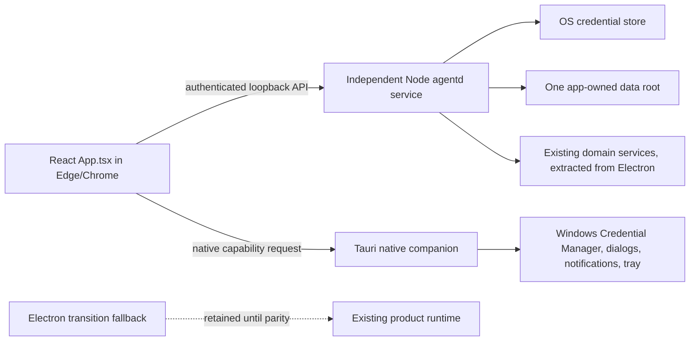

# Full Tauri Migration Plan

Status: active follow-up to the Tauri native-boundary pilot
Branch: `codex/tauri-full-migration`
Updated: 2026-09-18

Primary release platform: Windows. Every new native boundary must have a Windows implementation and CI/package evidence before it can be called production-ready; macOS smoke evidence is supplemental.

Current release gate: the Windows package must stage `aica-keyring-helper.exe` and run the packaged Credential Manager write/read/exists/delete smoke before native credential continuity can be called verified. The smoke uses a scoped throwaway secret and never prints its bytes; a skipped non-Windows run is not evidence for the Windows gate.

Current browser parity slice: Gmail Google Sign-In now runs through agentd's loopback PKCE callback. Agentd stores only the refresh token through the OS credential adapter, exposes status/start/sign-out routes to the browser, and owns bounded Gmail API inbox polling and approved text-only sends. Electron Gmail behavior remains unchanged; rich MIME, attachments, custom MCP and Windows runtime evidence remain open gates.

## Goal

Move the complete WA-copilot product to a lightweight browser UI backed by one local `agentd` service, while preserving every currently supported user workflow and its data. Windows users open the product in their normal browser (Edge/Chrome); no second desktop product UI is required.

Tauri is a small native companion only. It owns OS-only capabilities such as Windows Credential Manager access, file/folder pickers, notifications, tray/lifecycle and process supervision. It must not render or own the product workspace, business settings, channel workflows or a competing data writer. Keep Electron available as the stable transition fallback until browser + `agentd` parity, migration, security, platform and release gates pass.

“Complete” means the browser product UI and all backend features work through the authenticated local API, with native-only operations delegated to the Tauri companion or `agentd`; not merely that a Tauri window, picker and keychain demo build.

## Why the previous work stopped at a pilot

PR #9 was scoped as an opt-in native-boundary proof. Its execution plan explicitly left Electron as the supported/default runtime and deferred the product UI and service migration. The pilot validated that the existing React toolchain can open in Tauri, supervise a fixed Node sidecar, and access a small set of native facilities. It intentionally did not mount `App.tsx`, start channel integrations, or read Electron data.

That caution was warranted: the preload contains 139 Electron IPC call sites; the renderer has 258 direct `window.electron` references; and Electron APIs are spread across service modules under `src/main`. The pilot sidecar only implements `health.get` and `shutdown`. A separate loopback HTTP `agentd` exists at `agentd/server.cjs` with pairing, control, event intake, and its own database. A window-only migration would therefore remove most product behavior and risk creating two competing service/data owners.

This follow-up changes the scope from “prove the native boundary” to “migrate the product with parity gates.” PR #9 remains a clearly labeled pilot; this work is tracked separately on `codex/tauri-full-migration`.

## Target architecture

The browser remains the only product UI. `agentd` owns product/business services, durable state and background credentials. Tauri/Rust exposes only explicit native capabilities and may run headless/tray-first; it does not mount `App.tsx` or proxy arbitrary HTTP. The browser never receives the daemon bearer secret or secret values. Closing the browser or native companion does not stop `agentd`; explicit Stop Agent controls processing, and service installation/removal follows the OS user-service lifecycle.

Boundary note: product-facing Tauri invoke commands have been retired from the native invoke surface. The native window exposes only diagnostics, lifecycle/browser launch, OS credential presence/write/delete and owner-selected file/folder dialogs. Shared chat/settings validators and legacy client helpers remain temporarily for compatibility tests, but they are not registered as Tauri commands and cannot turn the companion into a second product workspace.

Canonical product protocol decision: use the existing `agentd/server.cjs` loopback HTTP service as the browser's typed product API, with explicit versioned routes, bounded/schema-validated payloads and an authenticated browser session. Tauri calls the same service only from native commands and never becomes a generic renderer proxy. Bind only to `127.0.0.1`; reject every request whose Host is not the exact actual listener host/port. Never log pairing codes. Publish only a private, owner-readable runtime descriptor containing origin, PID, protocol version, startup time and non-secret runtime identity. Expose the short-lived pairing code only through an explicit local-owner command, expire it and rate-limit failures. Keep `src/agentd/index.ts` stdio JSONL as pilot-only and do not grow it into a second product runtime. Before merging product services, consolidate executable/lifecycle, auth/session, schema migrations and data paths so there is one installed `agentd` service and one writer. Preserve route compatibility only where safe; do not preserve insecure behavior.

## Non-negotiable migration rules

1. Electron `dev`/`build` and the current production path remain unchanged until browser + `agentd` passes every gate.
2. Migrate one vertical slice at a time. Each slice retains the Electron adapter and receives host-neutral contract tests before Tauri wiring.
3. Preserve the behavior contract in `docs/app-behavior.md`, including safety controls, defaults, failures, event ordering, and draft/send boundaries.
4. Do not return success-shaped stubs for missing Tauri operations. Unsupported behavior is explicit and must not be presented as a completed feature.
5. Renderer access is through a typed, allowlisted bridge. No generic shell/process/SQL/filesystem RPC and no renderer-selected executable or arbitrary command.
6. Product credentials are stored and used only by `agentd` through its OS credential adapter; the Tauri companion's isolated slots are not the product secret store. The browser may submit a secret for storage and request presence/deletion through authenticated API routes, but never retrieves it. Secrets never move through general settings, logs, URLs, localStorage or persisted renderer state. Migration is a tested protected handoff or explicit reauthentication; no plaintext fallback.
7. Data import is opt-in, backed up, versioned, validated, idempotent, and rollback-capable. Electron and Tauri never write the same live data files concurrently.
   The settings/persona cutover additionally persists its state machine in agentd SQLite, drains in-flight generation/send work before external calls or commits, verifies backup hashes before rollback, and fails closed on platforms without no-follow/reparse-safe native file access. Windows continuity remains a release blocker until that native guarantee is shipped.
8. External integrations remain disabled by default in tests. Channel/network tests use fake providers or fixtures; real account pairing and sends require separate approval.
9. Measure whole-process resource use, including Node and local-model children. Do not claim savings from WebView measurements alone.
10. Do not remove Electron until all parity and release gates are evidenced on supported platforms.

## Current execution tasks

### Execution record — companion crash recovery

The Tauri companion now owns a small supervisor thread for the packaged child it starts. It reaps an exited child, waits with bounded backoff, validates the private runtime descriptor, and starts a replacement only when no other live daemon owns the data directory. It never kills or waits on `agentd` during companion shutdown, so the browser-first service lifetime remains independent. Recovery after the companion itself exits and Windows packaged runtime smoke remain release gates.

### Execution record — Windows per-user service registration

The native diagnostics surface now offers an explicit Windows-only install/remove action for the signed-in user's lightweight companion. Registration uses a fixed Task Scheduler XML definition with an interactive-token, least-privilege principal, a logon trigger, `--background` startup and bounded failure restart settings. The temporary XML is written under the private agentd data directory, passed only to the fixed `schtasks.exe` commands, and deleted after registration; non-Windows hosts return an explicit unsupported status. The companion hides its diagnostics window for the background launch while retaining the tray and agentd supervisor, so the browser remains the only product workspace. Rust tests cover XML escaping on every host and Task Scheduler register/query/remove on Windows; automatic installer enrollment, signed install/upgrade and full Windows packaged evidence remain release gates.

### Execution record — independent agentd lifetime

The native host no longer kills its `agentd` child when the Tauri window or tray exits. On launch it first validates the private runtime descriptor and reuses a live daemon; only a missing or stale descriptor causes a new child to start. While the companion remains alive, its supervisor reaps and restarts a child it started after a crash without competing with another valid descriptor. This preserves one-writer ownership and makes the documented browser/native-client lifecycle true. Windows per-user registration is now available through the native diagnostics owner action; installer enrollment, recovery after intentional user quit and packaged Windows evidence remain release gates.

### Task 1 — authenticated browser/agentd settings slice

Connect the browser product UI to the existing independently running `agentd` service for runtime status, remote LLM preferences, credential set/presence/delete and server-side connection tests for OpenAI, Gemini, OpenRouter and the local Ollama provider. The exact browser LLM settings schema is `preferredProvider: "auto" | "openai" | "gemini" | "openrouter" | "ollama" | "browser"`, `openaiModel`, `geminiModel` (a `gemini-*` model identifier), and `openrouterModel`; each model is non-empty and at most 128 characters. `browser` is a persistence-only selector for the browser's explicit WebGPU/WebLLM path and is never executed by agentd. Ollama uses a separate exact schema `{baseUrl,model}` and accepts only HTTP loopback hosts (`localhost`, `127.0.0.1`, `[::1]`). Defaults are `auto`, `gpt-4o-mini`, `gemini-2.5-flash`, `anthropic/claude-3-haiku`, and Ollama `http://127.0.0.1:11434` / `qwen2.5:3b`. Do not accept extra keys. Persist and return only these schemas at `GET/PUT /api/v1/settings/llm` and `GET/PUT /api/v1/settings/ollama`. OpenAI, Gemini, OpenRouter and Ollama prove the browser/agentd vertical path; explicit browser WebGPU uses a user-initiated cached model in the renderer, while other providers, custom remote OpenAI-compatible URLs and the rest of Settings remain later parity slices and must not appear as supported here. Keep `agentd` outside browser/Tauri window lifecycles; do not start a second pilot JSONL runtime. Resolve its private runtime descriptor only inside the native companion, validate protocol version, loopback origin, file size and platform permissions, and never return the bearer secret to React. Use fixed allowlisted API routes, bounded request/response sizes and timeouts, no redirects or proxy, and never return secrets to the browser. Provider probes are `POST /api/v1/providers/{openai|gemini|openrouter|ollama}/test`; cloud probes retrieve the corresponding key inside `agentd`, while Ollama probes use only the validated loopback URL and return bounded model names. Gemini generation uses the fixed Google `generateContent`/`streamGenerateContent` routes, an `x-goog-api-key` header, bounded text/image mapping and safe response parsing. They accept no arbitrary URL or key value from the renderer. A probe response returns only success/model count/model names or a generic safe error. Native file/folder selection remains a Tauri capability; browser settings use authenticated `agentd` routes. Leave Electron behavior unchanged until browser bridge parity is evidenced.

Acceptance: Rust tests reject malformed or non-loopback descriptors; daemon API tests prove settings writes are schema-allowlisted, credential set/presence/delete never return secret values and provider probes use the stored key only against fixed endpoints; browser requests use authenticated session/CSRF routes; Tauri commands use only typed fixed native routes; renderer typecheck, browser build, Rust tests and focused daemon tests pass. A smoke test against an isolated daemon verifies status, preference persistence and credential/probe lifecycle using fake keychain and provider adapters.

Browser runbook: build the web bundle, start the independently supervised `agentd` with `AICA_AGENTD_UI_ROOT` pointing at that bundle, open the native companion and use its explicit “Show pairing code” owner action (the `npm run agentd:pair-code` helper remains available for headless/service setups), then open the daemon's `tauri.html` URL in Edge or Chrome. The browser pairing form never persists the code; the daemon owns the HttpOnly session and all durable product state.

The browser settings surface exposes `auto`, Ollama, OpenAI/Compatible, Gemini, OpenRouter, and explicit On-Device/WebGPU. The remote cards use authenticated agentd routes; the WebGPU card uses the existing worker/cache only after a user-initiated download. Windows WebGPU adapter/download smoke remains required before release readiness.

## Work plan and acceptance gates

### Phase 0 — inventory and baseline (complete)

- Map the preload API, main handlers, direct Electron renderer references, startup/lifecycle services, data files, and current behavior contract.
- Select the loopback HTTP server as the canonical product API foundation; keep the pilot stdio process separate until the pilot is retired.
- Record baseline build/test failures separately from migration regressions.
- Produce a domain-by-domain parity checklist and determine supported OS/architecture targets.

Exit gate: reviewed inventory; canonical runtime/protocol/data ownership decision; no unresolved destructive data assumptions. The decision is recorded above and in `docs/omnichannel-langgraph-architecture.md`.

### Phase 1 — secure runtime foundation and backend-first proof

- Harden `agentd/server.cjs` before expanding the API: exact Host validation; no pairing code or bearer secrets in logs; a short-lived owner-readable pairing handoff; attempt throttling; an atomic private runtime descriptor; restart-safe exclusive ownership; and tests for forged Host, lock races, restart, permissions, and cleanup.
- Run one independently supervised per-user `agentd` service; the Tauri window connects to it and does not own its lifetime. Tauri obtains origin/session only through the native host bridge, never from renderer storage.
- Extract host-neutral service composition from `src/main/index.ts`; remove Electron imports from the headless product runtime rather than loading Electron under plain Node.
- Add injectable adapters for app-data paths, OS credentials, dialogs/open-external, logging, and event publication. The product runtime—not either renderer—must be able to use credentials for background providers and channels.
- Expand the loopback HTTP server into a versioned, typed product API with validated payloads, bounded requests, explicit authentication, and typed event subscriptions. Test authorization, origin/CSRF boundaries where applicable, daemon restart, crash recovery, and one-writer ownership.
- Preserve the existing Electron preload/IPC adapter while the Tauri adapter is added.
- Implement the first authenticated Settings/credential vertical slice with a fake keychain adapter in tests, then verify the production OS-store adapter on each target. Credentials are set/present/deleted and provider tests run inside `agentd`; no getter returns secret material to React.
- Before broader channel work, extract one draft-only WhatsApp workflow into the daemon and prove durable draft recovery through the authenticated browser client. This is a backend gate, not a reason to grow a second Tauri product UI.

Exit gate: the daemon installs/starts independently of Electron and UI lifetime; the credential/settings slice fails closed without OS storage; draft-only WhatsApp processing survives client and daemon restart; no unsafe pairing/logging/Host/lock behavior; exactly one service owns each writable store. Then migrate the remaining `App.tsx` workflows in vertical slices.

### Phase 2 — low-risk vertical slices

After the backend-first draft-only proof, migrate and verify in this order, reordering only with recorded dependency evidence:

1. Runtime metadata, dependency gate, logs, external links, Settings/preferences and credential set/presence/delete through authenticated `agentd`; provider tests execute server-side and safe migration status is visible. Provider/channel secret reads and use stay inside `agentd`.
2. Session creation, chat persistence, per-session isolation, local files/attachments, workspace selection, and streaming progress.
3. LLM provider/model selection and chat generation/stream/cancel; then knowledge/RAG, persona, memory inspection and export/migration.
4. MCP lifecycle/tool events after credential and filesystem/process policies are enforced in `agentd`.
5. Email IMAP/SMTP, OAuth, draft/edit/approve/send, inbound gating, and delivery status.
6. WhatsApp transports/auth, connection/message/escalation events, safe mode, and resolution audit; prove restart-safe draft-only execution before any live send.
7. Autonomy controls, recovery/retention, notifications, decision evidence, retries/quarantine, approved templates, and delivery safety.
8. Speech model support/download/audio/result events for each OS WebView.
9. Browser automation, system integration, command palette actions, appearance, About, and remaining polish.

Each slice exit gate: shared contract tests pass; Electron behavior remains unchanged; browser contract and integration tests pass; relevant no-credential end-to-end scenario passes; native-only operations have explicit Tauri capability coverage; user-facing errors and events match the behavior contract; UI reviewer confirms the workflow.

### Phase 3 — data and credentials continuity

- Inventory every Electron user-data file and schema, including settings, secure store, chat history, drafts, knowledge indexes, memory, WhatsApp auth, autonomy state/audit DBs, browser profiles, logs, and downloaded speech/model files.
- Implement a user-confirmed migration preview with source/target/version/size, free-space and integrity checks, encrypted backup, per-store import result, and rollback. The current bounded slice is native-only and stages validated non-secret Electron settings/persona/chat-history files under an isolated `.migration-staging/<id>` directory; it never replaces live `agentd.db`, reads credential values, or lets a browser session submit source paths. `settings-persona` and the separate `chat-history` scope now have native-bearer, transactional live cutovers with durable single-use tokens, one-writer migration fencing, idempotent conflict checks, mode-600 rollback metadata, and restart recovery. The chat scope requires a checkpointed closed SQLite file (source/staged `-wal`/`-shm` sidecars fail closed), applies the shared secret-key denylist, and preserves bounded legacy message/session metadata in agentd columns. A separate native-owner credential inventory now reports only allowlisted Electron key presence and support status; because Electron `safeStorage` ciphertext cannot be safely decrypted by agentd/Tauri, it is explicitly non-transferable and each supported key requires owner reauthentication through the OS credential adapter. The Tauri native diagnostics screen exposes typed native-only continuity commands; credential parity, derived indexes, Electron retirement, and Windows no-reparse/release gates remain open.
- Move non-secret data through validated, versioned importers. Rebuild derived indexes when safe instead of copying stale native artifacts.
- Migrate credentials only via a protected one-time handoff or guide reauthentication. The current implementation takes the safer reauthentication path: `POST /api/v1/continuity/credentials/preview` is native-owner-only, bounded and metadata-only, and reports supported/default-vs-user keys without returning values, ciphertext, user identifiers, paths or hashes. The owner then enters supported credentials through the existing typed `credential_set`/agentd OS-store flow; unsupported Gmail OAuth session material remains deferred. Verify secrets are absent from logs and temp files and that failure leaves the Electron source untouched.
- Prevent simultaneous runtimes from owning live channels or writable databases; show an actionable conflict state.

Exit gate: fixture migration tests cover clean import, repeat import, partial failure, corruption, rollback, and interrupted process. A separate manual test confirms existing user data can be recovered without exposing secret values.

### Phase 4 — native platform and release parity

- Verify dialogs and granted file access, keychain, clipboard/drag-drop, notifications, microphone/speech, tray, close/reopen, autostart (if retained), updater (if retained), and explicit shutdown on each supported OS.
- Add Windows and Linux packaging/build/test lanes alongside macOS; resolve target-specific Node/native dependency packaging.
- Configure production signing/notarization and install/upgrade/uninstall behavior.
- Benchmark startup and whole-process RSS/CPU/GPU/VRAM with UI open/closed and local model loaded/unloaded; compare against Electron on the same host.

Exit gate: all supported OS install/upgrade tests and native flows pass; signed release artifacts verify; resource measurements meet agreed budgets.

### Phase 5 — default switch and Electron retirement

- Keep both paths during a release-candidate period. Gate Tauri default behind an explicit setting/feature flag until support evidence is complete.
- Verify update, recovery, downgrade, and user-data rollback from a real test profile.
- Only then change the default/release pipeline. Remove Electron after a separately reviewed deprecation period and user-data retention plan.

Exit gate: every checklist item below is evidenced; no Critical/Important review finding remains; a rollback build is available.

## Behavior parity checklist

The detailed behavioral expectations remain in `docs/app-behavior.md`. This checklist tracks runtime-specific evidence:

| Domain | Required before Tauri default | Status |
|---|---|---|
| Startup, dependency gate, navigation, sessions, command palette | Full product app; dependency missing/resolved/recheck/skip states; sidebar/settings shell; create/switch sessions during running work without cross-writing; Cmd/Ctrl+K commands | In progress — browser pairing/startup, sidebar/settings shell, durable session hydration and session isolation are migrated; the shared browser/Electron palette now has focused parity coverage for open/close and all documented actions; Electron dependency gates remain open |
| Command Center | Metrics; WhatsApp connect/toggle; document/image upload; grounded RAG test drive; topic analysis; controlled failures | In progress — browser metrics, topic analysis, bounded text knowledge upload, supervised PDF/Office/document conversion, grounded test drive, authenticated WhatsApp Baileys/Cloud connection state and explicit unsupported failures are migrated; image parser parity and full autonomous connect/toggle behavior remain open |
| Chat, attachments, workspace/files, voice | Enter/Shift+Enter; submit; immediate user message; streamed assistant/tool progress and cancellation; attachment persistence; workspace parent selection; transcript; offline/native speech where supported | In progress — browser text chat now streams authenticated agentd SSE deltas and cancellation aborts provider work; bounded text/image attachments and durable workspace metadata are migrated; browser Web Speech API voice is available when the Edge/Chrome capability exists, while offline/native Vosk remains Electron-only until native speech is migrated |
| Settings, credentials, logs, About/system info | Preference persistence; authenticated `agentd` secret set/delete/existence and server-side use (no renderer getter); fail-closed UX; log path/open; version/platform/engine; no secret leakage | In progress — browser preferences, credential presence/write/delete, redacted audit storage/export, browser download, and authenticated agentd system-info labels (product/version/runtime/platform/engine) are migrated; native file reveal and full logs/About parity remain |
| Brain, RAG, memory, persona | Ingest/list/search/open/delete; test-drive grounded only in retrieved context; backend setting persistence; stats/inspection/export/migration; persona save/reload | In progress — browser persona, bounded text knowledge ingest/list/search/delete, supervised PDF/Office/document-to-Markdown conversion, grounded search, accuracy logs/stats, and agentd SQLite memory stats/search/entity tools/export are migrated; browser legacy `server-memory` preferences normalize to SQLite, while image/parser coverage, open-file semantics, and Electron memory migration/backend switching remain |
| Lead Directory | WhatsApp and email sessions with contact identifiers appear; selecting a row activates the matching session | In progress — browser/agentd chat sessions now persist bounded channel, contact and thread metadata across reload/restart; bounded browser email and WhatsApp inbound cursors hydrate text sessions when their explicit modes are enabled; live channel adapters, media and full directory parity remain open |
| LLM and MCP | Provider/model discovery; connect/tool call/cancel; safe errors and event cleanup | In progress — browser generation streaming/cancel and local Ollama discovery/generation are migrated through authenticated agentd; browser MCP management and bounded execution now run through the supervised agentd worker for approved uvx/SSE/HTTP servers, while internal/native definitions, Windows runtime evidence and Electron retirement remain open |
| Email and OAuth | App-password and Google modes; test starts/stops; enable/Auto-Reply/Draft Mode gates; sensitive topics never auto-send; medium confidence held as draft; one safe low-confidence acknowledgement plus durable escalated draft; failed acknowledgement/direct-send fallback; edit/approve/reject/reply-thread send; delivery events | In progress — browser/agentd persists bounded non-secret mailbox configuration and write-only app-password credentials, runs daemon-owned UID-deduplicated IMAP or Gmail API polling only behind explicit auth/TLS gates, accepts bounded text-only messages (direct TLS, STARTTLS, or Gmail API), and stores normalized inbound events behind authenticated cursor and atomic claim APIs. Browser Auto-Reply now runs authenticated agentd generation plus the existing confidence/draft policy and acknowledges only after policy handling; approved text-only drafts use daemon-owned SMTP TLS/STARTTLS or Gmail API delivery with duplicate-send locking. Multipart/attachments, richer tool/RAG policy parity and delivery-event parity remain open |
| WhatsApp and Web connector | QR/verify/manage/disconnect and auth continuity; inbound ignored when both gates off; self-messages ignored; disconnect/error disables Response Permission; unsupported customer media rejected; exactly one courtesy message after 60s; escalation/admin notice; successful resolution logged; 10-minute inactivity follow-up only after assistant last message; takeover/monitoring | In progress — browser QR/verify/manage/disconnect and local Baileys auth continuity now use authenticated `agentd` routes; bounded text/caption inbound events are durable and deduplicated, Response Permission can run authenticated agentd generation into durable review drafts, explicit text sends work through connected Baileys or Cloud transport, and failed outbox attempts have explicit retry/quarantine/cancel controls. WhatsApp Web transport, media bytes, autonomous direct-send, escalation/courtesy/follow-up parity and full continuity remain open |
| Autonomy | Start/pause/resume/recovery, drafts/approval, retries/quarantine/cancel, metrics/evidence/notifications | In progress — browser/agentd draft approval now sends through the selected Baileys or Cloud transport using a durable idempotent outbox plus authenticated retry/quarantine/cancel controls for failed attempts; pending-work cancellation, metrics evidence, notifications and full supervisor parity remain open |
| Native host and packaging | Windows-first OS lifecycle, tray, dialogs, clipboard, speech, `agentd` OS-keychain adapter, signing, install/upgrade, measured resources | Pilot only; Windows gates remain |
| Data continuity | Preview, backup/import, reauth, idempotency, corruption handling, rollback, one writer | In progress — native-only staging plus separate transactional `settings-persona` and `chat-history` cutovers validate allowlisted data, preserve bounded chat metadata, fence the single agentd writer, persist token/backup/recovery state, support idempotent apply/rollback, and expose the chat scope through native diagnostics; credential handoff, reauthentication, Electron retirement and Windows continuity smoke remain open |

## Existing pilot evidence (not parity evidence)

PR #9's pilot tests, Tauri web build, Rust build, sidecar health, pickers, and limited macOS smoke remain useful evidence for the native boundary. They do not validate the product UI, its service API, channel behavior, data continuity, or cross-platform release. The exact pilot evidence and its known gaps remain in `docs/architecture/tauri-hybrid-ui-pilot.md` and `docs/architecture/tauri-hybrid-ui-execution-plan.md`.

## Current audit findings

- `src/renderer/src/tauri-main.tsx` mounts `App.tsx` when opened as a normal browser page and `NativeHostDiagnostics` only inside a real Tauri runtime. The Tauri surface is native diagnostics/capabilities, not the product workspace.
- `src/agentd/index.ts` remains the small stdio protocol helper used by the legacy sidecar contract; the browser-first product API is implemented by the supervised `agentd/server.cjs` process.
- `agentd/server.cjs` is the selected product API owner for the browser path. It now owns authenticated pairing/CSRF, durable chat, provider generation, settings/credentials, knowledge/memory, bounded Email, WhatsApp Baileys/Cloud transport and draft outbox state in `agentd.db`; it is intentionally not started by Electron boot, which remains the transition client.
- Electron startup/service registration lives in `src/main/index.ts` and `src/main/ipc/**`; service modules import Electron directly, and many singletons are created before app readiness.
- Data and secret state span Electron app-data databases, electron-store files, OS encrypted storage, auth directories, model files, and browser profiles. Separate Tauri namespaces currently mean an explicit import/reauth path is mandatory.
- `window.electron` is referenced directly by renderer code beyond `src/renderer/src/lib/electron.ts`; remove those usages only as their typed adapters are migrated.
- Existing business-logic tests are valuable, but current product E2E launches Electron only. Browser product E2E, authenticated pairing/session coverage and Windows native-capability tests are required; Tauri does not need duplicate product-UI E2E.
- Windows is the primary user platform. A pull-request workflow now builds/tests the x86_64 MSVC Tauri bundle on `windows-latest`; run 35285827004 passed the browser/agentd checks, native compilation, NSIS/MSI bundling and unsigned artifact upload. The Windows path must still validate process identity, Credential Manager runtime behavior, and signed NSIS install/upgrade smoke tests before Tauri can be the default.
- The repository now exposes `npm run build:tauri:win` for the Windows CI/runner lane. It intentionally requires a native Windows host/toolchain; the macOS developer machine cannot produce or sign the release artifact.

### Credential-store implementation note

The Tauri host pins Rust `keyring` 4.2 with its `v1` API. Its documentation describes OS-backed entries for macOS Keychain, Windows Credential Manager, and Unix Secret Service ([keyring 4.2 docs](https://docs.rs/keyring/4.2.0/keyring/v1/)). The packaged daemon now reaches those stores through the fixed, bundled `aica-keyring-helper` over bounded stdin/stdout; credentials remain allowlisted and write-only to the renderer. The original `atom/node-keytar` repository is archived ([upstream status](https://github.com/atom/node-keytar/releases)), so it is not used. Cross-platform Secret Service/Credential Manager behavior, signed packaging, migration continuity, and release verification remain open gates.

## Execution record

- 2026-09-18: Audited `CommandPalette.tsx` against the shared Electron/browser `App.tsx` mount and `docs/app-behavior.md`. Added focused source-contract coverage for the documented `Cmd/Ctrl+K`/Escape lifecycle, navigation, chat, WhatsApp actions, and the absence of native-runtime dependencies. No browser-specific implementation gap was found; the same palette remains shared by both transition clients.

- 2026-09-15: Follow-up branch created from the open pilot branch. Inventory and parity audits completed. No product parity changes are merged yet; implementation proceeds slice-by-slice under the gates above.
- 2026-09-16: First runtime-security slice is implemented locally: private runtime/pairing files, owner pairing-code command, exact Host rejection, pairing lockout, and SQLite-backed exclusive daemon ownership. Focused tests pass; service extraction, daemon keychain adapter, UI migration and product parity remain open.
- 2026-09-17: Re-evaluated after merging `origin/codex/autonomy-evaluation-and-metrics` at `715f06a9`. The upstream Electron security/autonomy hardening is preserved. Follow-up checks added process-start identity validation and bounded loopback timeouts, closed browser-extension ingress and model-archive traversal gaps, and handled malformed model-server URLs. Full unit/integration tests and macOS Tauri app/DMG builds pass; the migration remains a partial Settings/credentials pilot. Non-English Vosk entries still lack integrity metadata required by the hardened downloader.
- 2026-09-17: Added and reviewed three bounded migration slices without changing Electron behavior: (1) authenticated, restart-safe WhatsApp draft-only ingestion with atomic deduplication, pause admission, conditional status transitions, and recursive at-rest payload redaction; (2) an allowlisted migration manifest/preview/import utility with backup, rollback, real SQLite integrity checks, no-follow operations, and 10 focused tests; and (3) authenticated, restart-safe `agentd` chat session/message persistence with idempotent message IDs, bounded sessions, and a typed Tauri host bridge plus explicit daemon-unavailable UI state. Focused daemon tests pass (11/11), migration tests pass (10/10), renderer typecheck and Tauri web build pass, and Rust check/tests pass (13 total). The migration utility is not yet a release gate: a fresh review retains a P0 pathname TOCTOU limitation on platforms without descriptor-relative `openat`/`renameat`, and a contract decision is still needed for scalar-value secret screening. Windows now uses a bounded `lstat`/`realpath`/opened-handle identity fallback when POSIX no-follow flags are unavailable; a real Windows runner must still exercise reparse-point attacks and signed migration recovery. Chat generation/provider streaming, Electron data parity, the full `App.tsx` mount, and OS service/release/resource gates remain open.
- 2026-09-17: Added bounded provider generation and WhatsApp settings slices. `agentd` now performs authenticated, fixed-endpoint, non-streaming OpenAI/OpenRouter chat generation with durable request/message state; Rust/Tauri commands and typed renderer clients are covered by focused tests. The normal Tauri shell now exposes daemon-backed session load/create/send, LLM preferences, provider credentials, WhatsApp transport settings, and write-only Cloud credentials with per-secret presence and visible partial-failure feedback. Electron remains unchanged and remains the full production path. Focused agentd/renderer/Rust checks and the Tauri web build pass. Remaining gates include runtime-neutral chat persistence, true stream/cancel semantics, complete product feature adapters, migration security blockers, cross-platform packaging, resource benchmarks, and product-level manual UX verification.
- 2026-09-17: Added runtime-neutral daemon chat persistence and deletion. The adapter currently exercises the same routes from the Tauri diagnostics host; browser API transport and full product parity remain open. Added fixed-resource packaged `agentd` supervision: the Tauri companion starts a target-matched Node runtime with the HTTP server, native keyring helper and better-sqlite3 binding from bundled resources, passes one app-data directory to both processes and terminates the child on host exit. Fixed bundle entrypoint selection (`mainBinaryName`/Cargo `default-run`) so fresh macOS artifacts launch the actual native host rather than the helper binary. Focused packaging/chat/Rust checks pass; a fresh macOS bundle starts `agentd`, reaches Ready, creates a real daemon-backed session and safely restores an unsent draft when provider generation fails. Full product parity is still open: browser API transport/pairing, generation is complete-response only, renderer cancellation does not cancel provider work, email, MCP, RAG, memory, speech, autonomy, attachments, full WhatsApp flows, data migration gates, cross-platform signing and resource benchmarks remain outstanding.
- 2026-09-17: Windows-first hardening started. The Rust host now has a Windows process-token ownership check and `GetProcessTimes` PID-reuse protection via `windows-sys`; the previous non-Unix fail-closed branch would have made every Windows packaged daemon appear unavailable. This compiles on the macOS host; a real Windows runner, Credential Manager smoke, `.exe` resource check, and signed NSIS install/upgrade evidence are still required before release.
- 2026-09-17: Windows-first verification continued. Windows resource staging now preserves `.exe` names, the packaged host retains the Windows system/profile environment after clearing inherited variables, descriptor reads use reparse-point protection, and direct daemon fallback paths prefer `%LOCALAPPDATA%`/`%APPDATA%` over Unix state paths. The macOS release bundle was rebuilt with `CFBundleExecutable=aica-tauri-pilot`; a fresh native smoke created a daemon-backed chat session, persisted exactly one user message, and restored the draft after the expected no-credential generation failure. The plain browser shell now fails closed with `HOST UNAVAILABLE`/`DAEMON REQUIRED` messaging and no console errors when Tauri is absent. Unit tests (234/234), integration tests (195 passed, 8 skipped), agentd/credential tests, renderer typecheck, packaging tests (3/3), Rust check/tests, and `git diff --check` pass. Windows cross-compilation remains a CI/host gate because this macOS machine lacks the Windows SDK/MSVC headers; full product parity and signed Windows packaging remain open.
- 2026-09-17: Browser-first boundary clarified. A normal browser load of `tauri.html` mounts the React product workspace; a real Tauri webview mounts only `NativeHostDiagnostics` native capabilities. The former `?workspace=1` escape hatch was removed so Tauri cannot become a second product UI. Browser API pairing/session/CSRF, full browser workflow parity, Windows native-capability validation, data migration, signing and resource benchmarks remain open.
- 2026-09-18: Enforced the boundary in the UI: browser `tauri.html` mounts `App.tsx`; Tauri mounts only `NativeHostDiagnostics` with daemon health, owner-selected file/folder pickers and write-free credential-presence checks. Removed the old Tauri product settings/chat preview and renamed the native window/menu to AICA Native Host. Browser smoke shows the full workspace with no console errors; renderer typecheck, focused bridge/storage/error tests (12/12), web build, Rust check/tests and diff checks pass. A fresh native dev launch was attempted but hit the host's disk limit while recompiling; an installed older bundle with the same bundle identifier prevented a clean packaged-window re-smoke. Windows native build/Credential Manager and browser authenticated API parity remain release gates.
- 2026-09-18: Added the first authenticated browser adapter. Browser `tauri.html` now checks local `agentd` health, requires one-time six-digit pairing, keeps the CSRF token in memory, relies on an HttpOnly session cookie, and mounts `App.tsx` only after pairing. Chat sessions/messages/generation and WhatsApp cloud settings/credential presence/set/delete use typed browser HTTP routes; browser chat no longer falls back to Electron persistence or localStorage. Static `agentd` UI serving now returns executable JavaScript/CSS MIME types and root navigation falls back to the Vite `tauri.html` entry. Focused browser/daemon/renderer checks pass (26 tests across static asset MIME, browser pairing/CSRF/chat, Tauri client/storage/bridge and packaging); an isolated agentd-served browser smoke paired successfully, opened the full workspace, created a durable chat session, and showed the expected no-provider error without console errors. Full feature adapters, true streaming/cancel, Windows native/Credential Manager validation, data continuity, signing and resource gates remain open.
- 2026-09-18: Packaged resources now include the browser bundle under `ui/`; the native host passes that directory to `agentd` when present, so the companion can advertise a real Edge/Chrome workspace URL instead of owning a second product UI. A fresh native bundle was not rebuilt on this host because only ~434 MiB disk remained after the web build; packaging/resource-map tests and Rust checks pass.
- 2026-09-18: Closed the first browser-chat race and reload gap found in real-user smoke testing. `useAgent` now ensures the daemon session and user message exist before generation, so a fresh browser chat no longer reaches `Session not found`; browser generations use the authenticated daemon path instead of the Electron-bound `AgentRuntime`. Added an authenticated session endpoint to rehydrate the short-lived CSRF token after reload, sharing it only in memory across Vite chunks. Browser LLM settings now load the exact daemon schema, expose only OpenAI/OpenRouter in this slice, write credentials through agentd, test stored credentials without reading them back, and hide unsupported provider cards rather than showing browser mocks. Renderer typecheck, daemon/bridge tests, web build, and a fake-provider Edge/Chrome smoke (pair, generate, reload, generate, stored-provider test) pass. Full feature parity and Windows/release gates remain open.
- 2026-09-18: Migrated browser Bot Identity persistence to the same authenticated agentd authority. Persona reads/writes are validated, CSRF-protected, durable in `agent_state`, and no longer emit Electron IPC errors in a normal browser session. Browser smoke edited and reloaded the persona successfully with no current-origin console errors. Bounded browser text/image attachments and durable workspace metadata now use the same agentd chat routes; full file semantics, streaming/cancel, voice, logs/About/system info, RAG/memory, MCP, email/OAuth, full WhatsApp, autonomy, continuity tooling and Windows/release gates remain open.
- 2026-09-18: Migrated browser product preferences and audit logging to authenticated agentd routes. Theme, speech preferences, browser automation preferences, memory backend selection and safe-mode state now use an allowlisted durable schema instead of browser `localStorage`/Electron storage; audit entries are redacted and persisted in the daemon database, with browser download export replacing File Explorer-only access. Renderer typecheck, daemon/client tests and redaction coverage pass. Full memory/RAG, speech engine, automation execution, logs/About parity, channel parity and Windows/release gates remain open.
- 2026-09-18: Removed browser autonomy mocks for the existing draft-only daemon slice. Browser `AutonomyPanel` now reads authenticated agentd status, pause/resume controls, durable WhatsApp drafts and safe approval transitions; direct-send mode remains disabled until a provider-backed outbox is migrated. Electron autonomy behavior is unchanged. Focused browser-client/typecheck coverage passes; full channel/autonomy parity and Windows/release gates remain open.
- 2026-09-18: Migrated the first browser Knowledge/Intelligence slice. Agentd now owns bounded text document persistence, list/search/delete, accuracy logs/stats and restart-safe SQLite state; the browser Knowledge view uses its native file input for supported text formats and the browser `rag_search`/`rag_get_stats`/`rag_save_correction` paths use agentd instead of Electron or empty mocks. Binary document conversion, original-file opening, memory, and full RAG parity remain open. Renderer typecheck, unit tests, daemon knowledge tests, and browser build pass.
- 2026-09-18: Migrated the bounded browser memory slice. Agentd now owns an authenticated SQLite graph for entity/relation create/update/delete/search, stats and bounded export; browser memory MCP calls, stats, test-write and inspector export no longer use Electron IPC or empty mocks. Native database path opening and legacy backend migration/switching remain desktop/release gates. Renderer typecheck, browser client tests and daemon memory contract tests pass.
- 2026-09-18 (superseded by the supervised conversion slice below): Closed the remaining browser dashboard upload gap for the migrated knowledge slice. The Command Center/Train AI card now uses a browser multi-file picker and the same authenticated agentd ingestion route for supported text formats, while binary files fail with an explicit capability message; Electron's native multi-file conversion path remains unchanged.
- 2026-09-18: Browser Knowledge Test Drive now generates its grounded answer through an ephemeral authenticated agentd chat session instead of trying to read Electron credentials or direct provider APIs from the page. The session is deleted after the answer, while Electron keeps its existing provider path.
- 2026-09-18: Reaffirmed and regression-tested the Windows runtime boundary: Edge/Chrome owns the complete product workspace, while a real Tauri runtime renders only native-host diagnostics/onboarding and narrow OS capability controls. No query parameter or browser flag may turn Tauri into a second product UI; Electron remains the transition fallback until browser/agentd parity and Windows release gates pass.
- 2026-09-18: Closed the browser chat streaming/cancellation gap. Authenticated browser generations now request bounded provider SSE, forward validated assistant deltas, render those deltas incrementally in the browser transcript, persist the completed assistant message only after a clean done event, and expose a CSRF-protected cancellation route that aborts provider work and permits safe retry. Browser cancellation removes any transient partial bubble and no longer renders a spurious error; Electron behavior remains unchanged. An isolated agentd-served browser smoke paired in Edge-compatible in-app browser, rendered `streamed answer` in the chat transcript, and recorded no console errors.
- 2026-09-18: Removed remaining success-shaped browser MCP mocks. Browser arbitrary MCP connect/disconnect/list/call operations now fail explicitly until an authenticated agentd MCP adapter exists; migrated memory/knowledge routes remain available and Electron behavior is unchanged.
- 2026-09-18 (superseded by the supervised-worker slice below): Closed the browser MCP contract gap without enabling execution. Browser MCP store initialization now performs only an authenticated GET, ignores legacy renderer/localStorage definitions, preserves authenticated agentd definitions as read-only continuity metadata, and does not mutate or auto-connect arbitrary definitions. Agentd returns only a bounded identity projection (`id`, `name`, `description`, `type`, `execution: unavailable`, `autoConnect: false`); native-owner authorization protects writes. Browser settings hide actionable add/edit/remove/connect/disconnect/auto-connect controls in favor of an explicit unavailable state. Authenticated agentd memory/knowledge routes remain available; Electron MCP persistence and IPC behavior are unchanged. Focused renderer/agentd tests, renderer typecheck, and diff checks pass.
- 2026-09-18: Migrated browser chat session channel continuity. `agentd` chat sessions now persist bounded status/channel/contact/thread metadata with backward-compatible SQLite columns and validated browser create payloads; browser hydration maps the metadata back into Lead Directory-compatible session fields across daemon restart. Inbound WhatsApp/email adapters and full Lead Directory parity remain open.
- 2026-09-18: Added a browser-first voice path. Edge/Chrome uses the native Web Speech API when exposed, honors the durable `speechLang` preference, avoids opening a second `getUserMedia` stream, retries only transient recognition endings, and fails closed with actionable permission/device/language/service errors. Electron's offline/native Vosk model flow remains unchanged; browser-local/offline speech and native-host speech migration remain release gates.
- 2026-09-18: Corrected browser About copy so the product no longer claims Electron when opened in Edge/Chrome; it now identifies the React/browser workspace, local `agentd`, and Tauri native companion while preserving Electron labeling for the transition client.
- 2026-09-18: Moved browser Email channel configuration into authenticated `agentd` state. Browser settings no longer use renderer `localStorage` for mailbox configuration; app-password writes use the daemon credential route and no read-back is exposed. Browser Email transport now fails explicitly instead of probing Electron IPC until the daemon IMAP/SMTP/OAuth adapter is migrated; Electron behavior is unchanged.
- 2026-09-18 (earlier checkpoint, superseded by the local-session slice): Removed the unreachable Tauri product chat preview and made the browser WhatsApp connection dialog fail closed with an explicit Cloud API/native-transport migration message instead of presenting a QR flow that could only call Electron. Electron QR/session behavior remained unchanged at that point.
- 2026-09-18: Added `.github/workflows/tauri-windows.yml` to run renderer/unit/agentd checks and build the x86_64 Windows Tauri/NSIS artifacts on a native Windows runner. Artifacts are intentionally unsigned until signing and install/upgrade smoke evidence is configured.
- 2026-09-18: Windows run 35285827004 passed renderer typecheck, browser/agentd tests, x86_64 MSVC native compilation, NSIS/MSI bundling and unsigned artifact upload. The Windows `windows-sys` process-token calls now use the current raw-pointer API, and the generated PNG-backed `.ico` is explicitly included in the bundle. Credential Manager runtime smoke, signing, install/upgrade, migration continuity and resource-budget gates remain open.
- 2026-09-18 (earlier checkpoint, superseded by the local-session slice): Migrated the explicit browser WhatsApp text-send action to authenticated `POST /api/v1/whatsapp/messages`. `agentd` validated the Cloud transport/settings and recipient, read the access token only from the OS credential adapter, called the fixed Meta Graph endpoint, returned only the provider message ID, and kept autonomous/draft-only paths fail closed. Browser client, daemon and renderer checks covered success, invalid configuration, recipient validation, CSRF and secret non-disclosure; QR/Web automation, inbound processing, provider-backed outbox and full channel continuity remained open at that point.
- 2026-09-18: Migrated the local Ollama model path for the browser product. Edge/Chrome now loads and saves a separate Ollama `{baseUrl,model}` schema through authenticated agentd, discovers installed models with bounded `/api/tags` probes, and generates through Ollama's local OpenAI-compatible `/v1/chat/completions` endpoint. Only loopback HTTP hosts are accepted, no Ollama credential is exposed or required, and `auto` may fall back to Ollama after cloud credentials are unavailable. The SQLite generation schema migrates existing rows to include `ollama` without changing the Electron path. Focused daemon/client tests and renderer typecheck pass; arbitrary remote/custom providers, MCP, Windows Ollama runtime smoke, and remaining product parity/release gates remain open.
- 2026-09-18: Migrated the browser Gemini provider slice. Agentd now persists `geminiModel` in the exact browser LLM schema, reads `gemini_api_key` only through the OS credential adapter, probes the fixed Google models endpoint with `x-goog-api-key`, and generates through fixed `generateContent`/`streamGenerateContent` routes with bounded text/image mapping, SSE forwarding, safe response parsing and durable/idempotent generation rows. Browser Settings exposes Gemini alongside OpenAI/OpenRouter/Ollama and the status hook includes it in the fixed auto-provider order; Electron Gemini/Antigravity behavior remains unchanged. Legacy three-field agentd settings are normalized on read so existing daemon state is not reset. Focused daemon generation/probe tests, renderer boundary tests and Rust typed-bridge tests pass; arbitrary MCP, Windows provider runtime smoke and remaining parity/release gates remain open.
- 2026-09-18: Migrated explicit browser on-device/WebGPU model selection. Edge/Chrome now expose a user-initiated WebLLM download/cache card, persist the selected browser model through agentd product preferences, and route explicit `browser` generation through the existing worker-backed renderer runtime; browser `auto` remains daemon-provider-only to avoid implicit multi-gigabyte downloads. Agentd accepts the browser preference for durable settings compatibility but rejects it before provider credential lookup/generation, so local model bytes stay in the browser profile. Focused renderer routing/boundary tests, agentd fail-closed generation tests and typechecks pass; real Windows WebGPU adapter/model-download smoke, native/offline speech, MCP and remaining parity/release gates remain open.
- 2026-09-18 (earlier checkpoint, superseded by the local-session slice): Migrated the browser-approved WhatsApp draft send slice. Agentd now stores a durable per-draft outbox with pending/sent/failed state, attempt counts and provider IDs; only an approved draft can call the fixed Cloud API route, concurrent/repeated sends are idempotent, and direct status mutation can no longer falsely mark a draft sent. The browser autonomy panel separates approval from the explicit `Send approved draft` action and never returns the Cloud credential. Inbound/live connector, retry/quarantine/cancel, Web automation and full autonomy metrics remained open at that point.
- 2026-09-18: Replaced browser autonomy's zero-filled metrics fallback with authenticated agentd metrics derived from durable inbound events, drafts, outbox state and completed chat generations. The browser panel now reports real inbound/sent/failed/pending/draft-approval/LLM-call counts for the migrated slice; decision review, recovery drills, channel-specific retries and full supervisor telemetry remain open.
- 2026-09-18: Tightened the Windows user path around the browser-first boundary. The native companion/tray now offers `Open browser workspace` using only the validated loopback agentd origin; the native window remains diagnostics and OS-capability controls, and no product workspace is opened in Tauri. Browser/native bridge tests and a Rust loopback-URL guard cover the launcher; Windows browser-default and packaged tray smoke remain release evidence.
- 2026-09-18: Audited the browser behavior contract against the current implementation. Corrected Email and Brain/Audit documentation: browser Email settings/probes are agentd-backed but do not start mailbox polling or SMTP delivery; browser inbound consumes only queued agentd events; browser knowledge imports are bounded text-only and cannot reveal native files; browser audit logs download redacted NDJSON instead of exposing a log folder. Updated Email settings copy so browser users see the same fail-closed boundary in the UI.
- 2026-09-18 (earlier checkpoint, superseded by the local-session slice): Added authenticated browser recovery controls for the migrated WhatsApp outbox. Failed draft sends can retry through the same durable idempotent Cloud path; operators can quarantine or cancel failed attempts, with explicit conflict responses for pending work and operator-disposed drafts. Browser client, daemon, CSRF and state-transition tests passed; inbound/live connectors, pending-work cancellation and broader autonomy evidence/notification parity remained open at that point.
- 2026-09-18: Added a read-only authenticated continuity status contract. Browser clients can inspect agentd-owned record counts, the allowlisted Electron-to-agentd store contract, and per-key credential presence without receiving secret values. Electron stores remain explicitly `pending` and the response requires an owner-approved native migration action; no browser route reads or imports Electron files. Focused agentd/client tests pass; native migration execution, backup/rollback UI, reauthentication and Windows continuity smoke remain open.
- 2026-09-18: Added the native-only continuity staging slice. The Tauri companion lets the owner select an Electron data folder, preview only the allowlisted non-secret settings/persona/chat-history stores, revalidate hashes, stage them under an isolated `.migration-staging/<id>` directory, and roll the snapshot back. Browser sessions cannot submit source paths; credentials are never read or migrated; live `agentd.db` is never replaced. Renderer bridge, daemon, Rust and web-build checks pass; schema-aware live cutover, encrypted backups, credential reauthentication/handoff, Windows reparse-point smoke and release-gate continuity tests remain open.
- 2026-09-18: Hardened continuity staging for native retries. Staged files and manifests are written atomically, completed snapshots are revalidated and returned idempotently when a native request is retried after a lost response, and malformed/tampered/partial snapshots fail closed until explicit rollback. Preview retention remains short-lived and rollback removes its retry authority; live cutover, encrypted backups, credential reauthentication/handoff and Windows reparse-point smoke remain open.
- 2026-09-18: Tightened Windows release CI by running target-specific locked Rust/Tauri host tests before bundle creation. This exercises native lifecycle, descriptor ownership, credential-boundary and loopback guards on the Windows runner; it does not claim signing, install/upgrade, keychain runtime or full parity evidence.
- 2026-09-18: Replaced the Windows migration `O_NOFOLLOW` hard-fail with a packaged `aica-migration-reader` Rust sidecar. The reader holds reparse-point-protected parent directory handles while opening the final file, rejects reparse attributes, bounds output, and is passed to packaged `agentd` through a fixed native environment path. Unix keeps descriptor-level `O_NOFOLLOW`; Windows junction/symlink replacement smoke and complete continuity parity remain release gates.
- 2026-09-18 (earlier checkpoint, superseded by later Email slices): Added the browser Email transport probe slice. Browser settings and write-only credentials remain agentd-owned; a bounded server-side IMAP/SMTP greeting/STARTTLS probe now reports reachability without returning secrets. Browser OAuth/custom MCP modes failed explicitly at that point; inbound polling, authenticated send, drafts and delivery events were still open. Email daemon/client/renderer checks passed.
- 2026-09-18 (superseded by the supervised conversion slice below): Reconciled browser Autonomy and Knowledge copy with the behavior contract. Browser Brain now describes only bounded text ingestion and explicitly names binary conversion as unavailable; browser Autonomy no longer exposes Electron-only WhatsApp Web, native backup, reconnect, or local-retention controls that previously no-op'd through compatibility fallbacks. Electron controls remain unchanged.
- 2026-09-18: Closed a browser WhatsApp UX mismatch found during behavior review. The browser settings panel now disables and clears the legacy Autonomous Bot Mode toggle, labels inbound handling as review-only, and keeps explicit sends/approved drafts separate; Electron retains its existing autonomous controls.
- 2026-09-18: Corrected command-palette shortcut labels for the primary Windows browser audience. Browser/Linux sessions now display Ctrl-based labels while macOS keeps Cmd; the cross-platform key handler remains unchanged.
- 2026-09-18: Removed seeded browser dashboard topic percentages. Conversation Topics now remains an explicit empty state until authenticated sessions are analyzed, avoiding fabricated activity in a fresh agentd database.
- 2026-09-18: Corrected the fresh agentd intelligence metric default from `100%` to `0%` autonomy when no accuracy events exist, so the browser dashboard cannot imply successful automation before evidence is recorded.
- 2026-09-18 (earlier checkpoint, superseded by later Email slices): Added two bounded browser parity slices. Dashboard topic analysis now routes through authenticated agentd generation in Edge/Chrome and persists an allowlisted topic on the durable chat session; Electron keeps its existing provider path. Agentd also accepted and listed deduplicated, bounded normalized email inbound events through an authenticated cursor API, while arbitrary MCP lifecycle/tool execution remained explicitly unavailable until a worker boundary was migrated. Focused chat/email/MCP tests and renderer typecheck passed; IMAP/Gmail polling, full email routing/drafts/send, arbitrary MCP execution and Windows/release gates remained open.
- 2026-09-18 (earlier checkpoint, superseded by later Email slices): Browser Email consumed the durable inbound cursor when Auto-Reply was explicitly enabled, mapped each normalized event to an agentd-backed email session and preserved deterministic thread/contact metadata across reloads. Stored events remained visible as a connected-but-gated state while Auto-Reply was off; no provider polling worker or outbound delivery was added at that point, and Electron transport behavior was unchanged.
- 2026-09-18: Added an explicit native-host pairing-code reveal action for the Windows browser-first handoff. The code is read only from the private agentd pairing file, validated as six digits, shown only after an owner click in Tauri, and never sent through browser storage, product API responses or logs. The native picker copy now also makes clear that product uploads stay browser-owned.
- 2026-09-18 (earlier checkpoint, superseded by the local-session slice): Added an authenticated, bounded WhatsApp inbound cursor for browser continuity. When the user explicitly enables WhatsApp mode, the browser consumes durable agentd events, ignores self/invalid payloads, and maps valid text messages into deterministic WhatsApp chat sessions with contact/thread metadata. This did not claim QR/Web transport, live connector auth, media handling or autonomous reply execution; Electron transport remained unchanged at that point.
- 2026-09-18 (management portion retained; execution status superseded by the supervised-worker slice below): Moved browser MCP server configuration persistence from renderer `localStorage` into authenticated `agentd` state. Server definitions are bounded and schema-validated; environment values are never returned to the browser (only variable names are surfaced). Browser connect/tool actions remain explicitly unavailable until a supervised agentd MCP worker is migrated; Electron execution remains unchanged.
- 2026-09-18: Added authenticated browser system-info metadata for About. `agentd` now returns the packaged product version, host platform and Node engine through a bounded read-only route; browser Settings renders those labels instead of stale Electron/static values, while Electron and Tauri native diagnostics remain unchanged. Audit logs continue to use redacted durable SQLite storage with browser NDJSON download export. Focused agentd/client tests and renderer typecheck remain required before release.
- 2026-09-18 (earlier checkpoint, superseded by later Email slices): Moved browser Email Draft Approval persistence from renderer `localStorage` into authenticated `agentd` SQLite records. Draft payloads and policy decisions are bounded/schema-validated; list/create/edit/status/delete routes enforce browser session and CSRF checks, and reloads rehydrate the durable queue. Email delivery still failed closed until the daemon-owned provider workers were migrated; Electron draft behavior remained unchanged.
- 2026-09-18 (earlier checkpoint, superseded by later Email slices): Audited browser Email Draft Approval behavior and removed the misleading Electron send fallback. Edge/Chrome kept review/edit/approve/reject available but visibly disabled `Send` until daemon-owned email delivery was migrated, preventing a browser click from invoking Electron IPC or mutating the draft with a synthetic send error. The Electron send path remained unchanged.
- 2026-09-18: Reconciled the behavior contract and tester guide with the implemented runtime boundary. The docs now specify the Electron/`tauri.html` entrypoint split, one-time native pairing handoff, descriptor-based agentd reuse, root UI fallback, and native-host-only actions. Browser knowledge upload copy names bounded text formats instead of advertising unsupported PDF/binary conversion. Renderer typecheck, lint (0 errors), full unit/integration suites, agentd/credential/email/packaging tests, Rust tests, browser web build, and a paired Edge-compatible browser smoke pass; signed Windows install/upgrade, native Credential Manager runtime, crash recovery and complete parity remain open.
- 2026-09-18: Added the first daemon-owned Email worker boundary without inventing a provider transport. Authenticated agentd now atomically claims queued normalized email events as `processing` before browser/session handling and keeps acknowledgement idempotent; this prevents duplicate browser workers from processing the same event while provider polling and delivery are migrated in bounded slices. Focused agentd email tests pass and Electron behavior is unchanged.
- 2026-09-18 (earlier checkpoint, superseded by the Gmail OAuth slice): Added a bounded daemon-owned SMTP delivery slice. An explicit authenticated route can send only an approved text-only draft when browser Email is enabled, app-password mode is selected, the OS credential store returns a password, and SMTP TLS/STARTTLS is enabled. Header injection, oversized bodies, unsupported custom MCP, insecure SMTP and concurrent duplicate sends fail closed; the draft becomes `sent` only after a successful SMTP response, otherwise `failed`. Electron behavior remained unchanged.
- 2026-09-18: Added a bounded daemon-owned IMAP inbound worker. Browser Email polling now requires enabled app-password mode, IMAP TLS, an IMAP host, and an OS-stored password; direct TLS on 993 and STARTTLS are supported. UID cursor state and the existing unique inbound-event key provide durable deduplication, while only bounded text/plain messages are normalized; HTML, multipart, attachments, unsupported encodings, malformed content, and oversized messages fail closed. Auto-Reply remains a response-policy gate, not an ingestion gate. Electron behavior remains unchanged.
- 2026-09-18: Added browser Google Sign-In through agentd loopback PKCE. The daemon stores only the refresh token through the OS credential adapter, exposes authenticated status/start/sign-out routes without returning tokens, polls bounded Gmail inbox text, and sends approved text-only drafts through the Gmail API. Expired or revoked sessions fail closed and require explicit reauthentication; rich MIME, attachments, custom MCP and Windows runtime evidence remain open gates.
- 2026-09-18: Migrated browser WhatsApp local-session transport into agentd. A bounded Baileys worker now owns QR/session state, multi-file auth continuity, reconnect/disconnect, text/caption inbound normalization with stable provider IDs, handshake verification and text sends; browser routes expose only validated state/actions and never auth material. Electron remains unchanged; media bytes, WhatsApp Web transport, autonomous response execution and Windows runtime evidence remain open gates.
- 2026-09-18: Extended the browser WhatsApp outbox to the selected local transport. Approved text-only drafts now use the same idempotent, migration-fenced send/retry/quarantine/cancel state machine for Baileys or Cloud; no autonomous direct-send or media delivery was enabled.
- 2026-09-18: Moved browser WhatsApp response-permission and target-number persistence into authenticated agentd UI settings. A paired browser may one-time migrate the legacy renderer copy, removes it after successful read, and never persists/restores `businessBotMode`; Electron storage remains unchanged. Focused agentd/client/integration tests pass.
- 2026-09-18: Closed the packaged-sidecar dependency gap for the local WhatsApp slice. Tauri preparation now stages the Baileys dependency closure, and the resource gate requires the worker and libsignal manifests before packaging; the worker remains lazy-loaded at runtime.
- 2026-09-18: Restored the Electron-only Antigravity auth service as a source-controlled, environment-configured fallback. OAuth client credentials are no longer expected in Git or ignored local source files; absent configuration fails closed, gateway URLs are allowlisted, request/response bodies are bounded, and the browser/Tauri paths remain agentd-owned. Repository-wide typecheck is no longer blocked by the missing legacy import.
- 2026-09-18: Audited browser Email behavior against the implementation. Browser app-password writes now populate separate agentd IMAP/SMTP credential slots, while the legacy `email_mcp_password` remains a read-only fallback for existing setups; the daemon worker and approved-draft delivery therefore use the same stored secret without exposing it to the page. Corrected the draft banner and settings copy to describe gated IMAP/Gmail polling and text-only approved delivery. Browser Auto-Reply is explicitly review/session hydration only; it does not run the Electron confidence-policy or automatic-reply loop. Focused worker/renderer checks and the full behavior preflight pass.
- 2026-09-18: Follow-up behavior audit found browser Email form writes could complete out of order while `Test Connection` or `Save Setup` was already reporting success. Agentd settings writes are now serialized, hydration preserves edits made before the first read, and the panel flushes pending writes before testing or confirming setup. Added a focused persistence regression test.
- 2026-09-18: The post-push Tauri Windows run `35356300448` was rejected before job startup because the GitHub account has failed payments or an exhausted spending limit. No Windows native, Credential Manager, install/upgrade, signing, or resource evidence can be claimed from that run; local macOS checks remain green.
- 2026-09-18: Windows CI exposed a workflow-ordering defect: Tauri's Rust build script requires the browser `dist/` assets even for `cargo test`. The workflow now builds `npm run build:tauri:web` before target-specific Windows native-host tests, and the packaging contract test locks that ordering. The first run therefore remains failed at the old missing-`dist` step; a rerun is required before claiming Windows native-host CI green.
- 2026-09-18: Added a pre-bundle Windows Tauri resource gate. After target-aware preparation removes stale opposite-platform sidecars, CI verifies the x86_64 Windows runtime/helper suffixes, agentd entrypoint/server/keyring files, copied `better-sqlite3` native binding plus `bindings`/`file-uri-to-path` package manifests, and browser `dist/tauri.html` plus JS/CSS assets. Focused temporary-fixture tests cover success, missing resources, missing native binding, and platform/extension mismatch. This proves staged-resource completeness only; signing, install/upgrade, Credential Manager runtime, companion-exit recovery and full parity remain open.
- 2026-09-18: Behavior audit found and fixed two browser parity leaks: bounded text/image chat attachments were persisted but omitted from the generation request, and legacy renderer WhatsApp/persona wrapper calls still returned browser-only unsupported/null fallbacks despite authenticated agentd routes. Browser generation now forwards the same validated attachment payload used for persistence; wrapper calls route through agentd while Electron behavior remains unchanged. Renderer typecheck, browser boundary/client tests, daemon attachment-generation tests and diff checks pass.
- 2026-09-18: Follow-up behavior audit found a startup timing leak around the intentionally disabled browser Autonomous Bot Mode. A legacy persisted Electron flag could briefly satisfy the browser WhatsApp ingress condition before Settings mounted. The bridge now clears that flag at mount and gates browser ingress only on Response Permission; Electron behavior remains unchanged. Focused browser-boundary and WhatsApp normalization tests pass.
- 2026-09-18 (superseded by the supervised-worker slice below): Code-first behavior review found `docs/tester_flow.html` still described the legacy Electron product, PDF browser ingestion, and Browser MCP/Playwright as available. The manual now reflects the Windows Edge/Chrome + paired agentd workspace, Tauri native-only boundary, bounded browser knowledge formats, and explicit browser MCP-unavailable state. The behavior contract and validation record now include the sanitized MCP metadata boundary and the corrected manual; full preflight remains green.
- 2026-09-18: Migrated the browser MCP boundary to a supervised agentd worker. Browser management and bounded connect/list/call/cancel actions now use authenticated, CSRF-protected routes; stdio is restricted to approved `uvx` packages, SSE/HTTP endpoints are validated, tool schemas/arguments/results are bounded and rate-limited, and supported credential names are resolved inside the OS-backed daemon without exposing values to the page. Electron behavior remains unchanged; internal Playwright/filesystem/native definitions, Windows runtime evidence and full parity/release gates remain open. Focused worker/client/store/route tests and renderer typecheck pass.
- 2026-09-18: Added companion-side `agentd` crash recovery. The native host now reaps and restarts only a packaged child it started, uses bounded backoff and descriptor validation to preserve one-writer ownership, and deliberately leaves the independent daemon alive when the companion exits. Automatic service installation, recovery after companion exit, Windows runtime evidence and full parity/release gates remain open. Rust tests and formatting pass.
- 2026-09-18: Migrated browser binary knowledge conversion through the supervised agentd MCP boundary. Edge/Chrome now sends bounded file bytes (up to 16 MiB) for supported PDF, DOCX, XLS/XLSX, and PPTX files to an authenticated conversion route; agentd writes a mode-600 private temp file with a parser-safe extension, invokes only the fixed `markitdown-mcp[all]` `convert_to_markdown` tool, caps converted Markdown at 512 KiB, persists the result in agentd SQLite, and removes the temp file. Native paths never reach the page, malformed/unsupported/password-protected/oversized conversions fail closed, Electron ingestion remains unchanged, and legacy `.doc`/`.ppt`, ODT/RTF, image/parser parity plus Windows packaged runtime evidence remain open.
- 2026-09-18: Follow-up behavior audit closed a memory-settings drift. Agentd still accepts an older browser `server-memory` preference for profile recovery, but canonicalizes it to the only browser implementation (`agentd-sqlite`) before persistence/response; the browser settings copy now makes the fixed backend explicit. Electron's selectable compatibility backend and legacy migration work remain unchanged.
- 2026-09-18: The follow-up PR Windows run `35377011275` was rejected before job startup because the GitHub account has failed payments or an exhausted spending limit. No new Windows native, Credential Manager, signing, install/upgrade, reparse-point, or resource evidence can be claimed from that run; the local macOS verification remains green.
- 2026-09-18: Behavior review found browser Email Auto-Reply stopped after session hydration and never entered the existing confidence/draft policy. Browser inbound handling now dispatches a completion-aware event, runs generation through authenticated agentd, applies the sensitive/low-confidence policy, and uses only the approved text-only agentd send route; events are acknowledged only after policy handling completes. Electron Email behavior remains unchanged; multipart/attachment, richer tool/RAG policy and delivery-event parity remain open.
- 2026-09-18: Behavior review found browser WhatsApp ingress stopped after session hydration and never produced a response. Browser text/caption events now dispatch completion-aware browser-runtime generation and admit the result only as a durable review draft through authenticated agentd's existing outbox route; cursor progress waits for completion and the durable draft record prevents duplicate drafts after reload. Direct autonomous delivery, WhatsApp Web/media, escalation/courtesy/follow-up and full continuity remain open.
- 2026-09-19: Follow-up retry audit tightened the channel completion boundary. Browser WhatsApp now uses the durable draft record—not merely an assistant chat bubble—as the replay marker and carries the hydrated agentd session id into generation; Browser Email uses deterministic event-scoped drafts and waits for their persistence before acknowledgement. This prevents transient draft-admission failures from advancing cursors while preserving the existing Electron paths.
- 2026-09-19: The post-push Windows workflow `35381574061` was rejected before job startup because the GitHub account has failed payments or an exhausted spending limit. No Windows runtime, Credential Manager, packaging, signing, install/upgrade, or native resource evidence can be claimed from that run; local macOS verification remains green.
- 2026-09-19: The follow-up post-push Windows workflow `35383566270` was rejected at the same pre-job boundary with no job steps or logs. This confirms the billing/spending-limit blocker is external to the migration code; Windows runtime, Credential Manager, packaging, signing, install/upgrade, and native resource evidence remain unclaimed.
- 2026-09-19: The documentation follow-up workflow `35383920744` was rejected in the same three-second pre-job window without executable steps or logs. Hosted Windows runtime, Credential Manager, packaging, signing, install/upgrade, and native resource evidence remain unclaimed.
- 2026-09-20: After the migration branch merged updated `main` (including PR #8) without conflicts, workflow `35500106827` was rejected at the same pre-job boundary. Local merged-tree checks remain green; hosted Windows runtime, Credential Manager, packaging, signing, install/upgrade, and native resource evidence remain unclaimed.
- 2026-09-19: Behavior-first audit found an Email boundary leak for the explicitly selected browser WebGPU provider. WebGPU generation now hands its response to the same authenticated agentd confidence/draft/send policy used by agentd-backed providers; only Electron retains the legacy `electron.email.send` delivery branch. Renderer typecheck and the browser boundary suite pass. Windows runtime/release evidence and the remaining Email multipart/attachment parity gates remain open.
- 2026-09-19: Migrated bounded browser Gmail attachment inspection. Gmail polling now preserves only validated attachment metadata; authenticated agentd exposes operator-only list/retrieve routes backed by fixed Gmail OAuth endpoints, a 10 MiB size cap, MIME/magic-byte checks and audit-safe responses. Browser autonomy uses the daemon adapter instead of an empty Electron fallback, while autonomous generation and outbound Email sends remain text-only.
- 2026-09-20: Migrated the native folder-reveal boundary. Tauri diagnostics now opens only the host-selected agentd data directory through a no-argument, platform-specific launcher; the browser continues to receive redacted NDJSON audit exports and never receives a native path or generic file-open bridge. Electron reveal behavior remains unchanged during transition.
