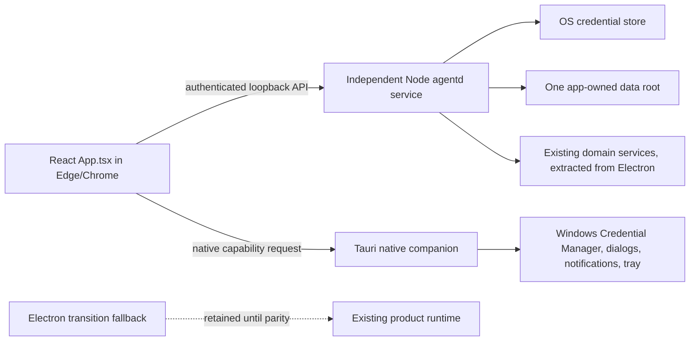

# Full Tauri Migration Plan

Status: active follow-up to the Tauri native-boundary pilot
Branch: `codex/tauri-full-migration`
Updated: 2026-09-18

Primary release platform: Windows. Every new native boundary must have a Windows implementation and CI/package evidence before it can be called production-ready; macOS smoke evidence is supplemental.

## Goal

Move the complete WA-copilot product to a lightweight browser UI backed by one local `agentd` service, while preserving every currently supported user workflow and its data. Windows users open the product in their normal browser (Edge/Chrome); no second desktop product UI is required.

Tauri is a small native companion only. It owns OS-only capabilities such as Windows Credential Manager access, file/folder pickers, notifications, tray/lifecycle and process supervision. It must not render or own the product workspace, business settings, channel workflows or a competing data writer. Keep Electron available as the stable transition fallback until browser + `agentd` parity, migration, security, platform and release gates pass.

“Complete” means the browser product UI and all backend features work through the authenticated local API, with native-only operations delegated to the Tauri companion or `agentd`; not merely that a Tauri window, picker and keychain demo build.

## Why the previous work stopped at a pilot

PR #9 was scoped as an opt-in native-boundary proof. Its execution plan explicitly left Electron as the supported/default runtime and deferred the product UI and service migration. The pilot validated that the existing React toolchain can open in Tauri, supervise a fixed Node sidecar, and access a small set of native facilities. It intentionally did not mount `App.tsx`, start channel integrations, or read Electron data.

That caution was warranted: the preload contains 139 Electron IPC call sites; the renderer has 258 direct `window.electron` references; and Electron APIs are spread across service modules under `src/main`. The pilot sidecar only implements `health.get` and `shutdown`. A separate loopback HTTP `agentd` exists at `agentd/server.cjs` with pairing, control, event intake, and its own database. A window-only migration would therefore remove most product behavior and risk creating two competing service/data owners.

This follow-up changes the scope from “prove the native boundary” to “migrate the product with parity gates.” PR #9 remains a clearly labeled pilot; this work is tracked separately on `codex/tauri-full-migration`.

## Target architecture

The browser remains the only product UI. `agentd` owns product/business services, durable state and background credentials. Tauri/Rust exposes only explicit native capabilities and may run headless/tray-first; it does not mount `App.tsx` or proxy arbitrary HTTP. The browser never receives the daemon bearer secret or secret values. Closing the browser or native companion does not stop `agentd`; explicit Stop Agent controls processing, and service installation/removal follows the OS user-service lifecycle.

Transition note: the branch still compiles a few typed Tauri→`agentd` product commands used by earlier migration smoke tests. They are not reachable from `NativeHostDiagnostics` and must be removed after the authenticated browser API adapters replace those seams; keeping them temporarily avoids breaking persisted data/credential tests during the migration.

Canonical product protocol decision: use the existing `agentd/server.cjs` loopback HTTP service as the browser's typed product API, with explicit versioned routes, bounded/schema-validated payloads and an authenticated browser session. Tauri calls the same service only from native commands and never becomes a generic renderer proxy. Bind only to `127.0.0.1`; reject every request whose Host is not the exact actual listener host/port. Never log pairing codes. Publish only a private, owner-readable runtime descriptor containing origin, PID, protocol version, startup time and non-secret runtime identity. Expose the short-lived pairing code only through an explicit local-owner command, expire it and rate-limit failures. Keep `src/agentd/index.ts` stdio JSONL as pilot-only and do not grow it into a second product runtime. Before merging product services, consolidate executable/lifecycle, auth/session, schema migrations and data paths so there is one installed `agentd` service and one writer. Preserve route compatibility only where safe; do not preserve insecure behavior.

## Non-negotiable migration rules

1. Electron `dev`/`build` and the current production path remain unchanged until browser + `agentd` passes every gate.
2. Migrate one vertical slice at a time. Each slice retains the Electron adapter and receives host-neutral contract tests before Tauri wiring.
3. Preserve the behavior contract in `docs/app-behavior.md`, including safety controls, defaults, failures, event ordering, and draft/send boundaries.
4. Do not return success-shaped stubs for missing Tauri operations. Unsupported behavior is explicit and must not be presented as a completed feature.
5. Renderer access is through a typed, allowlisted bridge. No generic shell/process/SQL/filesystem RPC and no renderer-selected executable or arbitrary command.
6. Product credentials are stored and used only by `agentd` through its OS credential adapter; the Tauri companion's isolated slots are not the product secret store. The browser may submit a secret for storage and request presence/deletion through authenticated API routes, but never retrieves it. Secrets never move through general settings, logs, URLs, localStorage or persisted renderer state. Migration is a tested protected handoff or explicit reauthentication; no plaintext fallback.
7. Data import is opt-in, backed up, versioned, validated, idempotent, and rollback-capable. Electron and Tauri never write the same live data files concurrently.
8. External integrations remain disabled by default in tests. Channel/network tests use fake providers or fixtures; real account pairing and sends require separate approval.
9. Measure whole-process resource use, including Node and local-model children. Do not claim savings from WebView measurements alone.
10. Do not remove Electron until all parity and release gates are evidenced on supported platforms.

## Current execution tasks

### Task 1 — authenticated browser/agentd settings slice

Connect the browser product UI to the existing independently running `agentd` service for runtime status, LLM preferences, credential set/presence/delete and server-side connection tests for OpenAI and OpenRouter. The exact first-slice settings schema is `preferredProvider: "auto" | "openai" | "openrouter"`, `openaiModel` (non-empty string, at most 128 characters), and `openrouterModel` (same bounds); defaults are `auto`, `gpt-4o-mini`, and `anthropic/claude-3-haiku`. Do not accept extra keys. Persist and return only this exact schema at `GET/PUT /api/v1/settings/llm`. These two providers prove the full vertical path; other providers, custom OpenAI-compatible URLs and the rest of Settings remain later parity slices and must not appear as supported here. Keep `agentd` outside browser/Tauri window lifecycles; do not start a second pilot JSONL runtime. Resolve its private runtime descriptor only inside the native companion, validate protocol version, loopback origin, file size and platform permissions, and never return the bearer secret to React. Use fixed allowlisted API routes, bounded request/response sizes and timeouts, no redirects or proxy, and never return secrets to the browser. Provider probes are `POST /api/v1/providers/{openai|openrouter}/test`, use only fixed provider endpoints and retrieve the corresponding key inside `agentd`; they accept no arbitrary URL or key value from the renderer. A probe response returns only success/model count or a generic safe error. Native file/folder selection remains a Tauri capability; browser settings use authenticated `agentd` routes. Leave Electron behavior unchanged until browser bridge parity is evidenced.

Acceptance: Rust tests reject malformed or non-loopback descriptors; daemon API tests prove settings writes are schema-allowlisted, credential set/presence/delete never return secret values and provider probes use the stored key only against fixed endpoints; browser requests use authenticated session/CSRF routes; Tauri commands use only typed fixed native routes; renderer typecheck, browser build, Rust tests and focused daemon tests pass. A smoke test against an isolated daemon verifies status, preference persistence and credential/probe lifecycle using fake keychain and provider adapters.

Browser runbook: build the web bundle, start the independently supervised `agentd` with `AICA_AGENTD_UI_ROOT` pointing at that bundle, read the owner-only code with `npm run agentd:pair-code`, and open the daemon's `tauri.html` URL in Edge or Chrome. The browser pairing form never persists the code; the daemon owns the HttpOnly session and all durable product state.

## Work plan and acceptance gates

### Phase 0 — inventory and baseline (complete)

- Map the preload API, main handlers, direct Electron renderer references, startup/lifecycle services, data files, and current behavior contract.
- Select the loopback HTTP server as the canonical product API foundation; keep the pilot stdio process separate until the pilot is retired.
- Record baseline build/test failures separately from migration regressions.
- Produce a domain-by-domain parity checklist and determine supported OS/architecture targets.

Exit gate: reviewed inventory; canonical runtime/protocol/data ownership decision; no unresolved destructive data assumptions. The decision is recorded above and in `docs/omnichannel-langgraph-architecture.md`.

### Phase 1 — secure runtime foundation and backend-first proof

- Harden `agentd/server.cjs` before expanding the API: exact Host validation; no pairing code or bearer secrets in logs; a short-lived owner-readable pairing handoff; attempt throttling; an atomic private runtime descriptor; restart-safe exclusive ownership; and tests for forged Host, lock races, restart, permissions, and cleanup.
- Run one independently supervised per-user `agentd` service; the Tauri window connects to it and does not own its lifetime. Tauri obtains origin/session only through the native host bridge, never from renderer storage.
- Extract host-neutral service composition from `src/main/index.ts`; remove Electron imports from the headless product runtime rather than loading Electron under plain Node.
- Add injectable adapters for app-data paths, OS credentials, dialogs/open-external, logging, and event publication. The product runtime—not either renderer—must be able to use credentials for background providers and channels.
- Expand the loopback HTTP server into a versioned, typed product API with validated payloads, bounded requests, explicit authentication, and typed event subscriptions. Test authorization, origin/CSRF boundaries where applicable, daemon restart, crash recovery, and one-writer ownership.
- Preserve the existing Electron preload/IPC adapter while the Tauri adapter is added.
- Implement the first authenticated Settings/credential vertical slice with a fake keychain adapter in tests, then verify the production OS-store adapter on each target. Credentials are set/present/deleted and provider tests run inside `agentd`; no getter returns secret material to React.
- Before broader channel work, extract one draft-only WhatsApp workflow into the daemon and prove durable draft recovery through the authenticated browser client. This is a backend gate, not a reason to grow a second Tauri product UI.

Exit gate: the daemon installs/starts independently of Electron and UI lifetime; the credential/settings slice fails closed without OS storage; draft-only WhatsApp processing survives client and daemon restart; no unsafe pairing/logging/Host/lock behavior; exactly one service owns each writable store. Then migrate the remaining `App.tsx` workflows in vertical slices.

### Phase 2 — low-risk vertical slices

After the backend-first draft-only proof, migrate and verify in this order, reordering only with recorded dependency evidence:

1. Runtime metadata, dependency gate, logs, external links, Settings/preferences and credential set/presence/delete through authenticated `agentd`; provider tests execute server-side and safe migration status is visible. Provider/channel secret reads and use stay inside `agentd`.
2. Session creation, chat persistence, per-session isolation, local files/attachments, workspace selection, and streaming progress.
3. LLM provider/model selection and chat generation/stream/cancel; then knowledge/RAG, persona, memory inspection and export/migration.
4. MCP lifecycle/tool events after credential and filesystem/process policies are enforced in `agentd`.
5. Email IMAP/SMTP, OAuth, draft/edit/approve/send, inbound gating, and delivery status.
6. WhatsApp transports/auth, connection/message/escalation events, safe mode, and resolution audit; prove restart-safe draft-only execution before any live send.
7. Autonomy controls, recovery/retention, notifications, decision evidence, retries/quarantine, approved templates, and delivery safety.
8. Speech model support/download/audio/result events for each OS WebView.
9. Browser automation, system integration, command palette actions, appearance, About, and remaining polish.

Each slice exit gate: shared contract tests pass; Electron behavior remains unchanged; browser contract and integration tests pass; relevant no-credential end-to-end scenario passes; native-only operations have explicit Tauri capability coverage; user-facing errors and events match the behavior contract; UI reviewer confirms the workflow.

### Phase 3 — data and credentials continuity

- Inventory every Electron user-data file and schema, including settings, secure store, chat history, drafts, knowledge indexes, memory, WhatsApp auth, autonomy state/audit DBs, browser profiles, logs, and downloaded speech/model files.
- Implement a user-confirmed migration preview with source/target/version/size, free-space and integrity checks, encrypted backup, per-store import result, and rollback.
- Move non-secret data through validated, versioned importers. Rebuild derived indexes when safe instead of copying stale native artifacts.
- Migrate credentials only via a protected one-time handoff or guide reauthentication. Verify secrets are absent from logs and temp files and that failure leaves the Electron source untouched.
- Prevent simultaneous runtimes from owning live channels or writable databases; show an actionable conflict state.

Exit gate: fixture migration tests cover clean import, repeat import, partial failure, corruption, rollback, and interrupted process. A separate manual test confirms existing user data can be recovered without exposing secret values.

### Phase 4 — native platform and release parity

- Verify dialogs and granted file access, keychain, clipboard/drag-drop, notifications, microphone/speech, tray, close/reopen, autostart (if retained), updater (if retained), and explicit shutdown on each supported OS.
- Add Windows and Linux packaging/build/test lanes alongside macOS; resolve target-specific Node/native dependency packaging.
- Configure production signing/notarization and install/upgrade/uninstall behavior.
- Benchmark startup and whole-process RSS/CPU/GPU/VRAM with UI open/closed and local model loaded/unloaded; compare against Electron on the same host.

Exit gate: all supported OS install/upgrade tests and native flows pass; signed release artifacts verify; resource measurements meet agreed budgets.

### Phase 5 — default switch and Electron retirement

- Keep both paths during a release-candidate period. Gate Tauri default behind an explicit setting/feature flag until support evidence is complete.
- Verify update, recovery, downgrade, and user-data rollback from a real test profile.
- Only then change the default/release pipeline. Remove Electron after a separately reviewed deprecation period and user-data retention plan.

Exit gate: every checklist item below is evidenced; no Critical/Important review finding remains; a rollback build is available.

## Behavior parity checklist

The detailed behavioral expectations remain in `docs/app-behavior.md`. This checklist tracks runtime-specific evidence:

| Domain | Required before Tauri default | Status |
|---|---|---|
| Startup, dependency gate, navigation, sessions, command palette | Full product app; dependency missing/resolved/recheck/skip states; sidebar/settings shell; create/switch sessions during running work without cross-writing; Cmd/Ctrl+K commands | Not started |
| Command Center | Metrics; WhatsApp connect/toggle; document/image upload; grounded RAG test drive; topic analysis; controlled failures | Not started |
| Chat, attachments, workspace/files, voice | Enter/Shift+Enter; submit; immediate user message; streamed assistant/tool progress and cancellation; attachment persistence; workspace parent selection; transcript; offline/native speech where supported | In progress — browser text chat now streams authenticated agentd SSE deltas and cancellation aborts provider work; bounded text/image attachments and durable workspace metadata are migrated; full file semantics and voice remain open |
| Settings, credentials, logs, About/system info | Preference persistence; authenticated `agentd` secret set/delete/existence and server-side use (no renderer getter); fail-closed UX; log path/open; version/platform/engine; no secret leakage | In progress — browser preferences, credential presence/write/delete, redacted audit storage/export, browser download, and browser-native About labeling are migrated; native file reveal and full logs/About parity remain |
| Brain, RAG, memory, persona | Ingest/list/search/open/delete; test-drive grounded only in retrieved context; backend setting persistence; stats/inspection/export/migration; persona save/reload | In progress — browser persona, bounded text knowledge ingest/list/search/delete, grounded search, accuracy logs/stats, and agentd memory stats/search/entity tools/export are migrated; binary conversion, open-file semantics, memory migration/backend switching remain |
| Lead Directory | WhatsApp and email sessions with contact identifiers appear; selecting a row activates the matching session | In progress — browser/agentd chat sessions now persist bounded channel, contact and thread metadata across reload/restart; inbound channel adapters and full directory parity remain open |
| LLM and MCP | Provider/model discovery; connect/tool call/cancel; safe errors and event cleanup | In progress — browser generation streaming/cancel is migrated; arbitrary MCP management/tool execution remains an explicit browser-unavailable gate, with Electron retained unchanged |
| Email and OAuth | App-password and Google modes; test starts/stops; enable/Auto-Reply/Draft Mode gates; sensitive topics never auto-send; medium confidence held as draft; one safe low-confidence acknowledgement plus durable escalated draft; failed acknowledgement/direct-send fallback; edit/approve/reject/reply-thread send; delivery events | In progress — browser/agentd persists bounded non-secret mailbox configuration and write-only app-password credentials without renderer storage; IMAP/SMTP runtime, OAuth, inbound gating and draft/send workflow remain open |
| WhatsApp and Web connector | QR/verify/manage/disconnect and auth continuity; inbound ignored when both gates off; self-messages ignored; disconnect/error disables Response Permission; unsupported customer media rejected; exactly one courtesy message after 60s; escalation/admin notice; successful resolution logged; 10-minute inactivity follow-up only after assistant last message; takeover/monitoring | Not started |
| Autonomy | Start/pause/resume/recovery, drafts/approval, retries/quarantine/cancel, metrics/evidence/notifications | Not started |
| Native host and packaging | Windows-first OS lifecycle, tray, dialogs, clipboard, speech, `agentd` OS-keychain adapter, signing, install/upgrade, measured resources | Pilot only; Windows gates remain |
| Data continuity | Preview, backup/import, reauth, idempotency, corruption handling, rollback, one writer | Not started |

## Existing pilot evidence (not parity evidence)

PR #9's pilot tests, Tauri web build, Rust build, sidecar health, pickers, and limited macOS smoke remain useful evidence for the native boundary. They do not validate the product UI, its service API, channel behavior, data continuity, or cross-platform release. The exact pilot evidence and its known gaps remain in `docs/architecture/tauri-hybrid-ui-pilot.md` and `docs/architecture/tauri-hybrid-ui-execution-plan.md`.

## Current audit findings

- `src/renderer/src/tauri-main.tsx` mounts `App.tsx` when opened as a normal browser page and `NativeHostDiagnostics` only inside a real Tauri runtime. The Tauri surface is native diagnostics/capabilities, not the product workspace.
- `src/agentd/index.ts` only implements protocol health and shutdown; it remains pilot-only.
- `agentd/server.cjs` is the selected product API foundation with pairing, pause/resume, event intake, and `agentd.db`; it is not started by Electron boot and does not yet host product services or migrated user data.
- Electron startup/service registration lives in `src/main/index.ts` and `src/main/ipc/**`; service modules import Electron directly, and many singletons are created before app readiness.
- Data and secret state span Electron app-data databases, electron-store files, OS encrypted storage, auth directories, model files, and browser profiles. Separate Tauri namespaces currently mean an explicit import/reauth path is mandatory.
- `window.electron` is referenced directly by renderer code beyond `src/renderer/src/lib/electron.ts`; remove those usages only as their typed adapters are migrated.
- Existing business-logic tests are valuable, but current product E2E launches Electron only. Browser product E2E, authenticated pairing/session coverage and Windows native-capability tests are required; Tauri does not need duplicate product-UI E2E.
- Windows is the primary user platform, but the current branch has no Windows build/installer lane yet. The Windows path must implement process identity validation (the current non-Unix fallback fails closed), validate Credential Manager access, exercise `.exe` resource resolution, and run signed NSIS install/upgrade smoke tests before Tauri can be the default.
- The repository now exposes `npm run build:tauri:win` for the Windows CI/runner lane. It intentionally requires a native Windows host/toolchain; the macOS developer machine cannot produce or sign the release artifact.

### Credential-store implementation note

The Tauri host pins Rust `keyring` 4.2 with its `v1` API. Its documentation describes OS-backed entries for macOS Keychain, Windows Credential Manager, and Unix Secret Service ([keyring 4.2 docs](https://docs.rs/keyring/4.2.0/keyring/v1/)). The packaged daemon now reaches those stores through the fixed, bundled `aica-keyring-helper` over bounded stdin/stdout; credentials remain allowlisted and write-only to the renderer. The original `atom/node-keytar` repository is archived ([upstream status](https://github.com/atom/node-keytar/releases)), so it is not used. Cross-platform Secret Service/Credential Manager behavior, signed packaging, migration continuity, and release verification remain open gates.

## Execution record

- 2026-09-15: Follow-up branch created from the open pilot branch. Inventory and parity audits completed. No product parity changes are merged yet; implementation proceeds slice-by-slice under the gates above.
- 2026-09-16: First runtime-security slice is implemented locally: private runtime/pairing files, owner pairing-code command, exact Host rejection, pairing lockout, and SQLite-backed exclusive daemon ownership. Focused tests pass; service extraction, daemon keychain adapter, UI migration and product parity remain open.
- 2026-09-17: Re-evaluated after merging `origin/codex/autonomy-evaluation-and-metrics` at `715f06a9`. The upstream Electron security/autonomy hardening is preserved. Follow-up checks added process-start identity validation and bounded loopback timeouts, closed browser-extension ingress and model-archive traversal gaps, and handled malformed model-server URLs. Full unit/integration tests and macOS Tauri app/DMG builds pass; the migration remains a partial Settings/credentials pilot. Full project typecheck still has the pre-existing ignored `AntigravityAuthService` import failure, and non-English Vosk entries still lack integrity metadata required by the hardened downloader.
- 2026-09-17: Added and reviewed three bounded migration slices without changing Electron behavior: (1) authenticated, restart-safe WhatsApp draft-only ingestion with atomic deduplication, pause admission, conditional status transitions, and recursive at-rest payload redaction; (2) an allowlisted migration manifest/preview/import utility with backup, rollback, real SQLite integrity checks, no-follow operations, and 10 focused tests; and (3) authenticated, restart-safe `agentd` chat session/message persistence with idempotent message IDs, bounded sessions, and a typed Tauri host bridge plus explicit daemon-unavailable UI state. Focused daemon tests pass (11/11), migration tests pass (10/10), renderer typecheck and Tauri web build pass, and Rust check/tests pass (13 total). The migration utility is not yet a release gate: a fresh review retains a P0 pathname TOCTOU limitation on platforms without descriptor-relative `openat`/`renameat`, a P1 Windows no-follow support gap, and a contract decision still needed for scalar-value secret screening. Chat generation/provider streaming, Electron data parity, the full `App.tsx` mount, and OS service/release/resource gates remain open.
- 2026-09-17: Added bounded provider generation and WhatsApp settings slices. `agentd` now performs authenticated, fixed-endpoint, non-streaming OpenAI/OpenRouter chat generation with durable request/message state; Rust/Tauri commands and typed renderer clients are covered by focused tests. The normal Tauri shell now exposes daemon-backed session load/create/send, LLM preferences, provider credentials, WhatsApp transport settings, and write-only Cloud credentials with per-secret presence and visible partial-failure feedback. Electron remains unchanged and remains the full production path. Focused agentd/renderer/Rust checks and the Tauri web build pass. Remaining gates include runtime-neutral chat persistence, true stream/cancel semantics, complete product feature adapters, migration security blockers, cross-platform packaging, resource benchmarks, and product-level manual UX verification.
- 2026-09-17: Added runtime-neutral daemon chat persistence and deletion. The adapter currently exercises the same routes from the Tauri diagnostics host; browser API transport and full product parity remain open. Added fixed-resource packaged `agentd` supervision: the Tauri companion starts a target-matched Node runtime with the HTTP server, native keyring helper and better-sqlite3 binding from bundled resources, passes one app-data directory to both processes and terminates the child on host exit. Fixed bundle entrypoint selection (`mainBinaryName`/Cargo `default-run`) so fresh macOS artifacts launch the actual native host rather than the helper binary. Focused packaging/chat/Rust checks pass; a fresh macOS bundle starts `agentd`, reaches Ready, creates a real daemon-backed session and safely restores an unsent draft when provider generation fails. Full product parity is still open: browser API transport/pairing, generation is complete-response only, renderer cancellation does not cancel provider work, email, MCP, RAG, memory, speech, autonomy, attachments, full WhatsApp flows, data migration gates, cross-platform signing and resource benchmarks remain outstanding.
- 2026-09-17: Windows-first hardening started. The Rust host now has a Windows process-token ownership check and `GetProcessTimes` PID-reuse protection via `windows-sys`; the previous non-Unix fail-closed branch would have made every Windows packaged daemon appear unavailable. This compiles on the macOS host; a real Windows runner, Credential Manager smoke, `.exe` resource check, and signed NSIS install/upgrade evidence are still required before release.
- 2026-09-17: Windows-first verification continued. Windows resource staging now preserves `.exe` names, the packaged host retains the Windows system/profile environment after clearing inherited variables, descriptor reads use reparse-point protection, and direct daemon fallback paths prefer `%LOCALAPPDATA%`/`%APPDATA%` over Unix state paths. The macOS release bundle was rebuilt with `CFBundleExecutable=aica-tauri-pilot`; a fresh native smoke created a daemon-backed chat session, persisted exactly one user message, and restored the draft after the expected no-credential generation failure. The plain browser shell now fails closed with `HOST UNAVAILABLE`/`DAEMON REQUIRED` messaging and no console errors when Tauri is absent. Unit tests (234/234), integration tests (195 passed, 8 skipped), agentd/credential tests, renderer typecheck, packaging tests (3/3), Rust check/tests, and `git diff --check` pass. Windows cross-compilation remains a CI/host gate because this macOS machine lacks the Windows SDK/MSVC headers; full product parity and signed Windows packaging remain open.
- 2026-09-17: Browser-first boundary clarified. A normal browser load of `tauri.html` mounts the React product workspace; a real Tauri webview mounts only `NativeHostDiagnostics` native capabilities. The former `?workspace=1` escape hatch was removed so Tauri cannot become a second product UI. Browser API pairing/session/CSRF, full browser workflow parity, Windows native-capability validation, data migration, signing and resource benchmarks remain open.
- 2026-09-18: Enforced the boundary in the UI: browser `tauri.html` mounts `App.tsx`; Tauri mounts only `NativeHostDiagnostics` with daemon health, owner-selected file/folder pickers and write-free credential-presence checks. Removed the old Tauri product settings/chat preview and renamed the native window/menu to AICA Native Host. Browser smoke shows the full workspace with no console errors; renderer typecheck, focused bridge/storage/error tests (12/12), web build, Rust check/tests and diff checks pass. A fresh native dev launch was attempted but hit the host's disk limit while recompiling; an installed older bundle with the same bundle identifier prevented a clean packaged-window re-smoke. Windows native build/Credential Manager and browser authenticated API parity remain release gates.
- 2026-09-18: Added the first authenticated browser adapter. Browser `tauri.html` now checks local `agentd` health, requires one-time six-digit pairing, keeps the CSRF token in memory, relies on an HttpOnly session cookie, and mounts `App.tsx` only after pairing. Chat sessions/messages/generation and WhatsApp cloud settings/credential presence/set/delete use typed browser HTTP routes; browser chat no longer falls back to Electron persistence or localStorage. Static `agentd` UI serving now returns executable JavaScript/CSS MIME types and root navigation falls back to the Vite `tauri.html` entry. Focused browser/daemon/renderer checks pass (26 tests across static asset MIME, browser pairing/CSRF/chat, Tauri client/storage/bridge and packaging); an isolated agentd-served browser smoke paired successfully, opened the full workspace, created a durable chat session, and showed the expected no-provider error without console errors. Full feature adapters, true streaming/cancel, Windows native/Credential Manager validation, data continuity, signing and resource gates remain open.
- 2026-09-18: Packaged resources now include the browser bundle under `ui/`; the native host passes that directory to `agentd` when present, so the companion can advertise a real Edge/Chrome workspace URL instead of owning a second product UI. A fresh native bundle was not rebuilt on this host because only ~434 MiB disk remained after the web build; packaging/resource-map tests and Rust checks pass.
- 2026-09-18: Closed the first browser-chat race and reload gap found in real-user smoke testing. `useAgent` now ensures the daemon session and user message exist before generation, so a fresh browser chat no longer reaches `Session not found`; browser generations use the authenticated daemon path instead of the Electron-bound `AgentRuntime`. Added an authenticated session endpoint to rehydrate the short-lived CSRF token after reload, sharing it only in memory across Vite chunks. Browser LLM settings now load the exact daemon schema, expose only OpenAI/OpenRouter in this slice, write credentials through agentd, test stored credentials without reading them back, and hide unsupported provider cards rather than showing browser mocks. Renderer typecheck, daemon/bridge tests, web build, and a fake-provider Edge/Chrome smoke (pair, generate, reload, generate, stored-provider test) pass. Full feature parity and Windows/release gates remain open.
- 2026-09-18: Migrated browser Bot Identity persistence to the same authenticated agentd authority. Persona reads/writes are validated, CSRF-protected, durable in `agent_state`, and no longer emit Electron IPC errors in a normal browser session. Browser smoke edited and reloaded the persona successfully with no current-origin console errors. Bounded browser text/image attachments and durable workspace metadata now use the same agentd chat routes; full file semantics, streaming/cancel, voice, logs/About/system info, RAG/memory, MCP, email/OAuth, full WhatsApp, autonomy, continuity tooling and Windows/release gates remain open.
- 2026-09-18: Migrated browser product preferences and audit logging to authenticated agentd routes. Theme, speech preferences, browser automation preferences, memory backend selection and safe-mode state now use an allowlisted durable schema instead of browser `localStorage`/Electron storage; audit entries are redacted and persisted in the daemon database, with browser download export replacing File Explorer-only access. Renderer typecheck, daemon/client tests and redaction coverage pass. Full memory/RAG, speech engine, automation execution, logs/About parity, channel parity and Windows/release gates remain open.
- 2026-09-18: Removed browser autonomy mocks for the existing draft-only daemon slice. Browser `AutonomyPanel` now reads authenticated agentd status, pause/resume controls, durable WhatsApp drafts and safe approval transitions; direct-send mode remains disabled until a provider-backed outbox is migrated. Electron autonomy behavior is unchanged. Focused browser-client/typecheck coverage passes; full channel/autonomy parity and Windows/release gates remain open.
- 2026-09-18: Migrated the first browser Knowledge/Intelligence slice. Agentd now owns bounded text document persistence, list/search/delete, accuracy logs/stats and restart-safe SQLite state; the browser Knowledge view uses its native file input for supported text formats and the browser `rag_search`/`rag_get_stats`/`rag_save_correction` paths use agentd instead of Electron or empty mocks. Binary document conversion, original-file opening, memory, and full RAG parity remain open. Renderer typecheck, unit tests, daemon knowledge tests, and browser build pass.
- 2026-09-18: Migrated the bounded browser memory slice. Agentd now owns an authenticated SQLite graph for entity/relation create/update/delete/search, stats and bounded export; browser memory MCP calls, stats, test-write and inspector export no longer use Electron IPC or empty mocks. Native database path opening and legacy backend migration/switching remain desktop/release gates. Renderer typecheck, browser client tests and daemon memory contract tests pass.
- 2026-09-18: Closed the remaining browser dashboard upload gap for the migrated knowledge slice. The Command Center/Train AI card now uses a browser multi-file picker and the same authenticated agentd ingestion route for supported text formats, while binary files fail with an explicit capability message; Electron's native multi-file conversion path remains unchanged.
- 2026-09-18: Browser Knowledge Test Drive now generates its grounded answer through an ephemeral authenticated agentd chat session instead of trying to read Electron credentials or direct provider APIs from the page. The session is deleted after the answer, while Electron keeps its existing provider path.
- 2026-09-18: Reaffirmed and regression-tested the Windows runtime boundary: Edge/Chrome owns the complete product workspace, while a real Tauri runtime renders only native-host diagnostics/onboarding and narrow OS capability controls. No query parameter or browser flag may turn Tauri into a second product UI; Electron remains the transition fallback until browser/agentd parity and Windows release gates pass.
- 2026-09-18: Closed the browser chat streaming/cancellation gap. Authenticated browser generations now request bounded provider SSE, forward validated assistant deltas, render those deltas incrementally in the browser transcript, persist the completed assistant message only after a clean done event, and expose a CSRF-protected cancellation route that aborts provider work and permits safe retry. Browser cancellation removes any transient partial bubble and no longer renders a spurious error; Electron behavior remains unchanged. An isolated agentd-served browser smoke paired in Edge-compatible in-app browser, rendered `streamed answer` in the chat transcript, and recorded no console errors.
- 2026-09-18: Removed remaining success-shaped browser MCP mocks. Browser arbitrary MCP connect/disconnect/list/call operations now fail explicitly until an authenticated agentd MCP adapter exists; migrated memory/knowledge routes remain available and Electron behavior is unchanged.
- 2026-09-18: Migrated browser chat session channel continuity. `agentd` chat sessions now persist bounded status/channel/contact/thread metadata with backward-compatible SQLite columns and validated browser create payloads; browser hydration maps the metadata back into Lead Directory-compatible session fields across daemon restart. Inbound WhatsApp/email adapters and full Lead Directory parity remain open.
- 2026-09-18: Corrected browser About copy so the product no longer claims Electron when opened in Edge/Chrome; it now identifies the React/browser workspace, local `agentd`, and Tauri native companion while preserving Electron labeling for the transition client.
- 2026-09-18: Moved browser Email channel configuration into authenticated `agentd` state. Browser settings no longer use renderer `localStorage` for mailbox configuration; app-password writes use the daemon credential route and no read-back is exposed. Browser Email transport now fails explicitly instead of probing Electron IPC until the daemon IMAP/SMTP/OAuth adapter is migrated; Electron behavior is unchanged.
