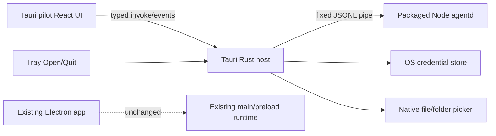

# Tauri hybrid UI execution plan (historical pilot)

Date: September 14, 2026

Status: Historical pilot record. The current browser-first migration is tracked in [`tauri-full-migration-plan.md`](./tauri-full-migration-plan.md) and supersedes this document's UI ownership wording and runnable task commands. Use the current package scripts (`dev:tauri`, `build:tauri:web`, `build:tauri`, `prepare:tauri:agentd`) when validating this branch.

Current boundary: the complete product workspace is rendered in Edge/Chrome. Tauri is retained only as a lightweight native companion for OS capabilities and agentd supervision; it must not become a second product UI.

## Outcome

The original pilot added an opt-in Tauri 2 shell beside the existing Electron application. Its checkpoint proved that the React toolchain could run in an operating-system WebView, that a packaged Node `agentd` process could remain alive while the WebView was destroyed and recreated, and that native capabilities could be exposed without returning credentials to the renderer. Those findings remain useful, but the pilot shell is not the product UI.

Electron remains the transition fallback until the browser and `agentd` reach parity. No existing channel, model, MCP, RAG, persistence or autonomous-send behavior may be removed or redirected without an equivalent browser/API slice and migration evidence. Tauri is native-only, not a competing default UI.

## Baseline

- Branch starts from PR #8 commit `6659d2f3`.
- Node requirement is `>=22.12.0`; `.nvmrc` selects `22.12.0`.
- Current host uses Node `24.7.0`, npm `11.5.1`, Rust `1.94.1` and Cargo `1.94.1`.
- Tauri host requires Rust `>=1.88.0` because locked `keyring` 4.2.0 requires that MSRV.
- `npm ci` succeeds with the existing lockfile.
- Historical baseline: existing `npm run typecheck` failed before this work because `src/main/ipc/antigravity.ts` imported a missing `AntigravityAuthService`; the migration branch now restores that Electron-only fallback with environment-provided credentials and fail-closed defaults.
- Existing `npm test` can remain idle for more than two minutes without reporting results on this checkout. Focused tests and bounded runs are required; these baseline failures must not be attributed to Tauri changes.

## Global constraints

1. Existing Electron scripts and runtime behavior remain unchanged and available.
2. Tauri is opt-in through new scripts; no package or release command silently switches formats.
3. Tauri uses the existing React, Vite, Tailwind and TypeScript toolchain. No second frontend framework or copied product UI.
4. Rust owns native capabilities and process supervision. Renderer cannot execute arbitrary processes, shell commands, filesystem paths or generic RPC methods.
5. Node sidecar executable and entrypoint are fixed by the host. Renderer cannot select either.
6. Sidecar stdout is newline-delimited JSON protocol only. Diagnostics use stderr and never contain credential values.
7. Protocol version is `1`. Frames are bounded to 1 MiB. Unknown versions, methods, message kinds and malformed frames fail closed.
8. Initial methods are `health.get` and `shutdown`; new methods require explicit typed additions on both sides.
9. Credential keys are allowlisted. Renderer can set, replace, check existence and delete; it cannot retrieve stored values. No plaintext or `localStorage` fallback is allowed.
10. Main-window close destroys the WebView and leaves Tauri core plus `agentd` alive. Tray Open creates at most one main window. Explicit Quit stops the owned child and exits.
11. Tauri capability scope is limited to the `main` window. JavaScript receives no shell-plugin execute permission.
12. Packaged assets use a restrictive CSP. Development may use a separate CSP limited to local Vite HMR. Electron's `sandbox: false`, `webSecurity: false`, certificate bypasses and broad permission grants are not copied.
13. Tauri uses a separate application identifier and data/credential namespace during the pilot. It does not read or migrate live Electron data.
14. No sender, OAuth flow, provider token, live channel, MCP process, autonomous worker or existing database is activated by the pilot.
15. New non-trivial protocol/security behavior has focused runnable tests. Existing baseline failures stay documented and separate.

## Architecture checkpoint

The original Tauri pilot was intentionally separate from the full `App.tsx` entry. The current migration has a different boundary: a normal browser load pairs with local `agentd` and mounts `App.tsx`; a real Tauri runtime mounts only native diagnostics/onboarding. Product screens move through authenticated `agentd` adapters, not into a Tauri WebView.

## Task 1: Secure runtime boundary

Files:

- `src/shared/native-bridge.ts`
- `src/renderer/src/lib/electron.ts`
- `tests/unit/native-bridge-security.test.ts`

Work:

1. Define shared runtime and credential-key types plus a minimal `NativeBridge` contract for health, file selection and set/exists/delete credential operations.
2. Preserve Electron detection and behavior.
3. Remove the browser implementation that writes or reads `secure_*` values in `localStorage`.
4. Browser secure operations return explicit unsupported/fail-closed results. They never report success.
5. Keep ordinary non-secret browser preference storage unchanged; it is not credential storage.
6. Add source-level regression tests proving no secure fallback reads/writes `localStorage` and existing Electron delegation remains present.

Acceptance:

- Focused test passes.
- Renderer typecheck passes or only reports documented pre-existing errors.
- Existing Electron secure IPC contract is unchanged.

## Task 2: Typed `agentd` protocol and real subprocess

Files:

- `src/shared/agentd-protocol.ts`
- `src/agentd/index.ts`
- `tsconfig.agentd.json`
- `tests/integration/agentd-protocol.test.ts`

Work:

1. Define closed TypeScript request, response, event and health types for protocol version `1`.
2. Parse one JSON object per line with a 1 MiB maximum and validate envelope, request ID and method before dispatch.
3. Implement `health.get` and idempotent `shutdown` using Node standard-library streams only.
4. Emit one `ready` event after startup. Keep stdout protocol-only and send diagnostics to stderr.
5. Exit on stdin EOF so host death does not leave the initial worker orphaned.
6. Test by spawning the compiled real Node process. Cover ready/health, malformed JSON, unsupported version, unknown method, oversized frame, shutdown and EOF.

Acceptance:

- The retired JSONL pilot protocol is not a current build target; use `npm run test:integration` for maintained integration coverage.
- Focused subprocess test passes without Electron mocks.
- Node entry import graph has no `electron` or `electron-store` dependency.

## Task 3: Sidecar preparation and Tauri host

Files:

- `scripts/prepare-tauri-agentd.mjs`
- `src-tauri/Cargo.toml`
- `src-tauri/build.rs`
- `src-tauri/tauri.conf.json`
- `src-tauri/capabilities/main.json`
- `src-tauri/src/main.rs`
- `.gitignore`

Work:

1. Add locked Tauri 2, shell, dialog and keyring dependencies.
2. Prepare target-specific sidecar assets by compiling `agentd`, copying the current Node executable to Tauri's required target-triple filename, and copying the compiled entrypoint into read-only resources. Generated binaries/resources remain ignored.
3. Rust starts exactly one fixed sidecar with the fixed entry resource and app-selected pilot data directory.
4. Consume protocol messages, validate ready/health state, retain the child handle and expose a typed health snapshot command.
5. Add allowlisted keychain set/exists/delete commands. Empty values, unknown keys and unavailable stores fail closed. Never add a getter command.
6. Add native file and folder picker commands.
7. Create tray Open/Quit actions. Window close destroys the main WebView; Open recreates/focuses one window; Quit requests child shutdown, then terminates it within a bounded grace period.
8. Scope capabilities to `main`; do not grant JavaScript sidecar execution.
9. Add focused Rust unit tests for key allowlisting, protocol-state transitions and duplicate-window/lifecycle decision helpers where practical without a desktop session.
10. Generate a valid ignored 512×512 RGBA placeholder icon at build time for Tauri codegen and macOS bundling; replace it with approved artwork before release.

Acceptance:

- `cargo fmt --check` and `cargo test --manifest-path src-tauri/Cargo.toml` pass.
- `cargo check --manifest-path src-tauri/Cargo.toml` passes.
- Generated sidecar artifacts are untracked.
- No generic shell, process or filesystem invoke command exists.

## Task 4: Tauri pilot UI and scripts

Files:

- `vite.tauri.config.ts`
- `src/renderer/tauri.html`
- `src/renderer/src/tauri-main.tsx`
- `src/renderer/src/NativeHostDiagnostics.tsx`
- `src/renderer/src/lib/tauri-native-bridge.ts`
- `package.json`
- `package-lock.json`

Work:

1. Add opt-in `dev:tauri`, `build:tauri`, `build:tauri:web` and agentd-preparation scripts. Existing Electron script meanings stay identical.
2. Add a normal Vite build using the existing React plugin, renderer alias and stylesheet.
3. Implement the shared bridge with fixed Tauri commands and validated event handling. Handle asynchronous listener cleanup safely.
4. Add a small pilot screen showing runtime/version and live `agentd` health, native file/folder selection, and credential set/exists/delete controls. Clear typed credential input immediately after a completed set attempt.
5. Do not mount `App.tsx`, channel hooks, MCP initialization, model providers or legacy settings stores.
6. Display unsupported/missing native operations as errors, never fake success.

Acceptance:

- `npm run build:tauri:web` and `npm run typecheck:renderer` pass.
- UI code contains no secret getter and does not persist credential values.
- Existing `npm run build` remains available; the historical missing Antigravity service is now restored as an environment-configured, fail-closed Electron fallback.

## Task 5: Integrated verification and operator notes

Files:

- `docs/architecture/tauri-hybrid-ui-execution-plan.md`
- `docs/architecture/tauri-hybrid-ui-pilot.md`

Work:

1. Run all new focused tests, Rust checks and Tauri web/sidecar builds.
2. Run existing lint, typechecks and a bounded existing test suite; distinguish new regressions from baseline failures.
3. Build the Tauri application on the current host. Record whether it is an unsigned development artifact and list generated artifact paths.
4. Manually launch the development or packaged application when the environment permits. Verify sidecar ready, credential lifecycle, picker invocation, WebView close/reopen with stable worker PID, and explicit quit cleanup.
5. Document exact setup/run commands, pilot limits and remaining parity gates.

Acceptance:

- No Critical or Important review finding remains.
- Git diff contains no generated Node executable, target directory, credential, database or user-data artifact.
- Electron remains the default `dev`/`build` path.
- Branch is committed and pushed only after review and verification.

## Execution record — September 15, 2026

- Tasks 1–4 are implemented on `codex/tauri-hybrid-ui`; Electron remains the default path. Independent review found no Critical, Important, or Moderate findings. A custom Tauri file-picker button label now fails explicitly because the pinned native dialog API does not expose that option; Electron behavior is unchanged.
- `npm run test:unit` passed (133 tests), `npm run test:integration` passed (185 tests), `npm run typecheck:renderer`, `npm run build:tauri:web`, and `npm run lint` passed. Lint reports existing repository warnings; the historical baseline typecheck blocker is resolved on the migration branch.
- Sidecar preparation passed for the current `aarch64-apple-darwin` host and rejected an intentionally mismatched `x86_64-apple-darwin` target. Generated runtime and sidecar files remain ignored.
- `package-lock.json` now contains only the missing platform-filtered Tauri CLI optional bindings in addition to the existing lock graph. A clean `npm ci --ignore-scripts --no-audit --no-fund` installed 1,189 packages on Darwin arm64; `npm exec -- tauri --version` reports 2.11.4 and `tauri build --help` works.
- `cargo fmt --check`, `cargo check --locked`, and `cargo test --locked` pass for the Rust host (6 tests, including unsupported picker-label behavior). The first bundle attempt exposed the invalid 1×1 placeholder; after adding a valid 512×512 RGBA icon generator, `npm run build:tauri` succeeded on the current Apple Silicon host. It produced `/tmp/wa-copilot-tauri-host/src-tauri/target/release/bundle/macos/AICA Native Pilot.app` and `/tmp/wa-copilot-tauri-host/src-tauri/target/release/bundle/dmg/AICA Native Pilot_1.0.0_aarch64.dmg`. The DMG checksum verified, and the app contains the packaged Node runtime and `sidecar/agentd` resources. Its code signature is ad-hoc only, not a Developer ID distribution signature.
- Manual smoke tests: both release app and `npm run dev:tauri` opened in the macOS WebView and reported Tauri v1.0.0 and agentd Ready. File and folder pickers opened and canceled cleanly. Closing the release window left the host and sidecar alive. A dev-watch rebuild loop from rewriting the generated icon was fixed by making generation content-idempotent. Desktop automation could not reach the menu-bar tray control, so tray Open/Quit and keychain operations remain unverified; test processes were terminated afterward. Do not interpret these limited smoke tests as full native runtime validation.
- No branch push is recorded as part of this execution. Production signing, artwork, parity and whole-process resource benchmarks remain future gates listed below.

## Later parity work, not hidden in this checkpoint

1. Extract durable draft-only LangGraph execution from `AutonomousSupervisor` without importing Electron, then expose it through typed `agentd` methods.
2. Move settings and provider actions so renderer stores credential existence only; never return API or OAuth tokens.
3. Move RAG, memory, MCP, email, WhatsApp, webhook, browser-automation and model services one vertical slice at a time.
4. Add explicit Electron-data backup/import and reauthentication; never let both process trees write the same databases.
5. Add native notifications, autostart and signed updater only with user controls and release signing.
6. Validate microphone/speech behavior under WebKit/WebView2/WebKitGTK without weakening CSP or web security.
7. Run native macOS, Windows and Linux install/upgrade tests, then whole-process RSS/CPU/GPU/VRAM benchmarks with UI open/closed and local model loaded/unloaded.
8. Retire Electron only after functional parity, single-owner migration, signing and resource gates pass.
