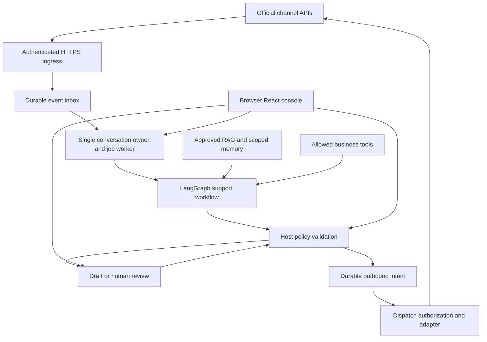

# WA-copilot: Omnichannel support architecture and delivery plan

Date: September 9, 2026

Cost and architecture rationale reviewed: September 13, 2026. See sections 2 and 10 for alternatives, operating assumptions and pricing sources.

Status: Selected target architecture. The current branch implements a bounded single-business desktop pilot; this document is not evidence that its deferred hosted, live-provider, legal, or operational gates are complete.

Decision: Make `agentd`, an independently managed plain Node service, the authoritative local runtime. The supported product UI is the existing React console in the user's Windows browser (Edge/Chrome) over an authenticated loopback API. Tauri is a lightweight native companion for OS-only capabilities; it does not render the product workspace or own business workflows. Electron remains an optional transition client until browser + `agentd` feature and data parity are proven. This supersedes the earlier browser-only/Tauri-deferred and Tauri-desktop-first wording without changing `agentd` ownership, safety model or backend-first extraction order. Keep LangGraph, RAG and channel workflows; extract lifecycle and a typed API before changing workflows.

### Desktop delivery amendment — September 15, 2026

Use Tauri only as a native companion because this product needs selected-file access, Windows Credential Manager integration, notifications, tray/lifecycle and speech/device capabilities while avoiding Electron's bundled Chromium runtime. Tauri is a native adapter, not a product UI or business-service runtime: `agentd` remains sole owner of product services, channel execution, durable state and credentials. The browser mounts `App.tsx`; the Tauri window, when shown, is diagnostics/onboarding for native capabilities only. Do not describe migration as complete until browser parity and migration gates in `docs/architecture/tauri-full-migration-plan.md` pass.

The final product serves React assets through the authenticated local browser console backed by `agentd`. Tauri may be installed as a small tray/native helper and connects to the same daemon through narrow typed commands. Do not expose the daemon bearer secret to either renderer. Native actions use narrow Tauri commands; business actions use authenticated browser API routes. Keep browser UI light, and benchmark browser + Tauri helper + `agentd` + model process tree against the Electron baseline.

### Browser UI ownership invariant

For Windows users, Edge or Chrome is the only product workspace. The URL served by `agentd` is the supported entry point for chat, settings, channels, knowledge, memory, approvals and diagnostics. A real Tauri process may show a compact native-host status surface (or run tray-first/headless), but it must not mount `App.tsx`, expose product navigation, or provide a second chat/settings workspace. The native host is limited to OS capabilities such as Credential Manager/keychain presence checks, owner-selected file/folder dialogs, notifications, tray/lifecycle and process supervision.

This is a hard routing rule, not a deployment preference:

- normal browser runtime → `BrowserProduct` → authenticated `agentd` HTTP API;
- real Tauri runtime → `NativeHostDiagnostics` → narrow native commands only;
- Electron → transition/fallback client until the browser and `agentd` pass feature, data, Windows and release gates.

No query parameter, local-storage flag or browser detection may switch a Tauri window into the product workspace. If a browser workflow needs a native capability, the page requests the specific capability through the authenticated daemon/native boundary and receives only the bounded result; business state remains owned by `agentd`.

This document is the target architecture for this work. `architecture.md`, `email-integration.md`, and `docs/autonomous-agent.md` describe earlier designs or partial implementation and must not be treated as evidence that the requirements below already work.

## 1. Product objective and boundaries

Build an owner-controlled support agent that can answer customers using approved business knowledge, execute narrowly authorized business operations, and hand conversations to a human. The owner uses the local console to configure channels, inspect conversations, review drafts, monitor costs, and pause automation.

The product is a business support system. A customer message is not permission to control the owner's computer, access another customer's data, launch advertising, or change a budget.

### Initial scope

- Inbound support, structured response decisions, evidence-backed answers, persistent drafts, and human takeover.
- One shared workflow and policy service across channels, with provider-specific rules.
- Local execution first, with a deployable hosted worker for owners requiring operation while their computer is off.
- Customer and conversation isolation, durable event processing, explicit sending permissions, auditable actions, and recoverable failures.
- Read-only ad attribution and lead ingestion before any advertising-management functionality.

### Version 1 deployment decision

V1 targets a single-business, single-owner installation. `agentd` owns SQLite, credential access, model connectors, queues, LangGraph, policy/outbox and channel adapters. Run it independently through an OS user-service manager (launchd on macOS, an equivalent supervised user service on Windows/Linux), not as an Electron or browser child whose lifetime follows the UI. A per-install runtime lock and persisted lease prevent a second sender. Explicit Stop Agent stops processing; Pause All immediately revokes dispatch permission. Closing a browser or quitting an optional client does neither. Device sleep, shutdown or loss of connectivity still prevents responses; user-service availability across logout is platform-dependent and must be tested.

Run `agentd` independently under the OS user-service manager and expose a versioned, typed API plus browser console on IPv4 loopback. Publish its ephemeral origin through a private owner-readable runtime descriptor containing no credentials. The browser uses pairing/session/CSRF controls below; Tauri uses narrow native commands only, including an explicit owner-triggered pairing-code reveal for the browser handoff. Extract and harden service lifecycle, API and host dependencies first; prove a restart-safe draft-only WhatsApp path through a minimal authenticated browser client before migrating additional workflows.

Current product behavior remains Electron-backed: `src/main/index.ts` initializes autonomous services in `app.whenReady()` and stops them in `before-quit`. The current branch mounts `App.tsx` in a normal browser page only after local `agentd` pairing; the first authenticated browser adapter covers chat persistence/generation and WhatsApp cloud settings/credential presence. Workflow parity is not complete. Tauri remains a native-boundary diagnostics surface only. The independently supervised product daemon and browser integration are not yet complete; the public relay below is also a required implementation gate, not a shipped feature.

### Runtime and client trust boundaries

- `agentd` is the only business-service, database and credential authority. Generate a cryptographically random per-install bearer secret, store it in the OS keychain and fail closed if that store is unavailable. Tauri and any optional Electron transition client use only narrow authenticated commands; neither opens competing database writers. Tauri native OS operations remain narrow, explicit UI capabilities and must not become a second business-service runtime.
- Do not expose the long-lived bearer secret to either renderer. The Tauri host uses a narrow authenticated client bridge; it must not expose a generic HTTP proxy or secret-bearing API to React. If browser access is enabled, bootstrap it with a short-lived, single-use pairing code displayed by a local owner command/helper and submitted by POST. After local verification, issue a short-lived HttpOnly, SameSite=Strict session cookie and a session-bound CSRF token kept in memory. Never put bearer/provider credentials or pairing codes in URLs, browser storage or logs. Rate-limit pairing, expire unused codes and revoke sessions on secret rotation.
- Bind exactly to IPv4 loopback, validate Host against the actual bound address/port, and allow only the exact console Origin (including its ephemeral port). No wildcard CORS, null-origin allowance or arbitrary localhost origins. Check Origin and CSRF on every browser mutation; reject cross-site reads and authenticate sensitive reads. Handle safe initial document navigation separately from protected API access.
- Require JSON content types, bounded bodies, schema validation, deadlines and rate limits. Validate Origin/authentication on any streaming or WebSocket upgrade; use no GET mutations. Set CSP and frame-ancestors restrictions, avoid remote scripts, and prevent secret-bearing responses from being cached. Browser local-network permission prompts are additional browser behavior, not our authorization mechanism.
- Retain explicit adapters for OS keychain, owner-selected file import and notifications. A picker grants only that chosen file operation; never accept arbitrary filesystem paths or unrestricted shell/browser execution from React. If a browser lacks a native capability, display it as unavailable or use the installed narrow helper.
- Test forged Host, unauthorized API/stream access, secret redaction, daemon restart and client exit while draft work continues before enabling product workflows. Browser product access must also test cross-origin requests, CSRF and expired/replayed pairing.

Electron's Chromium process tree and lifecycle explain the coupling, but a browser also consumes resources. Removing Electron is not evidence of a model-capacity gain. [Electron process model](https://www.electronjs.org/docs/latest/tutorial/process-model), [Electron performance](https://www.electronjs.org/docs/latest/tutorial/performance), [Chrome Local Network Access](https://developer.chrome.com/blog/local-network-access).

### Capacity decision and measurement gate

Measure the same target hardware, model/version/quantization, context size, prompt set and power mode for all four states. Repeat warm runs and report median/p95 plus idle and peak values. Compare optional Electron and browser clients against the same daemon.

| UI | Model | Required evidence |
| --- | --- | --- |
| Closed | Unloaded | Daemon and helper idle/peak whole-process-tree RSS, CPU and GPU/VRAM |
| Open | Unloaded | Above plus browser/Electron process-tree cost and UI responsiveness |
| Closed | Loaded | Above plus model time-to-first-token, total inference time and queued-message latency |
| Open | Loaded | Same measurements at concurrency 1 and 2; check model/UI contention |

Include independently running model-server processes, renderer/GPU/helper processes and relay-client overhead. Record whole-browser totals and the pre-existing browser baseline separately; summing RSS can double-count shared pages, so retain per-process figures and OS memory-pressure/swap evidence. Node `process.memoryUsage().rss` is only one component. On unified-memory hardware, do not add GPU allocations to RAM as though they were separate pools.

Provisional acceptance budget: reserve at least 25% of physical RAM and 20% of dedicated VRAM, require no sustained swap growth, idle runtime CPU below 5% of one core, and no more than 10% p95 inference degradation with UI open. Start with one active model generation; enable concurrency two only if peak memory fits and p95 end-to-end draft latency remains within the existing 30-second job budget. These are proposed thresholds, not measured results. If a target cannot pass, choose a smaller supported model or cloud inference rather than asserting that shell removal solves it. Record actual hardware/results before retiring Electron on capacity grounds.

Customer-owned Meta, Instagram, Messenger, WhatsApp and X accounts must use the customer connection flow in `docs/customer-connection-onboarding.md`. OAuth and guided asset selection replace developer-only environment-variable setup; provider credentials remain outside the renderer and are stored in the OS secure store for the desktop pilot or an encrypted hosted vault for multi-customer operation.

### Deferred capabilities

- Autonomous ad creation, spend changes, audience changes, public posting, and bulk outreach.
- Automatic cross-channel customer identity matching from names or model guesses.
- WhatsApp Web autonomous outbound automation; the repository includes an optional restricted browser-extension/manual-takeover inbound pilot, while live session validation and autonomous outbound control remain deferred.
- A mandatory Chatwoot deployment, mandatory LangSmith subscription, vector database, or distributed queue.
- Multi-tenant hosted SaaS in the first deployment. Include business/account IDs in contracts now, but do not claim tenant isolation is proven until tested.

## 2. Why this approach

We are building a reusable support product for business owners, not just buying an inbox for one business. Keeping our local owner console, RAG and memory gives us control over the owner experience, approved knowledge and business tools. The economic case is lower incremental platform cost as customers grow, provided shared engineering and customer-support costs remain manageable. It is not a claim that custom software is the cheapest way to serve the first customer.

LangGraph is justified by our explicit requirements for persistent review, interruption and recovery. LangChain supplies selected integrations; it does not lower model token prices. Official APIs reduce our dependence on undocumented browser/session behavior, but introduce provider approvals, policy changes and usage charges. Our advantage must come from useful business workflows and reliable owner control, not merely from generating WhatsApp answers.

LangChain components provide model and tool integration. LangGraph supplies workflow checkpoints and human-review interrupts; a durable checkpointer is required for restart recovery. It does not provide the inbox, WhatsApp transport, consent ledger, or exactly-once external effects. On resume, interrupted nodes may execute again, so irreversible operations must not be placed before an interrupt without their own deduplication controls. [LangGraph persistence](https://docs.langchain.com/oss/javascript/langgraph/persistence), [interrupt semantics](https://docs.langchain.com/oss/javascript/langgraph/interrupts).

The JavaScript projects are MIT licensed; using their libraries does not require purchasing the hosted platform. Audit the actual selected package licenses and pin versions during implementation. [LangGraph license](https://github.com/langchain-ai/langgraphjs/blob/main/LICENSE), [LangChain license](https://github.com/langchain-ai/langchainjs/blob/main/LICENSE).

| Alternative | Reason it is not our default | When to reconsider |
| --- | --- | --- |
| Fully custom workflow engine | More checkpoint, approval and recovery logic to own | If the product is reduced to a short deterministic responder |
| Chatwoot plus our agent | Adds an inbox and server stack overlapping our current UI | Multiple human agents need assignment, shared inboxes and support operations |
| Managed support platform | Recurring platform costs and less control over local workflows | Speed of deploying one business is more valuable than product ownership |
| Native Meta Business AI | Useful benchmark, but does not establish support for our custom local tools and model selection | An owner's needs are limited to basic native business answers |
| Baileys/browser automation | Unofficial transport and extra session-maintenance burden | Explicit experimental local deployments |

Chatwoot remains a valid future adapter: its AgentBot API supports external agents and handoff. Community software is free; paid self-hosted plans and operational dependencies are separate. [AgentBot](https://www.chatwoot.com/features/chatbots), [self-hosted plans](https://www.chatwoot.com/pricing/self-hosted-plans).

Keep this decision conditional: use a managed platform if the goal becomes launching one conventional support inbox quickly; add Chatwoot when team assignment and shared ownership become central; simplify the graph if review/resume requirements disappear. Reassess using cost per resolved conversation and operator time, not library license price alone. Section 10 compares these choices financially.

## 3. Channel scope and access requirements

The WhatsApp Cloud API only serves WhatsApp. Instagram, Messenger, advertising and X require separate adapters, permissions, subscriptions and account capabilities. A common workflow does not eliminate those boundaries.

| Integration | Initial behavior | Prerequisites to verify in implementation | Boundaries |
| --- | --- | --- | --- |
| WhatsApp Cloud API | Receive support messages, reply, consume delivery events, handle templates | Business account/number setup, token scope, webhook setup, applicable review and verification | Apply response window, opt-out and template rules at dispatch |
| WhatsApp Coexistence | Keep eligible Business App use alongside API; detect owner replies from app echoes | Number/account eligibility and onboarding route | Never assume every existing number qualifies |
| Email | Reuse Gmail OAuth/API and supported existing mailbox integration | Mailbox authorization, scopes, verification obligations, provider quotas | Preserve threading; prevent auto-response loops |
| Instagram | Professional-account DMs, human takeover and supported message events | Selected Instagram Login or Facebook Login route, permissions and review | Do not assume personal-account support or universal feature parity |
| Facebook Messenger | Page support conversations and supported events | Page access, messaging permissions, subscriptions and review | Its own policy eligibility and reply rules |
| Meta ads | Ingest lead-form submissions and available click-to-message referral metadata | Ad/Page asset access, lead access and appropriate permissions | A lead is not automatically a message or cross-channel consent |
| X | Authorized support DMs first; mentions/public replies as a later capability | Developer access, OAuth scopes, endpoint availability and budget | Public replies default to review; separate usage accounting |

Meta's official Instagram collection describes the account/login options. Verify the exact scopes against the chosen route rather than combining requirements from different login flows. [Instagram API](https://www.postman.com/meta/instagram/documentation/6yqw8pt/instagram-api).

Coexistence app-message echoes provide a useful input for human takeover; they must be correlated to the actual customer conversation and separated from our own API sends. [Coexistence events](https://docs.360dialog.com/docs/hub/embedded-signup/whatsapp-coexistence/coexistence-webhooks).

Gmail supports mailbox change notifications through Pub/Sub. Notifications trigger incremental synchronization; they are not a replacement for fetching messages. Renew watches and maintain reconciliation so missed notifications do not silently lose mail. Existing polling can remain the first implementation. [Gmail push notifications](https://developers.google.com/workspace/gmail/api/guides/push).

Meta's Messenger overview and lead-retrieval documentation did not load through the research tool during this assessment. Permission lists, review requirements and current policy details for those two adapters are implementation verification gates, not verified claims in this document. Official starting points: [Messenger](https://developers.facebook.com/docs/messenger-platform/overview), [lead retrieval](https://developers.facebook.com/docs/marketing-api/guides/lead-ads/retrieving/), [Meta lead-webhook sample](https://github.com/fbsamples/lead-ads-webhook-sample).

### Ads are a source, not a messaging transport

An ad click may start a WhatsApp, Instagram or Messenger conversation. That conversation belongs to its messaging adapter; attach any available referral/ad identifiers as attribution. A submitted lead form is a distinct lead event. Store its source and the exact consent evidence before making an outreach decision. Neither event authorizes changing an ad campaign.

## 4. Architecture and deployment

### Component ownership

| Component | Owns | Must not own |
| --- | --- | --- |
| Browser React console | Product UI, operator inputs, draft editing through authenticated `agentd` API | Runtime lifecycle ownership, workflow decisions, raw secrets or arbitrary native access |
| Tauri native companion / Electron transition client | Explicit native OS capabilities or temporary compatibility access | Product workspace, workflow decisions, raw secrets, generic API proxying or a competing data writer |
| Local agent service (`agentd`) | Business services, LangGraph lifecycle, authenticated API, pause controls, durable work, credentials and worker health | A second parallel customer-response pipeline or unrestricted OS access |
| Shared Node runtime | LangGraph workflow, channel-independent decisions | Renderer globals or direct UI-store dependencies |
| Channel adapter | Provider authentication, normalization, sending and delivery mapping | Model-chosen destinations or business policy overrides |
| Inbox/job store | Deduplication, ordering, leases, retry scheduling | Treating a checkpoint as proof of external delivery |
| Policy service/outbox | Final sending permission, approvals, dispatch state | Letting model output grant authority |
| Knowledge/memory services | Business evidence, provenance, scoped conversation context | Unreviewed ingestion of customer instructions into business knowledge |

### Deployment A: owner-machine worker

Run the plain Node service independently of UI lifetime, with durable local storage and OS supervision. Extract Electron-specific paths, credentials, events and native operations behind injected host adapters. Explicit daemon shutdown drains/cancels work and records recovery state; client disconnect never calls shutdown.

Official webhooks require public HTTPS. Select one minimal Node HTTPS relay with SQLite on a persistent single-host deployment before the real Cloud API pilot. The current localhost listeners are test adapters only. The relay is a required dependency of phase 2, not an optional post-pilot enhancement.

Verify provider signatures against raw request bytes, map the account to its enrolled business and commit the event to durable storage before returning success. Return a retryable failure if persistence fails. Deduplicate by provider/account/event ID. `agentd` initiates authenticated outbound HTTPS long-poll requests, commits received events locally before acknowledging them to the relay, and tolerates replay if either acknowledgment is lost. The relay holds no agent workflow or send credentials and never generates or dispatches customer replies.

Use per-install scoped relay credentials, TLS, encrypted payload storage and redacted logs. Default queued payload TTL to 24 hours; expire rather than process overdue payloads, retain a minimal expiry audit, and notify the owner of lost availability. Delete payloads after durable local acknowledgment; expire encrypted backup copies under a documented seven-day backup policy. Bound bytes/events per business, surface oldest-event age and storage exhaustion, and recheck response windows after recovery. A single relay host is not high availability. Test signature failure, duplicate delivery, crash before/after commit, lost acknowledgments, offline agent, expiry and backup restore before live ingress.

The relay handles customer event data. Document its retention and encryption; do not market this configuration as zero-cloud processing. Provider and selected LLM data flows remain additional boundaries. If the machine is offline, the implemented relay must retain the event only until its TTL and report that no response was generated; the relay does not become an autonomous agent.

### Deployment B: hosted worker

Deploy the same Node runtime with HTTPS ingress on an always-on host. Remote administration requires its own authenticated control plane; never expose the loopback console directly. Cloud execution requires approved knowledge and credentials accessible to that host; local-only tools remain unavailable when the desktop is offline. Do not silently reroute those tools or upload all local files.

Only one runtime may own a conversation at a time. Switching local/hosted execution requires a persisted ownership generation or lease and a controlled transfer. Never have both runtimes send for the same job. A single small server is an initial deployment, not high availability.

## 5. Workflow and contracts

Use a bounded graph rather than an unrestricted tool loop:

1. Load the normalized event and current conversation ownership.
2. Apply early exclusions: duplicate, own echo, group/broadcast event, opt-out, unsupported content or disabled automation.
3. Load scoped conversation context and retrieve approved business evidence.
4. Run only authorized business lookups needed to answer the request.
5. Generate a schema-validated decision, with bounded tokens, calls and time.
6. Validate evidence and policy on the host.
7. Persist a draft, escalate with context, or create an outbound intent.
8. Dispatch through the final authorization gate and record provider outcomes.

Control events are processed outside the generation queue and take effect immediately. Opt-out, human takeover, owner permission revocation, emergency pause, credential revocation and provider delivery updates must update authoritative state without waiting behind a customer response job. The final dispatch gate reads that state again.

For rapid customer messages, increment a conversation revision on every relevant inbound event. A decision records the revision it used. Before approval or dispatch, compare the decision revision with the current revision. A stale decision is superseded or regenerated; it is never sent silently. A short debounce may combine rapid messages into one response turn, but each covered inbound event remains linked to the resulting decision.

### Normalized inbound event

Required fields: schema version, business ID, channel, channel-account ID, provider event/message IDs, event kind, conversation ID, sender identity, actor classification, provider timestamp, receipt timestamp, content type, sanitized content and raw-event reference.

Optional fields: reply-to ID, attachment references, provider thread ID, referral/ad identifiers, consent evidence and delivery status. Identity keys include business and account scope. Do not merge an Instagram handle and WhatsApp number merely because their display names match.

### Structured decision

Required fields:

- `responseText` or null; `disposition`: draft, reply, escalate or no-reply.
- `confidence`: model estimate, explicitly not a calibrated probability.
- `groundingStatus`: supported, insufficient, conflicting or not-applicable.
- `evidence`: source IDs, source versions and relevant supporting passages.
- `sensitiveTopic`: none, account-security, financial-action, legal, health, personal-data or other.
- `escalationRequired`, stable reason code and concise operator explanation.
- Proposed business actions, separately validated against authorization.

Model output must not choose the destination, business ID, consent state or operator permissions. Reject malformed decisions. Set explicit content/length limits. A source's existence is not evidence that every generated claim is supported.

Use a stable graph thread key scoped to business, channel account and provider conversation. Persist each inbound job separately so new messages cannot accidentally resume an unrelated approval. Stamp every run with graph version, policy version, prompt version and conversation revision.

Use a persistent checkpointer supported by the pinned LangGraph version. MemorySaver is development-only; LangGraph identifies SQLite as a local file-based option and Postgres as the hosted option. The job store is authoritative for scheduling and terminal status. The checkpoint is authoritative only for graph position and graph state. The decision and approval are authoritative for the proposed response and review binding. The outbox is authoritative for whether a provider send may be attempted.

On recovery, reconcile those records by correlation ID: reuse a persisted decision, resume an incomplete graph, or quarantine an outbox with an ambiguous provider result. Never regenerate and send merely because a checkpoint is missing. Graph changes require workflow/schema versions, compatibility fixtures and a drain or migration policy for interrupted runs.

## 6. Modes, approvals and human ownership

| Control | Meaning |
| --- | --- |
| Autonomous Bot Mode | Whether the worker may run agent jobs |
| Observe-only | Record events and status; no customer sends or business mutations |
| Draft Mode | Generate decisions/drafts without customer sends |
| Auto-Reply | Eligible decisions may enter the outbox |
| Response Permission | Independent owner permission required to dispatch; selecting Auto-Reply does not enable it |
| Pause | Stop new execution and invalidate pending dispatch authorization |
| Stop | Stop runtime processing, preserve durable backlog and configuration |
| Pause All | Persist emergency pause; cancel active work where possible and block pending autonomous side effects |
| Human takeover | Persist human ownership of one conversation until explicit return to the bot |

Draft generation must work while response permission is disabled. Resume must actively schedule eligible backlog. A pause cannot recall a request already accepted by a provider; show that boundary clearly.

A stop or pause invalidates unclaimed dispatch authorizations and cancels model/tool work where cancellation is supported. Consent, takeover, permission changes and emergency pause do not wait behind a generation job.

Approval records bind operator identity, conversation, decision version, exact content hash, destination and expiry. Editing a draft invalidates the old approval. Recheck ownership, newest customer message, consent, policy window and emergency state immediately before dispatch, even after approval.

Detect explicit takeover and provider owner-message events. Match known API message IDs before classifying outgoing echoes as human activity. Any unrecognized owner reply should conservatively suspend the affected customer conversation, not the owner's own chat.

## 7. Storage, ordering and delivery guarantees

Extend or consolidate existing persistence deliberately. Avoid separate contradictory records in UI storage, graph checkpoints and JSON state. For a single local worker, reuse SQLite with migrations, transactions, WAL and tested backups; select hosted storage based on actual concurrency requirements.

Autonomous conversations use host-owned incremental writes. The renderer must not replace an entire session snapshot after a background worker has advanced it. UI saves require a version check or append-only event command. Existing full-replace session persistence remains a migration risk until this contract is implemented.

| Durable record | Key information |
| --- | --- |
| Channel accounts | Business, provider identity, capability flags, credential reference and health |
| Inbound events | Unique business/account/provider event key, payload reference, processing status |
| Conversations | Provider identity, owner, mode, latest inbound timestamp, consent and policy version |
| Jobs | Event, sequence, status, attempts, next attempt time, lease and last failure |
| Graph checkpoints | Thread state and pending interrupts; no raw API secrets |
| Decisions and approvals | Versioned response, evidence, classification, approval binding |
| Outbound intents | Unique response slot per inbound event, destination, payload hash, attempt and provider IDs |
| Delivery events | Provider status, timestamps and correlation; append without inventing delivered status |
| Audit and usage | Actor, action, result, correlation IDs, tokens and estimated/actual charges |

Authenticate and validate incoming webhooks, persist them, then acknowledge promptly. Process asynchronously. Provider retries must not create duplicate jobs. Preserve receipt order per conversation; retain provider timestamps for context and explicitly flag late events. Do not promise reconstruction of a perfect global order across providers.

### At-most-once outbound response

Persist the unique outbound intent before any network send. Claim it atomically. Use provider idempotency only where documented and verified. A crash or timeout after the network request can mean the provider accepted the message even though we lack its ID.

For an ambiguous result, mark `delivery_unknown`, reconcile when the provider supports it, and otherwise require operator investigation. Do not blindly retry. To preserve at-most-once behavior without provider idempotency, accept that an uncertain message might remain unsent. A database uniqueness constraint alone cannot guarantee exactly-once delivery across a network.

The at-most-once claim is scoped: one active dispatch authority, durable pre-send intent, no automatic retry after an ambiguous provider result, no restoration of an old backup into a sending state, and provider correlation where available. Restore always enters paused recovery mode. The operator must reconcile or quarantine all sending and delivery-unknown intents before resuming.

Retry generation and confirmed pre-send transient failures with capped exponential backoff and jitter. Respect provider retry headers. Persist schedules, cap attempts and wall time, and send exhausted jobs to review. Permanent authorization, policy and invalid-recipient errors require intervention. Hold later jobs in the same conversation until the earlier job is resolved or explicitly skipped.

## 8. Policy, privacy and machine control

Implement a channel capability/policy layer rather than applying WhatsApp rules everywhere. For WhatsApp, check the current service window and approved-template eligibility at dispatch; persist opt-outs immediately, including in observe mode. Lead submission is not unrestricted consent. Provide a visible AI support identity and a practical human contact path. Current WhatsApp policy permits automated service responses subject to its rules and escalation requirements. [WhatsApp messaging policy](https://business.whatsapp.com/policy).

Reuse the existing RAG and memory interfaces behind scoped wrappers. Customer attachments may inform that conversation, but only owner-approved ingestion may update authoritative business knowledge. Verify identity before returning account-specific information. Return-policy questions may be answered from evidence; executing refunds is a separate authorized action. Avoid blocking every occurrence of the word “refund.”

Consent is durable per channel account and customer, with source, timestamp, wording/version, scope and revocation time. An opt-out takes effect before any queued response and is not overridden by a later model decision. Lead-form consent, ad referral metadata and a customer-initiated support message are separate facts.

Keep credentials in OS-backed storage locally and a secrets facility on hosted deployments. Select minimum OAuth scopes, handle revocation and deletion, and document what reaches providers. Local inference does not make WhatsApp itself local. Do not enable hosted model fallback without an owner data-sharing choice.

Expose a separate owner-only MCP control surface: health, agent/queue/channel status, recent failures, pause/resume, eligible retry, reconnect and sanitized diagnostics. Browser surfacing and screenshot capture require explicit capability settings. No arbitrary shell, filesystem path access, browser evaluation or raw browser-control tool enters the customer graph.

Enforce authorization on the server for every tool. Validate schemas, rate-limit, time out, cancel where supported and audit results. Retry commands must reject sent or delivery-unknown jobs. Bind local transports narrowly; any remote control endpoint requires authenticated encrypted access. Diagnostic export must redact credentials and unnecessary message content.

## 9. UI and observability

Extend the existing inbox and autonomy panel with:

- Execution location, mode, independent response permission and emergency pause state.
- Per-channel status, permission/review blockers, last successful sync and reconnect control.
- Queue depth, oldest pending age, active jobs, paused conversations and last failure.
- Draft editing, evidence inspection, approval, rejection and human takeover.
- Provider delivery status, unknown-delivery warnings and incident history.
- Model/RAG/memory availability, worker heartbeat, disk capacity and local-tool/browser status.
- Daily/monthly spend, limits, channel breakdown and estimated cost per resolved conversation.

Use connection states that the provider can actually establish. WhatsApp can include disconnected, connecting, QR-required where applicable, connected, logged-out, blocked and error; Cloud API token failures must not be mislabeled as QR problems. Treat unseen provider states as unknown rather than guessing.

Record operational summaries, decisions and evidence references, not hidden model reasoning. Owner notifications are durable in-app events plus optional configured desktop/remote alerts. Notify on meaningful failures and escalations; deduplicate repeated outage notifications.

Define retention by record class before launch. A starting policy is 30 days for raw webhook payloads and diagnostics, 12 months for audit records, 90 days for graph checkpoints after terminal completion, and business-configurable retention for conversation content. Deletion must cover local databases, relay storage, hosted storage, exports and backups according to a documented backup expiry process. Restored backups must not silently reintroduce deleted data.

Define an escalation SLA and fallback contact path before enabling unattended operation; an alert that nobody can action is not a completed handoff.

## 10. Cost model and controls

### Definition of a resolved conversation

A resolution is an explicit owner-confirmed outcome for a scoped conversation at its current revision, with evidence that the support request was completed. Persist `resolved_agent` or `resolved_human`, revision, confirmation evidence and timestamp. Persist `escalated`, `closed_unresolved` and `open` separately; none is a resolution. A sent/read message, generated answer, silence or escalation never closes a conversation automatically. The current operator API records these outcomes; a dedicated outcome-review UI remains to be added.

Count each conversation once, not each inbound message or repeated confirmation. New inbound revisions invalidate the previous current-resolution classification until confirmed again. Historical messages receive no inferred resolution backfill. The existing pilot metric is an operational period ratio: all estimated model cost in the selected period divided by conversations currently resolved at a confirmation time in that period. Zero denominator returns null and displays N/A. Escalated inbound messages remain a separate message-level count. This ratio is not lifetime attributed cost per resolution: per-case cost allocation, resolution episodes and provider-reconciled charges are required before using it for pricing or customer profitability.

Monthly cash operating cost = hosting + model usage + channel usage + storage/backups + monitoring + optional provider fees. Monthly total ownership cost adds maintenance, onboarding/support and human-review labor, plus amortized remaining development. Advertising spend is a separate owner budget. USD estimates below exclude tax, hardware purchase and exchange-rate changes; labor is included only where explicitly calculated. These are planning examples, not measured production costs or a customer subscription price.

LangChain/LangGraph libraries have no usage subscription. LangSmith services are optional and separately priced. Direct Cloud API integration avoids adding a mandatory support-inbox subscription; any onboarding/intermediary fees must be checked for the selected route. [LangSmith pricing](https://www.langchain.com/pricing).

Meta's public pricing page checked September 13 lists service messages and utility messages responding to users as free within the customer-service window; other delivered template charges depend on category and recipient market. Outside the window, use an eligible approved template; a budget never grants permission to send. [WhatsApp pricing](https://business.whatsapp.com/products/platform-pricing).

Pricing verification limitation: reports of an October 2026 service-pricing change could not be confirmed against Meta's developer pricing pages, which did not load during this review. Do not treat free service replies as a permanent contract or use an unverified future rate. Before launch, obtain the effective rate card for the business/account, recipient markets and billing month. Retain a nonzero channel-cost sensitivity in the budget.

### Cost comparison of the approaches

Infrastructure ranges here are our planning allowances, not vendor quotes. They exclude AI/channel usage and labor unless stated. Feature coverage and billing units differ, so these rows are not equivalent product bundles.

| Approach | License/platform and infrastructure | Main benefit | Main cost or limitation | Decision for us |
| --- | --- | --- | --- | --- |
| Our app + LangGraph/LangChain + official APIs | Libraries $0; small hosted runtime/backups roughly $10–30/month under the narrow assumptions below | Reuses our product; model choice, review/resume and local knowledge; no mandatory inbox seat charge | We fund development, provider onboarding, recovery, security and customer support | Selected for building our product |
| Our app + custom workflow engine | Similar hosting and usage; no framework subscription | Fewer dependencies for a short deterministic flow | We own checkpoint compatibility and approval/resume machinery; removing LangGraph does not remove those requirements | Reconsider only with a smaller scope |
| Chatwoot + our agent | Community $0; reserve roughly $30–100/month for a small server/backups, then size from the selected release; optional paid support $19/human agent/month, billed annually | Team inbox, assignment and handoff already available | Another application, PostgreSQL and Redis to operate; AI and channel bills remain | Stronger fit when team support is required |
| respond.io | Growth $159/month equivalent ($1,908/year); Advanced $279/month equivalent ($3,348/year), billed annually | Managed inbox and AI workflows reduce infrastructure work | Contact/AI allowances, overages and provider charges; Advanced adds webhooks/custom channels; verify required channel coverage | Often better for one business needing a quick launch |
| Native Meta Business AI | No verified account-specific total in this review; obtain eligibility and a quote | Potentially least setup for basic native support | Our required local tools, model choice and cross-channel workflow are not established | Benchmark before building a basic FAQ-only offering |
| Baileys / WhatsApp Web + our agent | No official Cloud API bill on that transport; machine, inference and upkeep remain | Existing integration and local experimentation | Unofficial compatibility/session failures and outage/support effort are hard to forecast | Experimental, not the production cost-saving strategy |

Vendor evidence: [Chatwoot self-hosted pricing](https://www.chatwoot.com/pricing/self-hosted-plans), [Chatwoot deployment requirements](https://www.chatwoot.com/deploy), [respond.io pricing](https://respond.io/pricing). Chatwoot's deployment page currently lists 8 GB minimum, so the earlier $25–60 allowance is not a universal production budget. respond.io meters active contacts and AI credits, not our model-token unit; WhatsApp fees are extra. Do not add our full model bill to a managed plan if its included AI replaces those calls, or assume included AI is unlimited.

### What we actually pay for

| Cost item | Who incurs it | Budget treatment |
| --- | --- | --- |
| Model calls | Business directly with its own billing, or us with metered customer allocation | Sum input, output/thinking, retries, summaries, validation and tool-loop calls |
| RAG and attachments | Runtime operator | Existing local search avoids a mandatory vector-service subscription; embeddings, OCR, audio transcription, reindexing and storage may add usage |
| WhatsApp | Business's Meta billing account, plus any selected intermediary | Delivered billable messages by category/market; do not infer fees from inbound job count |
| Instagram / Messenger / lead events | Us and/or business according to provider arrangement | Verify access terms; budget webhook processing, media, review and token support even without a quoted message tariff |
| X | Holder of the developer app's billing account | Meter reads/events and writes separately; customer OAuth does not establish separate customer billing |
| Email | Mailbox owner and runtime operator | Existing mailbox subscription, any Pub/Sub/relay charges, attachments and synchronization; check account quotas |
| Hosting, backups and diagnostics | Us for managed deployment; owner for local resources | Include retention, restore testing, egress, domain and monitoring; avoid counting backups twice |
| Customer connection flow | Primarily our product team | OAuth apps, review submissions, secure credential handling, asset selection, reconnect support and any required external assessment |
| Human operation | Our team and customer | Maintenance, incident response, draft review, escalation handling and onboarding time |

Non-developer onboarding moves technical work from the customer to us; it does not eliminate it. The guided flow in `docs/customer-connection-onboarding.md` is a product investment. Record setup/support hours per business. No fixed assessment or approval fee is assumed without confirming the applicable provider requirements and obtaining a quote.

### Planning scenarios

Use an illustrative model rate of $0.75/million input tokens and $3.75/million billed output tokens, with 4,000 input and 500 output tokens per processed customer message. This is a cost assumption, not a selected model or guaranteed quality level. Count all calls, including validation and thinking tokens, when measuring actual usage. Current provider rates must be checked at model selection. [Google model pricing](https://ai.google.dev/gemini-api/docs/pricing).

The pricing page reviewed lists these Flash rates through December 31, 2026, and $1.50/$7.50 from January 1, 2027. Under unchanged token usage that doubles the model line; it does not double hosting or channel charges. Revalidate the exact model/version when purchasing. No model configuration is changed by this document.

Formula: model cost = (total input tokens × input rate + total billed output tokens × output rate) / 1,000,000. Here, one generation costs $0.004875. A message, a generation, an active contact and a resolved conversation are different units: a five-turn conversation would cost $0.024375 in generation alone under these assumptions.

| Monthly messages | Input tokens | Output tokens | Illustrative model cost | Small hosted runtime/backups estimate | Subtotal before channel fees and labor |
| --- | --- | --- | --- | --- | --- |
| 1,000 | 4 million | 0.5 million | $4.88 | $10–30 | $14.88–34.88 |
| 10,000 | 40 million | 5 million | $48.75 | $10–30 | $58.75–78.75 |
| 100,000 | 400 million | 50 million | $487.50 | Capacity test required | Not estimated |

These are low-complexity examples. The production budget must report low, base and high scenarios including classification, retrieval, validation, summaries, retries, attachments, checkpoint storage, relay, monitoring and human review. Record actual tokens and provider charges by conversation and disposition. A generated answer that escalates still has a model cost.

The $10–30 infrastructure range assumes one small instance calling a remote model, existing lightweight storage, modest retained text and basic backups. It excludes hosted GPU inference, high availability and multi-tenant production operations. As a price anchor, DigitalOcean lists a 2 GiB/1 vCPU instance at $12/month before backup and other additions; this is not evidence that our workload fits it. [Instance pricing](https://www.digitalocean.com/pricing/droplets).

### Low, base and high sensitivity: 10,000 processed messages/month

These are explicit workload assumptions, not observed percentiles. The multiplier represents aggregate tokens across all model calls relative to the one-pass example. Infrastructure includes the listed backup/storage/monitoring allowance; exclude it from any separate duplicate line item.

| Scenario | Model tokens versus baseline | Model cost | Infrastructure allowance | Cash subtotal before channels and labor |
| --- | --- | --- | --- | --- |
| Lean text pilot | 1× | $48.75 | $10–30 | $58.75–78.75 |
| Planning base: extra validation/summaries | 1.5× | $73.13 | $20–50 | $93.13–123.13 |
| Stress case: longer context and repeated calls | 3× | $146.25 | $50–100 | $196.25–246.25 |

Add actual channel charges, media/embedding usage and external business-tool fees to every row. The lean case is valid only when its limited work is sufficient for evaluated quality. At the listed January model rates, its model bill becomes $97.50 and cash subtotal $107.50–127.50.

For channel sensitivity, 10,000 billable deliveries at hypothetical rates of $0.005, $0.01 or $0.03 add $50, $100 or $300. These are test inputs, not WhatsApp rate quotes. Use actual billable deliveries after any confirmed allowances, not all inbound messages.

Local execution removes the hosted inference worker expense but may still require relay hosting, electricity and backups. A 20 W incremental continuous load consumes approximately 14.4 kWh over 30 days; a 100 W load consumes 72 kWh. Multiply by the owner's electricity rate. Local models add hardware, latency and concurrency considerations.

### X budget must be separate

X currently lists DM event reads at $0.010/resource and DM interaction creation at $0.015/request. Under the simple assumption of one billable inbound DM event plus one create request per interaction, 10,000 interactions cost approximately $250 before LLM usage and other events. Confirm actual endpoint semantics and account rates before enabling. Set a provider spending limit and an application cap. [X pricing](https://docs.x.com/x-api/getting-started/pricing).

The same page lists incoming DM webhook events at $0.010/event. Do not automatically count an inbound webhook and retrieval as two separately billed resources; reconcile the provider's deduplication rules and invoices. At the simplified $0.025 interaction rate, 1,000 X interactions add $25. If all 10,000 baseline interactions use X, the lean cash subtotal becomes $308.75–328.75 before labor and additional usage. X therefore needs an explicit allowance or usage pass-through, not an unlimited inclusion.

Do not assume Instagram/Messenger API use, email infrastructure, Pub/Sub, or Meta integration support has zero total cost. Verify provider terms, hosting and account subscriptions for the chosen setup. Do not put ad spend into the support-agent subscription estimate.

### Controls to ship

- Per-business/channel daily and monthly caps; reserve estimated cost before new model work.
- Bounded retrieval context, conversation summaries, output length and maximum tool/model calls.
- One sufficient model pass for simple answers; measured escalation to a stronger model when needed.
- Reuse an existing persisted decision after retry instead of regenerating without cause.
- Cache only appropriately scoped, versioned business evidence; never share personalized responses across customers.
- Limit X historical reads and reconciliation; measure billable events, not HTTP requests alone.
- Show estimates separately from provider-reconciled charges. Budget exhaustion holds drafts and notifies the owner; it must not silently switch providers.

For total ownership cost, add engineering hours × the team's actual hourly cost. Even a few hours of monthly transport repair can outweigh small subscription savings. Track support incidents and human handling time as operating costs.

### Labor, break-even and customer pricing

For an illustrative $70/month lean cash cost and $30/hour labor rate, 4 maintenance hours add $120: total $190/month before development, onboarding and review. If 500 drafts/escalations take two minutes each, they add 16.67 hours or $500 at that same assumed rate. Human review can dominate the token bill; measure it rather than hiding it in a claim of autonomous operation.

Against the $159 managed starting price, a $70 custom cash bill leaves $89, or roughly 3 hours/month at $30/hour, for **additional** custom maintenance before the apparent savings disappear. Against $279 it leaves about 7 hours. This is sensitivity arithmetic, not a like-for-like quote: match channels, contacts, AI allowances, review time and integration requirements first. Managed software also needs configuration and operators.

Remaining implementation is an upfront investment. Estimate it from unfinished work and measured delivery time, not money already spent. For illustration only, 200 additional hours at $30/hour is $6,000, or $500/month spread over 12 months. Replace those inputs with our actual estimate before making a profitability claim.

For future customer pricing:

- Separate a base product/support fee, included AI allowance, optional hosted availability and metered channel overages. Do not promise unlimited X or template messaging.
- Clearly show whether the customer pays Meta/model bills directly or reimburses us. If we use shared provider billing, enforce per-business metering and caps before opening it to customers.
- Allocate shared fixed costs across paying businesses, then add each customer's variable costs and support. A $30 server divided among ten customers is only a $3 infrastructure allocation, not a $3 total service cost or proof of capacity/tenant isolation.
- If fully loaded recurring cost per business is C and target gross margin is g, required recurring revenue is C / (1 − g). Keep development recovery and acquisition costs visible separately; no sale price is selected here.

Recommendation: retain the chosen architecture for the product, begin with WhatsApp and email, and add X only with a funded cap. Before setting a customer price or committing to hosted availability, measure a representative pilot's token usage, message mix, resolution rate, operator minutes, support hours and peak resource use. Revisit build-versus-buy if ongoing custom maintenance consumes the subscription savings without delivering valued capabilities.

## 11. Repository migration

The current supervisor is a prototype. Its build passing is not evidence of correct autonomous operation.

| Existing area | Migration action |
| --- | --- |
| `src/renderer/src/lib/electron.ts` and renderer bridge callers | Extract a typed browser service API backed by authenticated `agentd`; reuse React components and retain an optional Electron adapter only during transition |
| Browser fallback in `src/renderer/src/lib/electron.ts` | Remove secret persistence in `localStorage`; implement pairing/session/CSRF before enabling browser product workflows |
| Electron bootstrap and preload | Extract business-service start/stop into independently managed `agentd`; retain only narrow Tauri native operations in the companion; client quit must not stop the daemon |
| `src/main/services/AutonomousSupervisor.ts` | Extract lifecycle/control responsibilities into `agentd`; replace in-memory execution with durable jobs and LangGraph integration |
| `src/main/whatsapp/WhatsAppService.ts` | Keep Baileys as an experimental adapter; introduce Cloud API independently |
| `src/main/services/EmailChannelService.ts` | Reuse supported Gmail/mailbox transport; normalize inbound and outbound events |
| `src/main/packages/omnichannel/index.ts` | Inspect and extend existing shared contracts before creating new ones |
| `src/main/packages/rag-engine/index.ts` | Reuse retrieval behind tenant/business-scoped evidence contracts |
| Memory and chat persistence services | Reuse context and sessions with explicit ownership and migration rules |
| Renderer agent runtime and `useWhatsAppBridge` | Remove automatic duplicate customer execution when a conversation is owned by the new runtime |
| `AutonomyPanel` and local-service API | Add typed service API contracts and authoritative host controls; remove contradictory toggles |
| Playwright and MCP services | Keep owner tools separate; expose only narrow approved business capabilities to the graph |

Current migration status (2026-09-20): the backend-first draft gate is closed for the bounded local WhatsApp text path. Browser `businessBotMode` now uses authenticated agentd state and the provider-backed idempotent outbox (`draft -> approved -> send`); the browser Autonomy panel exposes the same mode and response-permission controls. Deterministic courtesy/admin-escalation outbox records, resolution logging and daemon-owned inactivity follow-up are also migrated for text/caption events. This does not close the separate WhatsApp Web/media, Windows release, or full data-parity gates.

Package a supported Node runtime and independent OS user-service registration. Verify package integrity and signed installer/update behavior. Test daemon start/stop/restart, exclusive storage ownership, credential operations, Tauri native operations and browser closure; test browser pairing/session/CSRF as a required product path. The backend-first exit evidence is one persisted WhatsApp job visible in the authenticated browser console after daemon/client restart. Automatic sends are permitted only after that evidence and only through the provider-backed idempotent outbox; public relay/hosted automatic sends remain disabled until their separate gates pass.

Known repairs: reconstruct queued work after restart; make draft mode generate without sending permission; enforce pause after generation and before dispatch; handle ambiguous sends; persist opt-outs/takeover; replace hardcoded confidence; store provider IDs; prevent renderer and main-process duplicate responses. Also review persona instructions that conceal AI identity and replace them with the requested disclosure behavior.

The current RAG FTS query path also needs multilingual validation before claiming support for all native Indian languages. Its query cleaning can remove non-ASCII-only queries. Add language-specific test cases and a tested normalization/search path.

Do not migrate customer data destructively. Back up existing databases, version migrations, test rollback compatibility and preserve message IDs. Select one authoritative conversation record; synchronize UI views from it. Retain the previous runtime for manual tasks only until migration completes, never as an automatic fallback sender.

## 12. Phased delivery and acceptance gates

| Phase | Deliverable | Exit evidence |
| --- | --- | --- |
| 0: Baseline and containment | Document existing gaps; establish test baseline; block unsafe new auto-send path during migration; remove renderer secret persistence; benchmark Electron; verify distribution model, Meta assets, Cloud API eligibility, OAuth scopes, data regions and retention obligations | No dual sender, no secrets in browser storage, verified control contracts, access decision and reproducible performance baseline |
| 1: Independent runtime and draft-only vertical slice | Harden and supervise `agentd`; extract/inject service dependencies; establish typed authenticated API and exclusive data ownership; prove one restart-safe draft-only WhatsApp workflow through a minimal authenticated client | Daemon security, ownership and restart tests pass; one persisted draft is visible after daemon/client restart; no auto-send. Do not migrate the product UI before this gate. |
| 2: Browser product UI foundation | Mount the existing React product UI in the authenticated browser console and migrate renderer bridge contracts to typed `agentd` routes; retain Tauri only for native capabilities and Electron as fallback | Browser shell and migrated vertical slice work; no direct Electron IPC/localStorage secrets in migrated paths; safe data/credential continuity and rollback evidence pass |
| 3: WhatsApp feature parity | Migrate WhatsApp configuration, inbox, drafts, approvals, controls and history to `agentd`; deploy the selected authenticated HTTPS relay before live Cloud API onboarding | Relay commit-before-ack, offline/expiry/replay and signature tests; authorized live webhook-to-draft proof; duplicate, pause, opt-out, window and ambiguous-send tests; browser parity evidence |
| 4: Email parity | Migrate shared workflow into `agentd` with preserved mail threading and loop suppression; keep browser as the product UI and Tauri native-only | Gmail/mailbox restart, token expiry, threading and bounce/auto-reply tests pass through the authenticated browser console; Tauri only covers required OS capability seams |
| 5: Instagram and Messenger | Migrate independent approved adapters and human ownership | Real authorized account tests, permission failure and owner-echo handling verified |
| 6: Advertising context and X | Add lead-form events/referral attribution, then X DM support subject to separate budget/access validation | Correct attribution, no unsolicited cross-channel send, no spend-changing operations; X metering, limits, takeover and supported delivery behavior verified |
| 7: Hosted operation | Deploy same runtime with secure owner control and ownership transfer | Owner-device-off operation, failover boundaries, backup restore and isolation tests pass |

Relay implementation and public HTTPS provisioning must finish before the phase 2 live pilot. Hosted execution remains a separate later phase. Platform review proceeds in parallel and may dominate elapsed delivery time. Do not promise a delivery date until account access and the core migration spike are measured.

### Mandatory failure tests

- Crash before/after event commit, graph checkpoint, outbox claim, provider request and delivery update.
- Replay the same webhook and restart with queued jobs; verify one response slot.
- Pause, revoke sending permission or take over while generation/dispatch is pending.
- Opt out during backlog; resume after response-window expiry; edit an approved draft.
- Receive out-of-order events, multiple rapid messages, unknown echoes and duplicate delivery receipts.
- Expire credentials; simulate 429, permanent rejection, timeout and exhausted retry.
- Inject misleading customer text, poisoned attachments and unsupported model evidence.
- Check cross-business/customer isolation, unauthorized MCP requests and redacted diagnostics.
- Exhaust token/channel budgets and disk capacity; restore backup; ensure old sends are not replayed.

Use fake adapters for destructive/failure cases and explicitly authorized test accounts for live integration. Proposed pilot target: all safety invariants pass, recovery succeeds under the agreed crash matrix, and measured answer quality supports the chosen auto-reply threshold. Do not derive thresholds from the model's confidence number alone.

Build a representative evaluation set before auto-reply: common intents, missing and contradictory knowledge, multilingual messages, follow-ups, sensitive topics, prompt injection and personalized account questions. Measure correctness, unnecessary escalation, missed escalation, latency, owner editing time, cost per resolved conversation and recovery time.

## 13. Decisions settled and remaining checks

Settled: plain Node `agentd` is the independent local authority. The React console is the primary browser product UI; Tauri is native companion only; Electron is retained only during migration and until parity/data gates pass. Official HTTPS ingress is required before a live Cloud API pilot. LangGraph and selected LangChain integrations, RAG/memory and host-authorized sending remain. X is separately budgeted; ad management is deferred.

Before deployment, verify the owner's Meta assets and Coexistence eligibility, required reviews/scopes, first email provider, Gmail restricted-scope applicability, approved model/data region, initial traffic and spending caps, knowledge-sharing rules, retention period, and local execution choice. Also make the distribution model explicit: our own account, a locally installed product where each customer connects their own accounts, or a hosted service operating customer accounts. OAuth review, support and cost estimates depend on this decision.

Current implementation slice: continue migrating `App.tsx` workflows to authenticated `agentd` routes in vertical slices. Browser Email configuration/credential continuity and the bounded app-password IMAP/SMTP text path now use `agentd`; Gmail OAuth/API, rich MIME/attachments and unsupported provider transports remain gated until their adapters are complete. Tauri stays limited to native capabilities. Implement and test the selected public relay before live Cloud API ingress. Capacity measurements and terminal conversation outcomes are explicit acceptance gates; no checkbox is closed solely by this architecture decision.

The implementation order is: freeze v1 deployment/distribution model; harden and independently supervise `agentd`, extract/inject host dependencies, establish authenticated typed API and exclusive data ownership, and contain legacy senders; prove a restart-safe draft-only WhatsApp workflow through the browser console; then migrate renderer bridges and workflows by channel. Keep Tauri native-only and add OS capability adapters without duplicating business UI. Build the draft-only LangGraph workflow/evaluation set, add control-event priority, stale-revision handling, approval recovery and the outbox, implement durable public ingress and pilot WhatsApp Cloud API, then add email, Instagram/Messenger, ad attribution and X according to measured demand. Electron remains fallback until each browser/data gate passes.
