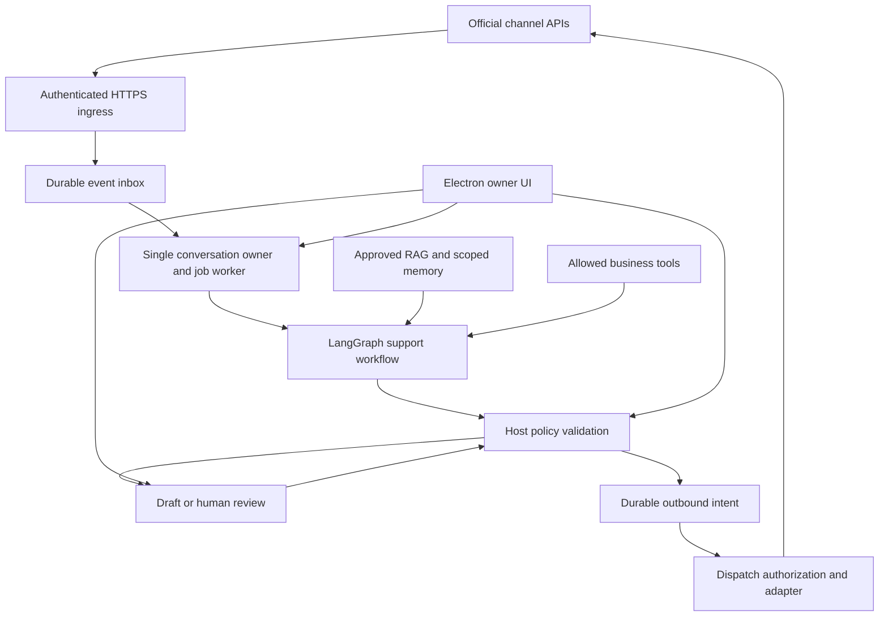

# WA-copilot: Omnichannel support architecture and delivery plan

Date: September 9, 2026

Status: Selected architectural direction; implementation proposal, not a statement of shipped capabilities.

Decision: Keep our Electron application, integrate LangGraph JS and selected LangChain components, and use official channel APIs. Begin with WhatsApp Cloud API and the existing email integration; extend to Instagram messaging, Facebook Messenger, Meta advertising lead events, and X.

This document is the target architecture for this work. `architecture.md`, `email-integration.md`, and `docs/autonomous-agent.md` describe earlier designs or partial implementation and must not be treated as evidence that the requirements below already work.

## 1. Product objective and boundaries

Build an owner-controlled support agent that can answer customers using approved business knowledge, execute narrowly authorized business operations, and hand conversations to a human. The owner uses Electron to configure channels, inspect conversations, review drafts, monitor costs, and pause automation.

The product is a business support system. A customer message is not permission to control the owner's computer, access another customer's data, launch advertising, or change a budget.

### Initial scope

- Inbound support, structured response decisions, evidence-backed answers, persistent drafts, and human takeover.
- One shared workflow and policy service across channels, with provider-specific rules.
- Local execution first, with a deployable hosted worker for owners requiring operation while their computer is off.
- Customer and conversation isolation, durable event processing, explicit sending permissions, auditable actions, and recoverable failures.
- Read-only ad attribution and lead ingestion before any advertising-management functionality.

### Version 1 deployment decision

Version 1 is a single-business, single-owner desktop deployment. The worker runs on the owner's machine in the Electron main process; webhook listeners bind to localhost only. A small authenticated HTTPS relay is a future production deployment option, not part of the current desktop pilot, and there is no automatic local/hosted failover in v1.

The hosted worker is a later deployment target, not a second active sender. Moving ownership between runtimes is an explicit operator action with a persisted ownership generation. Both runtimes must never dispatch for the same business account at once.

Customer-owned Meta, Instagram, Messenger, WhatsApp and X accounts must use the customer connection flow in `docs/customer-connection-onboarding.md`. OAuth and guided asset selection replace developer-only environment-variable setup; provider credentials remain outside the renderer and are stored in the OS secure store for the desktop pilot or an encrypted hosted vault for multi-customer operation.

### Deferred capabilities

- Autonomous ad creation, spend changes, audience changes, public posting, and bulk outreach.
- Automatic cross-channel customer identity matching from names or model guesses.
- A WhatsApp Web automation connector or browser extension unless an unmet requirement justifies one.
- A mandatory Chatwoot deployment, mandatory LangSmith subscription, vector database, or distributed queue.
- Multi-tenant hosted SaaS in the first deployment. Include business/account IDs in contracts now, but do not claim tenant isolation is proven until tested.

## 2. Why this approach

LangChain components provide model and tool integration. LangGraph supplies workflow checkpoints and human-review interrupts; a durable checkpointer is required for restart recovery. It does not provide the inbox, WhatsApp transport, consent ledger, or exactly-once external effects. On resume, interrupted nodes may execute again, so irreversible operations must not be placed before an interrupt without their own deduplication controls. [LangGraph persistence](https://docs.langchain.com/oss/javascript/langgraph/persistence), [interrupt semantics](https://docs.langchain.com/oss/javascript/langgraph/interrupts).

The JavaScript projects are MIT licensed; using their libraries does not require purchasing the hosted platform. Audit the actual selected package licenses and pin versions during implementation. [LangGraph license](https://github.com/langchain-ai/langgraphjs/blob/main/LICENSE), [LangChain license](https://github.com/langchain-ai/langchainjs/blob/main/LICENSE).

| Alternative | Reason it is not our default | When to reconsider |
| --- | --- | --- |
| Fully custom workflow engine | More checkpoint, approval and recovery logic to own | If the product is reduced to a short deterministic responder |
| Chatwoot plus our agent | Adds an inbox and server stack overlapping our current UI | Multiple human agents need assignment, shared inboxes and support operations |
| Managed support platform | Recurring platform costs and less control over local workflows | Speed of deploying one business is more valuable than product ownership |
| Native Meta Business AI | Useful benchmark, but does not establish support for our custom local tools and model selection | An owner's needs are limited to basic native business answers |
| Baileys/browser automation | Unofficial transport and extra session-maintenance burden | Explicit experimental local deployments |

Chatwoot remains a valid future adapter: its AgentBot API supports external agents and handoff. Community software is free; paid self-hosted plans and operational dependencies are separate. [AgentBot](https://www.chatwoot.com/features/chatbots), [self-hosted plans](https://www.chatwoot.com/pricing/self-hosted-plans).

## 3. Channel scope and access requirements

The WhatsApp Cloud API only serves WhatsApp. Instagram, Messenger, advertising and X require separate adapters, permissions, subscriptions and account capabilities. A common workflow does not eliminate those boundaries.

| Integration | Initial behavior | Prerequisites to verify in implementation | Boundaries |
| --- | --- | --- | --- |
| WhatsApp Cloud API | Receive support messages, reply, consume delivery events, handle templates | Business account/number setup, token scope, webhook setup, applicable review and verification | Apply response window, opt-out and template rules at dispatch |
| WhatsApp Coexistence | Keep eligible Business App use alongside API; detect owner replies from app echoes | Number/account eligibility and onboarding route | Never assume every existing number qualifies |
| Email | Reuse Gmail OAuth/API and supported existing mailbox integration | Mailbox authorization, scopes, verification obligations, provider quotas | Preserve threading; prevent auto-response loops |
| Instagram | Professional-account DMs, human takeover and supported message events | Selected Instagram Login or Facebook Login route, permissions and review | Do not assume personal-account support or universal feature parity |
| Facebook Messenger | Page support conversations and supported events | Page access, messaging permissions, subscriptions and review | Its own policy eligibility and reply rules |
| Meta ads | Ingest lead-form submissions and available click-to-message referral metadata | Ad/Page asset access, lead access and appropriate permissions | A lead is not automatically a message or cross-channel consent |
| X | Authorized support DMs first; mentions/public replies as a later capability | Developer access, OAuth scopes, endpoint availability and budget | Public replies default to review; separate usage accounting |

Meta's official Instagram collection describes the account/login options. Verify the exact scopes against the chosen route rather than combining requirements from different login flows. [Instagram API](https://www.postman.com/meta/instagram/documentation/6yqw8pt/instagram-api).

Coexistence app-message echoes provide a useful input for human takeover; they must be correlated to the actual customer conversation and separated from our own API sends. [Coexistence events](https://docs.360dialog.com/docs/hub/embedded-signup/whatsapp-coexistence/coexistence-webhooks).

Gmail supports mailbox change notifications through Pub/Sub. Notifications trigger incremental synchronization; they are not a replacement for fetching messages. Renew watches and maintain reconciliation so missed notifications do not silently lose mail. Existing polling can remain the first implementation. [Gmail push notifications](https://developers.google.com/workspace/gmail/api/guides/push).

Meta's Messenger overview and lead-retrieval documentation did not load through the research tool during this assessment. Permission lists, review requirements and current policy details for those two adapters are implementation verification gates, not verified claims in this document. Official starting points: [Messenger](https://developers.facebook.com/docs/messenger-platform/overview), [lead retrieval](https://developers.facebook.com/docs/marketing-api/guides/lead-ads/retrieving/), [Meta lead-webhook sample](https://github.com/fbsamples/lead-ads-webhook-sample).

### Ads are a source, not a messaging transport

An ad click may start a WhatsApp, Instagram or Messenger conversation. That conversation belongs to its messaging adapter; attach any available referral/ad identifiers as attribution. A submitted lead form is a distinct lead event. Store its source and the exact consent evidence before making an outreach decision. Neither event authorizes changing an ad campaign.

## 4. Architecture and deployment

### Component ownership

| Component | Owns | Must not own |
| --- | --- | --- |
| Electron renderer | Display, operator inputs, draft editing | Authoritative permissions, autonomous execution or secrets |
| Main-process supervisor | Local lifecycle, authenticated commands, pause controls, worker health | An additional parallel customer-response pipeline |
| Shared Node runtime | LangGraph workflow, channel-independent decisions | Renderer globals or direct UI-store dependencies |
| Channel adapter | Provider authentication, normalization, sending and delivery mapping | Model-chosen destinations or business policy overrides |
| Inbox/job store | Deduplication, ordering, leases, retry scheduling | Treating a checkpoint as proof of external delivery |
| Policy service/outbox | Final sending permission, approvals, dispatch state | Letting model output grant authority |
| Knowledge/memory services | Business evidence, provenance, scoped conversation context | Unreviewed ingestion of customer instructions into business knowledge |

### Deployment A: owner-machine worker

Run the workflow under the Electron main-process lifecycle, with durable local storage. Move expensive parsing/inference into an isolated worker where required to keep controls responsive. Closing the window may retain tray/background operation; explicitly quitting stops the local worker. Power-off and network outages stop local responses.

Official webhook integrations need reachable HTTPS ingress. The current desktop pilot therefore supports controlled localhost testing only; it does not ship a public listener or implicit tunnel. A future production relay may durably buffer events and connect to the desktop over an authenticated outbound channel, but that relay is not implemented and cannot be treated as part of v1 availability.

The relay handles customer event data. Document its retention and encryption; do not market this configuration as zero-cloud processing. Provider and selected LLM data flows remain additional boundaries. If the machine is offline, the system records the event and reports that no response was generated; the relay does not become an autonomous agent.

### Deployment B: hosted worker

Deploy the same Node runtime with HTTPS ingress on an always-on host. Electron becomes the owner console. Cloud execution requires approved knowledge and credentials accessible to that host; local-only tools remain unavailable when the desktop is offline. Do not silently reroute those tools or upload all local files.

Only one runtime may own a conversation at a time. Switching local/hosted execution requires a persisted ownership generation or lease and a controlled transfer. Never have both runtimes send for the same job. A single small server is an initial deployment, not high availability.

## 5. Workflow and contracts

Use a bounded graph rather than an unrestricted tool loop:

1. Load the normalized event and current conversation ownership.
2. Apply early exclusions: duplicate, own echo, group/broadcast event, opt-out, unsupported content or disabled automation.
3. Load scoped conversation context and retrieve approved business evidence.
4. Run only authorized business lookups needed to answer the request.
5. Generate a schema-validated decision, with bounded tokens, calls and time.
6. Validate evidence and policy on the host.
7. Persist a draft, escalate with context, or create an outbound intent.
8. Dispatch through the final authorization gate and record provider outcomes.

Control events are processed outside the generation queue and take effect immediately. Opt-out, human takeover, owner permission revocation, emergency pause, credential revocation and provider delivery updates must update authoritative state without waiting behind a customer response job. The final dispatch gate reads that state again.

For rapid customer messages, increment a conversation revision on every relevant inbound event. A decision records the revision it used. Before approval or dispatch, compare the decision revision with the current revision. A stale decision is superseded or regenerated; it is never sent silently. A short debounce may combine rapid messages into one response turn, but each covered inbound event remains linked to the resulting decision.

### Normalized inbound event

Required fields: schema version, business ID, channel, channel-account ID, provider event/message IDs, event kind, conversation ID, sender identity, actor classification, provider timestamp, receipt timestamp, content type, sanitized content and raw-event reference.

Optional fields: reply-to ID, attachment references, provider thread ID, referral/ad identifiers, consent evidence and delivery status. Identity keys include business and account scope. Do not merge an Instagram handle and WhatsApp number merely because their display names match.

### Structured decision

Required fields:

- `responseText` or null; `disposition`: draft, reply, escalate or no-reply.
- `confidence`: model estimate, explicitly not a calibrated probability.
- `groundingStatus`: supported, insufficient, conflicting or not-applicable.
- `evidence`: source IDs, source versions and relevant supporting passages.
- `sensitiveTopic`: none, account-security, financial-action, legal, health, personal-data or other.
- `escalationRequired`, stable reason code and concise operator explanation.
- Proposed business actions, separately validated against authorization.

Model output must not choose the destination, business ID, consent state or operator permissions. Reject malformed decisions. Set explicit content/length limits. A source's existence is not evidence that every generated claim is supported.

Use a stable graph thread key scoped to business, channel account and provider conversation. Persist each inbound job separately so new messages cannot accidentally resume an unrelated approval. Stamp every run with graph version, policy version, prompt version and conversation revision.

Use a persistent checkpointer supported by the pinned LangGraph version. MemorySaver is development-only; LangGraph identifies SQLite as a local file-based option and Postgres as the hosted option. The job store is authoritative for scheduling and terminal status. The checkpoint is authoritative only for graph position and graph state. The decision and approval are authoritative for the proposed response and review binding. The outbox is authoritative for whether a provider send may be attempted.

On recovery, reconcile those records by correlation ID: reuse a persisted decision, resume an incomplete graph, or quarantine an outbox with an ambiguous provider result. Never regenerate and send merely because a checkpoint is missing. Graph changes require workflow/schema versions, compatibility fixtures and a drain or migration policy for interrupted runs.

## 6. Modes, approvals and human ownership

| Control | Meaning |
| --- | --- |
| Autonomous Bot Mode | Whether the worker may run agent jobs |
| Observe-only | Record events and status; no customer sends or business mutations |
| Draft Mode | Generate decisions/drafts without customer sends |
| Auto-Reply | Eligible decisions may enter the outbox |
| Response Permission | Independent owner permission required to dispatch; selecting Auto-Reply does not enable it |
| Pause | Stop new execution and invalidate pending dispatch authorization |
| Stop | Stop runtime processing, preserve durable backlog and configuration |
| Pause All | Persist emergency pause; cancel active work where possible and block pending autonomous side effects |
| Human takeover | Persist human ownership of one conversation until explicit return to the bot |

Draft generation must work while response permission is disabled. Resume must actively schedule eligible backlog. A pause cannot recall a request already accepted by a provider; show that boundary clearly.

A stop or pause invalidates unclaimed dispatch authorizations and cancels model/tool work where cancellation is supported. Consent, takeover, permission changes and emergency pause do not wait behind a generation job.

Approval records bind operator identity, conversation, decision version, exact content hash, destination and expiry. Editing a draft invalidates the old approval. Recheck ownership, newest customer message, consent, policy window and emergency state immediately before dispatch, even after approval.

Detect explicit takeover and provider owner-message events. Match known API message IDs before classifying outgoing echoes as human activity. Any unrecognized owner reply should conservatively suspend the affected customer conversation, not the owner's own chat.

## 7. Storage, ordering and delivery guarantees

Extend or consolidate existing persistence deliberately. Avoid separate contradictory records in UI storage, graph checkpoints and JSON state. For a single local worker, reuse SQLite with migrations, transactions, WAL and tested backups; select hosted storage based on actual concurrency requirements.

Autonomous conversations use host-owned incremental writes. The renderer must not replace an entire session snapshot after a background worker has advanced it. UI saves require a version check or append-only event command. Existing full-replace session persistence remains a migration risk until this contract is implemented.

| Durable record | Key information |
| --- | --- |
| Channel accounts | Business, provider identity, capability flags, credential reference and health |
| Inbound events | Unique business/account/provider event key, payload reference, processing status |
| Conversations | Provider identity, owner, mode, latest inbound timestamp, consent and policy version |
| Jobs | Event, sequence, status, attempts, next attempt time, lease and last failure |
| Graph checkpoints | Thread state and pending interrupts; no raw API secrets |
| Decisions and approvals | Versioned response, evidence, classification, approval binding |
| Outbound intents | Unique response slot per inbound event, destination, payload hash, attempt and provider IDs |
| Delivery events | Provider status, timestamps and correlation; append without inventing delivered status |
| Audit and usage | Actor, action, result, correlation IDs, tokens and estimated/actual charges |

Authenticate and validate incoming webhooks, persist them, then acknowledge promptly. Process asynchronously. Provider retries must not create duplicate jobs. Preserve receipt order per conversation; retain provider timestamps for context and explicitly flag late events. Do not promise reconstruction of a perfect global order across providers.

### At-most-once outbound response

Persist the unique outbound intent before any network send. Claim it atomically. Use provider idempotency only where documented and verified. A crash or timeout after the network request can mean the provider accepted the message even though we lack its ID.

For an ambiguous result, mark `delivery_unknown`, reconcile when the provider supports it, and otherwise require operator investigation. Do not blindly retry. To preserve at-most-once behavior without provider idempotency, accept that an uncertain message might remain unsent. A database uniqueness constraint alone cannot guarantee exactly-once delivery across a network.

The at-most-once claim is scoped: one active dispatch authority, durable pre-send intent, no automatic retry after an ambiguous provider result, no restoration of an old backup into a sending state, and provider correlation where available. Restore always enters paused recovery mode. The operator must reconcile or quarantine all sending and delivery-unknown intents before resuming.

Retry generation and confirmed pre-send transient failures with capped exponential backoff and jitter. Respect provider retry headers. Persist schedules, cap attempts and wall time, and send exhausted jobs to review. Permanent authorization, policy and invalid-recipient errors require intervention. Hold later jobs in the same conversation until the earlier job is resolved or explicitly skipped.

## 8. Policy, privacy and machine control

Implement a channel capability/policy layer rather than applying WhatsApp rules everywhere. For WhatsApp, check the current service window and approved-template eligibility at dispatch; persist opt-outs immediately, including in observe mode. Lead submission is not unrestricted consent. Provide a visible AI support identity and a practical human contact path. Current WhatsApp policy permits automated service responses subject to its rules and escalation requirements. [WhatsApp messaging policy](https://business.whatsapp.com/policy).

Reuse the existing RAG and memory interfaces behind scoped wrappers. Customer attachments may inform that conversation, but only owner-approved ingestion may update authoritative business knowledge. Verify identity before returning account-specific information. Return-policy questions may be answered from evidence; executing refunds is a separate authorized action. Avoid blocking every occurrence of the word “refund.”

Consent is durable per channel account and customer, with source, timestamp, wording/version, scope and revocation time. An opt-out takes effect before any queued response and is not overridden by a later model decision. Lead-form consent, ad referral metadata and a customer-initiated support message are separate facts.

Keep credentials in OS-backed storage locally and a secrets facility on hosted deployments. Select minimum OAuth scopes, handle revocation and deletion, and document what reaches providers. Local inference does not make WhatsApp itself local. Do not enable hosted model fallback without an owner data-sharing choice.

Expose a separate owner-only MCP control surface: health, agent/queue/channel status, recent failures, pause/resume, eligible retry, reconnect and sanitized diagnostics. Browser surfacing and screenshot capture require explicit capability settings. No arbitrary shell, filesystem path access, browser evaluation or raw browser-control tool enters the customer graph.

Enforce authorization on the server for every tool. Validate schemas, rate-limit, time out, cancel where supported and audit results. Retry commands must reject sent or delivery-unknown jobs. Bind local transports narrowly; any remote control endpoint requires authenticated encrypted access. Diagnostic export must redact credentials and unnecessary message content.

## 9. UI and observability

Extend the existing inbox and autonomy panel with:

- Execution location, mode, independent response permission and emergency pause state.
- Per-channel status, permission/review blockers, last successful sync and reconnect control.
- Queue depth, oldest pending age, active jobs, paused conversations and last failure.
- Draft editing, evidence inspection, approval, rejection and human takeover.
- Provider delivery status, unknown-delivery warnings and incident history.
- Model/RAG/memory availability, worker heartbeat, disk capacity and local-tool/browser status.
- Daily/monthly spend, limits, channel breakdown and estimated cost per resolved conversation.

Use connection states that the provider can actually establish. WhatsApp can include disconnected, connecting, QR-required where applicable, connected, logged-out, blocked and error; Cloud API token failures must not be mislabeled as QR problems. Treat unseen provider states as unknown rather than guessing.

Record operational summaries, decisions and evidence references, not hidden model reasoning. Owner notifications are durable in-app events plus optional configured desktop/remote alerts. Notify on meaningful failures and escalations; deduplicate repeated outage notifications.

Define retention by record class before launch. A starting policy is 30 days for raw webhook payloads and diagnostics, 12 months for audit records, 90 days for graph checkpoints after terminal completion, and business-configurable retention for conversation content. Deletion must cover local databases, relay storage, hosted storage, exports and backups according to a documented backup expiry process. Restored backups must not silently reintroduce deleted data.

Define an escalation SLA and fallback contact path before enabling unattended operation; an alert that nobody can action is not a completed handoff.

## 10. Cost model and controls

Monthly total = hosting + model usage + channel usage + storage/backups + monitoring + optional provider fees + maintenance labor. Advertising spend is a separate owner budget. Estimates below exclude tax, hardware purchase, exchange-rate changes and engineering labor.

LangChain/LangGraph libraries have no usage subscription. LangSmith services are optional and separately priced. Direct Cloud API integration avoids adding a mandatory support-inbox subscription; any onboarding/intermediary fees must be checked for the selected route. [LangSmith pricing](https://www.langchain.com/pricing).

Meta currently lists service replies within the rolling 24-hour customer-service window as free; paid template categories and other charges are separate. [WhatsApp pricing](https://business.whatsapp.com/products/platform-pricing).

### Planning scenarios

Use an illustrative model rate of $0.75/million input tokens and $3.75/million billed output tokens, with 4,000 input and 500 output tokens per processed customer message. This is a cost assumption, not a selected model or guaranteed quality level. Count all calls, including validation and thinking tokens, when measuring actual usage. Current provider rates must be checked at model selection. [Google model pricing](https://ai.google.dev/gemini-api/docs/pricing).

| Monthly messages | Input tokens | Output tokens | Illustrative model cost | Small hosted runtime/backups estimate | Subtotal before channel fees and labor |
| --- | --- | --- | --- | --- | --- |
| 1,000 | 4 million | 0.5 million | $4.88 | $10–30 | $14.88–34.88 |
| 10,000 | 40 million | 5 million | $48.75 | $10–30 | $58.75–78.75 |
| 100,000 | 400 million | 50 million | $487.50 | Capacity test required | Not estimated |

These are low-complexity examples. The production budget must report low, base and high scenarios including classification, retrieval, validation, summaries, retries, attachments, checkpoint storage, relay, monitoring and human review. Record actual tokens and provider charges by conversation and disposition. A generated answer that escalates still has a model cost.

Local execution removes the hosted inference worker expense but may still require relay hosting, electricity and backups. A 20 W incremental continuous load consumes approximately 14.4 kWh over 30 days; a 100 W load consumes 72 kWh. Multiply by the owner's electricity rate. Local models add hardware, latency and concurrency considerations.

### X budget must be separate

X currently lists DM event reads at $0.010/resource and DM interaction creation at $0.015/request. Under the simple assumption of one billable inbound DM event plus one create request per interaction, 10,000 interactions cost approximately $250 before LLM usage and other events. Confirm actual endpoint semantics and account rates before enabling. Set a provider spending limit and an application cap. [X pricing](https://docs.x.com/x-api/getting-started/pricing).

Do not assume Instagram/Messenger API use, email infrastructure, Pub/Sub, or Meta integration support has zero total cost. Verify provider terms, hosting and account subscriptions for the chosen setup. Do not put ad spend into the support-agent subscription estimate.

### Controls to ship

- Per-business/channel daily and monthly caps; reserve estimated cost before new model work.
- Bounded retrieval context, conversation summaries, output length and maximum tool/model calls.
- One sufficient model pass for simple answers; measured escalation to a stronger model when needed.
- Reuse an existing persisted decision after retry instead of regenerating without cause.
- Cache only appropriately scoped, versioned business evidence; never share personalized responses across customers.
- Limit X historical reads and reconciliation; measure billable events, not HTTP requests alone.
- Show estimates separately from provider-reconciled charges. Budget exhaustion holds drafts and notifies the owner; it must not silently switch providers.

For total ownership cost, add engineering hours × the team's actual hourly cost. Even a few hours of monthly transport repair can outweigh small subscription savings. Track support incidents and human handling time as operating costs.

## 11. Repository migration

The current supervisor is a prototype. Its build passing is not evidence of correct autonomous operation.

| Existing area | Migration action |
| --- | --- |
| `src/main/services/AutonomousSupervisor.ts` | Retain lifecycle/control responsibilities; replace in-memory execution with durable jobs and LangGraph integration |
| `src/main/whatsapp/WhatsAppService.ts` | Keep Baileys as an experimental adapter; introduce Cloud API independently |
| `src/main/services/EmailChannelService.ts` | Reuse supported Gmail/mailbox transport; normalize inbound and outbound events |
| `src/main/packages/omnichannel/index.ts` | Inspect and extend existing shared contracts before creating new ones |
| `src/main/packages/rag-engine/index.ts` | Reuse retrieval behind tenant/business-scoped evidence contracts |
| Memory and chat persistence services | Reuse context and sessions with explicit ownership and migration rules |
| Renderer agent runtime and `useWhatsAppBridge` | Remove automatic duplicate customer execution when a conversation is owned by the new runtime |
| `AutonomyPanel`, preload and IPC | Add typed contracts and authoritative host controls; remove contradictory toggles |
| Playwright and MCP services | Keep owner tools separate; expose only narrow approved business capabilities to the graph |

Known repairs: reconstruct queued work after restart; make draft mode generate without sending permission; enforce pause after generation and before dispatch; handle ambiguous sends; persist opt-outs/takeover; replace hardcoded confidence; store provider IDs; prevent renderer and main-process duplicate responses. Also review persona instructions that conceal AI identity and replace them with the requested disclosure behavior.

The current RAG FTS query path also needs multilingual validation before claiming support for all native Indian languages. Its query cleaning can remove non-ASCII-only queries. Add language-specific test cases and a tested normalization/search path.

Do not migrate customer data destructively. Back up existing databases, version migrations, test rollback compatibility and preserve message IDs. Select one authoritative conversation record; synchronize UI views from it. Retain the previous runtime for manual tasks only until migration completes, never as an automatic fallback sender.

## 12. Phased delivery and acceptance gates

| Phase | Deliverable | Exit evidence |
| --- | --- | --- |
| 0: Baseline and containment | Document existing gaps; establish test baseline; block unsafe new auto-send path during migration; verify distribution model, Meta assets, Cloud API eligibility, OAuth scopes, data regions and retention obligations | No dual sender, verified control contracts, access decision and reproducible baseline |
| 1: Durable agent core | Node-compatible LangGraph, selected model adapter, persistent jobs/checkpoints and draft decisions | Restart recovers jobs/approval; no message sent in draft or observe mode; graph migration fixture passes |
| 2: WhatsApp production path | Cloud API onboarding, webhook validation, outbox, delivery events and policy checks | Duplicate webhook, pause race, opt-out, window expiry and ambiguous-send tests pass |
| 3: Email parity | Shared workflow with preserved mail threading and loop suppression | Gmail/mailbox restart, token expiry, threading and bounce/auto-reply tests pass |
| 4: Instagram and Messenger | Independent approved adapters and human ownership | Real authorized account tests, permission failure and owner-echo handling verified |
| 5: Advertising context | Lead-form events and supported referral attribution | Correct attribution; no unsolicited cross-channel send; no spend-changing operations |
| 6: X | DM support with separate budget and access validation | Metering, limits, takeover and supported delivery behavior verified |
| 7: Hosted operation | Same runtime deployed with secure desktop control and ownership transfer | Desktop-off operation, failover boundaries, backup restore and isolation tests pass |

Infrastructure/access discovery for hosted operation begins in phase 2 even though the full hosted worker ships later. Platform review proceeds in parallel and may dominate elapsed delivery time. Do not promise a delivery date until account access and the core migration spike are measured.

### Mandatory failure tests

- Crash before/after event commit, graph checkpoint, outbox claim, provider request and delivery update.
- Replay the same webhook and restart with queued jobs; verify one response slot.
- Pause, revoke sending permission or take over while generation/dispatch is pending.
- Opt out during backlog; resume after response-window expiry; edit an approved draft.
- Receive out-of-order events, multiple rapid messages, unknown echoes and duplicate delivery receipts.
- Expire credentials; simulate 429, permanent rejection, timeout and exhausted retry.
- Inject misleading customer text, poisoned attachments and unsupported model evidence.
- Check cross-business/customer isolation, unauthorized MCP requests and redacted diagnostics.
- Exhaust token/channel budgets and disk capacity; restore backup; ensure old sends are not replayed.

Use fake adapters for destructive/failure cases and explicitly authorized test accounts for live integration. Proposed pilot target: all safety invariants pass, recovery succeeds under the agreed crash matrix, and measured answer quality supports the chosen auto-reply threshold. Do not derive thresholds from the model's confidence number alone.

Build a representative evaluation set before auto-reply: common intents, missing and contradictory knowledge, multilingual messages, follow-ups, sensitive topics, prompt injection and personalized account questions. Measure correctness, unnecessary escalation, missed escalation, latency, owner editing time, cost per resolved conversation and recovery time.

## 13. Decisions settled and remaining checks

Settled: Electron remains our product UI; LangGraph plus selected LangChain integrations powers the shared support workflow; official APIs are the production route; RAG/memory are reused; sending remains host-authorized; X is optional and separately budgeted; ad management is deferred.

Before deployment, verify the owner's Meta assets and Coexistence eligibility, required reviews/scopes, first email provider, Gmail restricted-scope applicability, approved model/data region, initial traffic and spending caps, knowledge-sharing rules, retention period, and local execution choice. Also make the distribution model explicit: our own account, a desktop product where each customer connects their own accounts, or a hosted service operating customer accounts. OAuth review, support and cost estimates depend on this decision.

Next implementation slice: a restart-safe draft-only LangGraph workflow using our existing RAG and session data, with one authoritative job store and tests for pause, duplicate input and approval recovery. Follow it with the Cloud API adapter and the single outbound gate. This gives us a reviewable foundation before adding more channels.

The implementation order is: freeze the v1 deployment and distribution model; contain legacy senders and make host-owned persistence authoritative; build the draft-only LangGraph workflow and evaluation set; add control-event priority, stale-revision handling, approval recovery and the outbox; pilot WhatsApp Cloud API; then add email, Instagram/Messenger, ad attribution and X according to measured demand.
