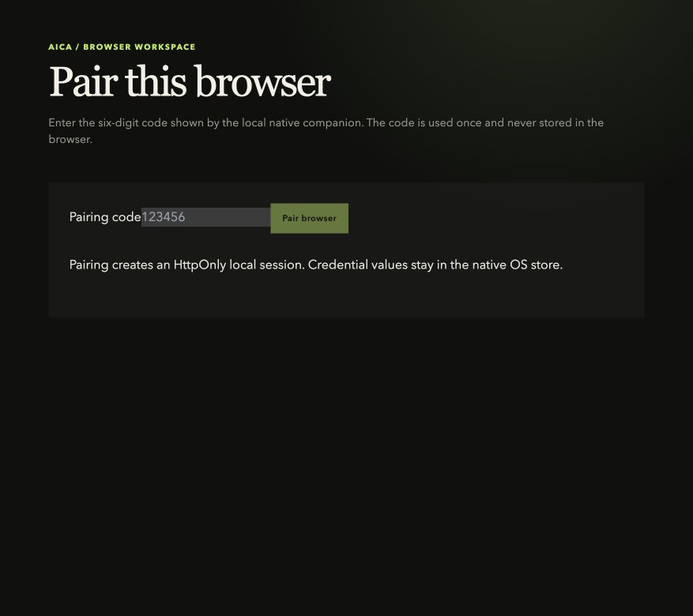
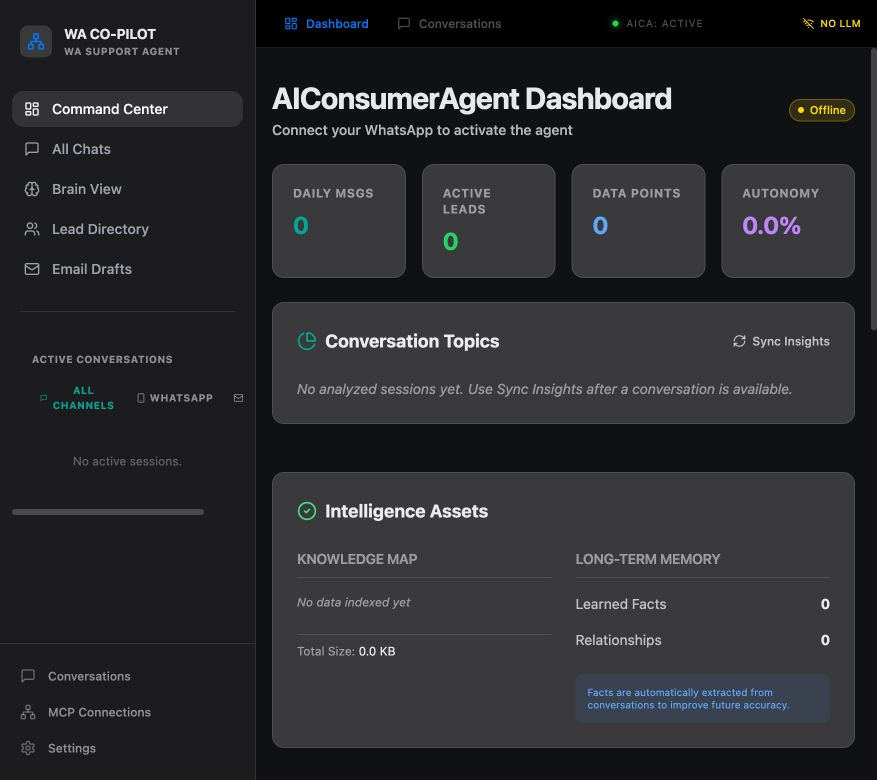
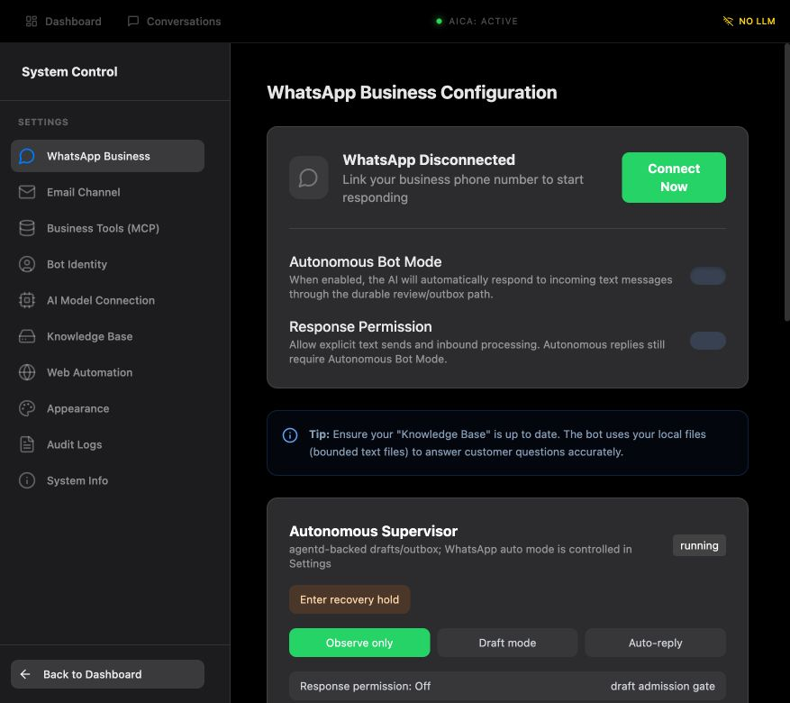

# Windows and macOS browser-first setup

This guide covers the current browser-first native-host release candidate. The installed app supplies the local native supervisor and OS integrations; users do their work in a normal browser tab.

> **Release status:** this is an unsigned release candidate. The macOS artifact is Apple Silicon (`arm64`). Windows packaging is `x64`. Production signing, notarization, live provider validation, and real-user upgrade/rollback evidence remain open gates in [`docs/release-readiness.md`](release-readiness.md).

## Download

Download the latest candidate from the public GitHub Release:

**[AICA browser-first lifecycle RC](https://github.com/meharajM/WA-copilot/releases/tag/v1.0.1-browser-lifecycle-rc.1)**

Choose one installer for your platform:

- **Windows:** the `.exe` NSIS installer is the normal path. The `.msi` is available for managed deployment.
- **macOS Apple Silicon:** use the `.dmg`, or the `.app.zip` when you need the application bundle directly.
- Verify the published `SHA256SUMS` beside the downloads before installing in a test environment.

## First launch: one flow on both platforms

1. Install the package.
   - **Windows:** run the NSIS installer and keep the default per-user location unless your IT policy requires otherwise.
   - **macOS:** open the DMG and drag **AICA Native Host** to **Applications**. Because this candidate is unsigned, macOS may require **System Settings → Privacy & Security → Open Anyway**. Only do this when the checksum matches the release.
2. Click the **AICA Native Host** app icon. The native window stays hidden; the app starts/reuses the local `agentd` supervisor and opens the browser workspace in your default browser.
3. On the first visit, enter the six-digit code shown by the local native companion and select **Pair browser**. The code is single-use; the browser receives an HttpOnly local session and credentials remain in the native OS store.

4. The dashboard is now ready. The status bar shows the local agent state and the active channel controls.

5. Open **Settings** to connect channels, configure the knowledge base, choose the supervisor mode, and review transport health. Keep **Observe only** or **Draft mode** until your provider and escalation drills are complete.

## After setup: browser and background behavior

- Closing the browser tab closes the UI only. With **Keep running in background** enabled (the default), `agentd` continues processing queued work and provider events on the machine.
- Reopen the UI by clicking **AICA Native Host** again, or use the tray/menu-bar action **Open browser workspace**. Pairing persists for the browser profile until its local session is cleared.
- The native tray/menu-bar menu exposes:
  - **Start background agent** — start/reuse the managed supervisor.
  - **Stop background agent** — stop processing and disable automatic restarts until started again.
  - **Keep running in background** — persist the close-window policy.
  - **Open native diagnostics** — inspect loopback health without changing the browser UI.
  - **Quit** — explicit app exit; the supervisor is stopped before the process exits.
- If the browser cannot be opened, the native diagnostics window is shown so the local origin and health state remain discoverable.

## Windows notes

- Use the `.exe` installer for an interactive install. Use the `.msi` when deploying through an enterprise installer system.
- Windows Defender SmartScreen can warn because this candidate is unsigned. Verify `SHA256SUMS` and use a signed build for production distribution.
- The Windows workflow runs staged migration-reader and Credential Manager smoke checks, builds both NSIS and MSI packages, installs the NSIS package, checks agentd health, and uninstalls it.
- The first launch may open the browser after a short delay while the local sidecar starts. Do not start a second copy if the tray icon is already present.

## macOS notes

- This candidate targets Apple Silicon (`arm64`). An Intel build requires a separate x86_64 artifact.
- The DMG checksum is verified before publication, but the app is ad-hoc/linker-signed for this candidate and is not notarized.
- If the app is blocked, use **Open Anyway** only after verifying the checksum. Do not remove quarantine attributes as a release workaround.

## Troubleshooting

| Symptom | Action |
| --- | --- |
| Browser does not open | Use the tray/menu-bar **Open browser workspace** action. If it still fails, open **Open native diagnostics** and copy the displayed local origin. |
| Pairing code rejected | Request a fresh code from the native companion and enter it once. Codes expire and are never stored in the browser. |
| UI closed but work should continue | Confirm **Keep running in background** is enabled. Closing the tab is not an app quit. |
| Work must stop immediately | Choose **Stop background agent**. For a full shutdown choose **Quit**. |
| Channel shows disconnected | Open **Settings**, review the channel card, and keep the supervisor in **Observe only** until credentials and provider callbacks are validated. |

## What this release does not claim

This release demonstrates the browser-first UI boundary, native OS/keychain access, background lifecycle controls, and package smoke tests. It does **not** claim 100% migration completion or production-ready provider auto-reply. See [`docs/release-readiness.md`](release-readiness.md) for the remaining gates and [`docs/testing.md`](testing.md) for repeatable checks.

