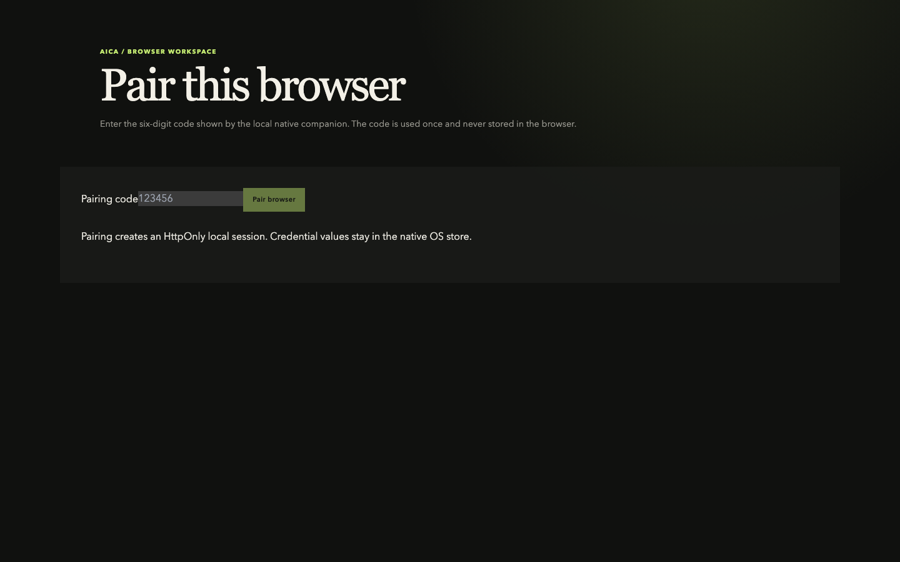
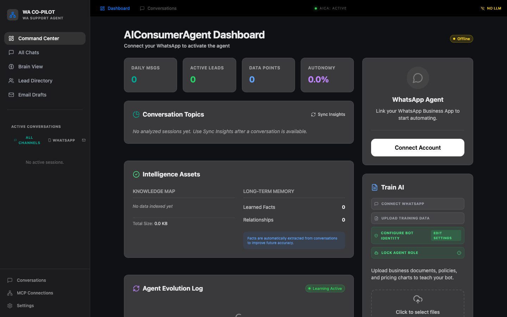
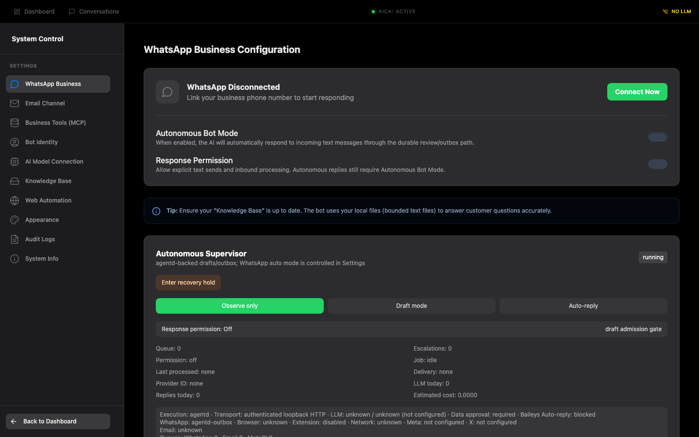
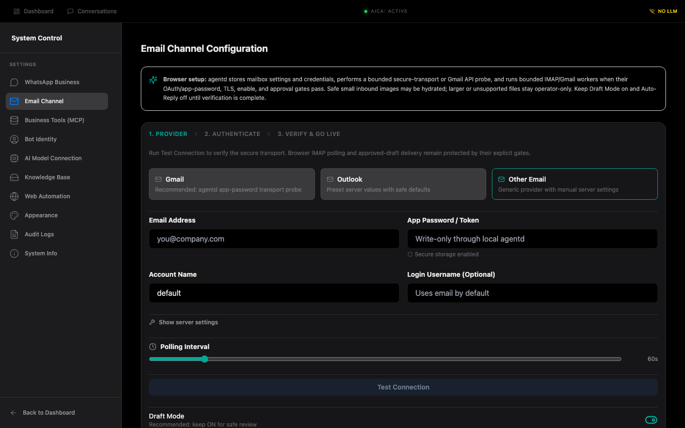
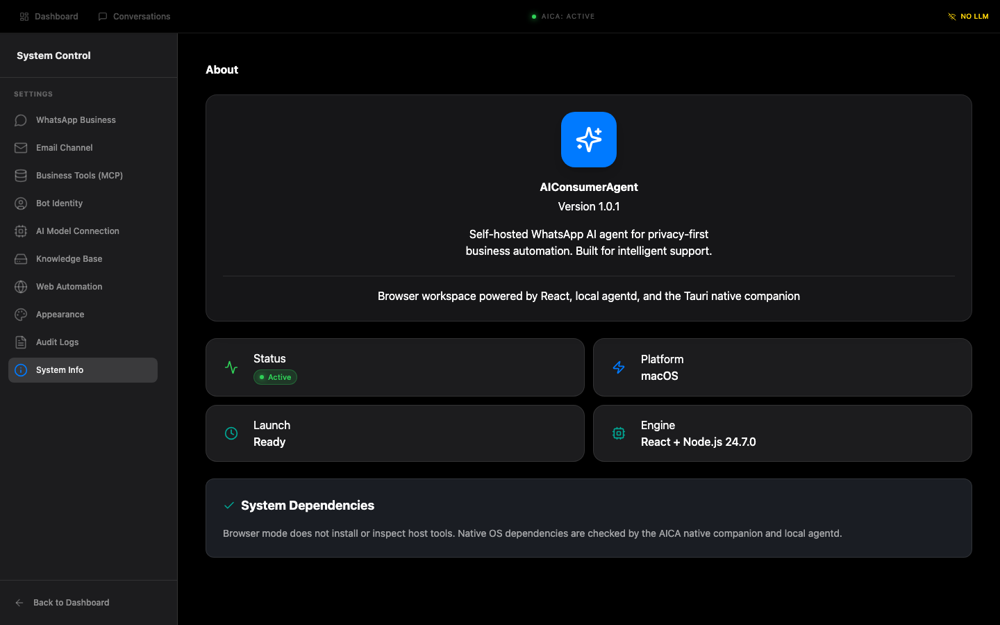

# AICA Windows user guide

This guide describes the Windows-first product flow. The browser is the product UI; the small Tauri companion supplies native capabilities and starts the local `agentd` service.

## Before you start

- Windows 10/11, an account allowed to install a per-user application, and a modern browser (Edge or Chrome recommended).
- Provider credentials you intend to use: LLM, Email, WhatsApp, or MCP.
- Keep the browser and native companion on the same machine. `agentd` binds to loopback only.

## 1. Download and install

1. Download the signed Windows installer from the project release page when a Windows release is published.
2. Run the installer, choose the install directory, and finish setup.
3. Launch **AICA Native Host** from the Start menu. The companion stays small because it does not render the product workspace.

The current public branch includes a verified browser bundle at [`docs/downloads/aica-browser-web.zip`](downloads/aica-browser-web.zip), plus unsigned Windows installers: [`NSIS setup`](downloads/AICA%20Native%20Host_1.0.0_x64-setup.exe) and [`MSI package`](downloads/AICA%20Native%20Host_1.0.0_x64_en-US.msi). General distribution still requires release signing. The installers were produced on a Windows runner because this macOS development host cannot compile the Windows Credential Manager and migration sidecars.

The repository's **Tauri Windows package** workflow can be dispatched from GitHub Actions to produce and verify the Windows NSIS/MSI bundle for a selected commit. Its artifact is unsigned until release signing completes.

## 2. Open the browser workspace

The native companion starts `agentd` on a random loopback port and exposes **Open browser workspace**. Use that action or the URL shown by the companion. Do not bookmark a fixed port; the port is intentionally per-run.

## 3. Pair the browser

1. Read the six-digit code shown by the native companion.
2. Enter it in **Pairing code**.
3. Select **Pair browser**.
4. The code is single-use and short-lived. The browser receives an HttpOnly local session and memory-only CSRF state; credential values never enter browser storage.

## 4. Confirm the workspace

After pairing, the browser opens the Command Center. Chat, conversations, knowledge, email drafts, lead directory, MCP, settings, and autonomy controls all stay in the browser.

## 5. Configure channels and credentials

### WhatsApp

Open **Settings → WhatsApp Business**. Choose Baileys or Cloud transport, connect the account, and keep **Response Permission** and **Autonomous Bot Mode** off until the account and policies are verified. Browser Baileys/Cloud flows use authenticated agentd routes and durable drafts/outbox state.

### Email

Open **Settings → Email Channel**.

1. Select Gmail, Outlook, or Other Email.
2. Enter the mailbox address and app password/token. The field is write-only through agentd.
3. Keep **Draft Mode** on and **Auto-Reply** off during initial verification.
4. Select **Save Setup**, then **Test Connection**.
5. Enable the channel only after the secure transport or Gmail OAuth probe succeeds.

### LLM, MCP, knowledge, and persona

Configure these from the corresponding Settings pages. The browser sends mutations to authenticated agentd routes. Native credential reauthentication writes directly to the OS credential store and clears the form after success.

## 6. Normal operation after setup

- Use browser chat and channel pages for daily work.
- Incoming Email/WhatsApp events are normalized and persisted by agentd.
- Draft Mode creates reviewable drafts. Approval is required before outbound delivery.
- Autonomy controls expose durable queue, recovery, notification, evidence, and delivery history.
- Gmail history retains provider IDs. SMTP history retains RFC `Message-ID` correlation handles. Neither is proof of final mailbox delivery; provider bounce/webhook parity remains pending.
- Tauri is used only for native seams: startup, tray/lifecycle, OS credential storage, folder reveal, diagnostics, and future native speech.

## 7. Restart, upgrade, and recovery

1. Close the browser tab if desired; agentd state remains on disk.
2. Restart the native companion and open the new workspace URL it reports.
3. Pair again only when the session expired or the companion requests it.
4. If a provider credential is revoked, use the native reauthentication form or the provider sign-in flow. Secrets are never copied from Electron ciphertext.
5. If recovery mode is shown, resolve or quarantine unresolved outbound work before resuming automation.

## 8. System information and troubleshooting

Use **Settings → System Info** to confirm runtime, platform, engine, and dependency ownership.

- **Local service unavailable:** start the native companion, then refresh the browser workspace.
- **Pairing expired:** request a fresh code from the companion.
- **Email test disabled:** complete secure transport settings and save them first.
- **WhatsApp disconnected:** reconnect the account; response permission is fail-closed until the connection is healthy.
- **Credential prompt:** approve the native OS credential-store request only for the AICA companion.

## Build status

The browser bundle was built locally with `npm run build:tauri:web`. Local verification passed: typecheck, lint with existing warnings, 339 unit tests, 196 integration tests with 8 skips, Tauri web build, 20 Rust tests, and diff checks.

`npm run build:tauri:win` was attempted on macOS arm64. Frontend compilation passed, then the repository's cross-target guard stopped before packaging because Windows keyring/migration sidecars require a Windows toolchain. The public Windows packaging workflow then produced and verified unsigned NSIS/MSI artifacts; release signing is still required for distribution.
